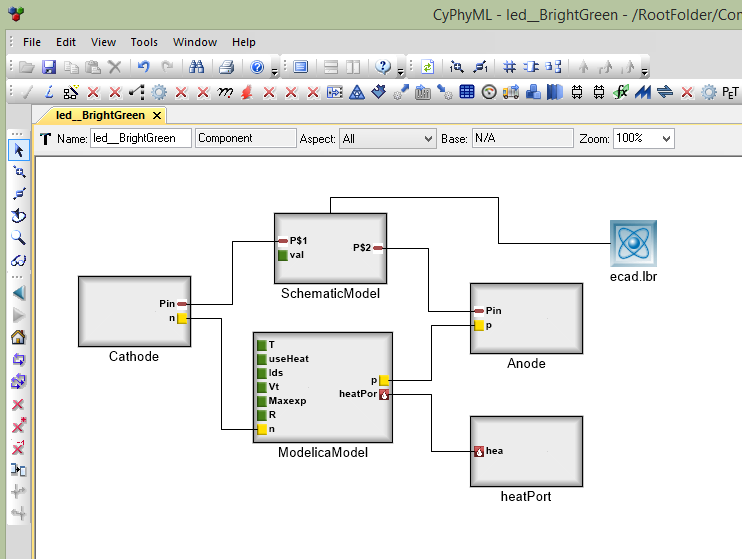

.. _concepts:

Modeling Concepts
=================

Components
----------

The **component** is the atomic model construct in OpenMETA, and it serves
as the basis for the multi-domain nature of the tools. Components touch
virtually every other concept in OpenMETA.

What's Inside a Component Model?
~~~~~~~~~~~~~~~~~~~~~~~~~~~~~~~~

Inside a component, you will typically see one or more domain models
and a number of interfaces exposing parts of the component the containing
environment. For example, you could have a schematic model, CAD model,
and Modelica model, along with many properties, connectors, and other
essential parts. The component model captures several qualities of the
physical component, including its geometry (3-dimensional CAD model),
its dynamic behavior (an acausal power flow and transfer function), and
its numerical properties (characteristics such as weight). The component
also has connectors, which allow connection to other components.

.. figure:: images/LED_Diagram_lores.png
   :align: center

   *Concept drawing of an OpenMETA Component Model of an LED*

The OpenMETA Component Model aggregates these various models, providing a
single set of properties and connectors. When two components are
composed via these connectors, they are joined in many analysis domains
at once.

The figure below shows a simple capacitor component as represented in OpenMETA.

.. _capacitor:

.. figure:: images/capacitor.png
   :align: center

   *OpenMETA Model of a Capacitor*

Domain-Specific Models
~~~~~~~~~~~~~~~~~~~~~~

For each of the domains represented in the component model, there is a
domain-specific model that exposes the necessary features of that domain.

For example, in the :ref:`capacitor` figure above we see that this capacitor has both an EDA and a
SPICE model. The EDA model exposes the two pins which represent the phyiscal
pads of the part footprint on a printed circuit board (PCB) to which other components need to
connect. The SPICE model also exposes the two pins of the component but additionally exposes four values
needed to construct an accurate representation of the capacitor in the SPICE
domain. The **properties** that specify the appropriate values for the SPICE
model as well as a number of other **properties** that describe this
component are described in the next subsection.

Properties & Parameters
~~~~~~~~~~~~~~~~~~~~~~~

Components will typically contain a number of different **properties**
and **parameters**. Properties and parameters are ways of capturing
values that describe components. **Properties** are values that are
fixed for a given component and cannot be changed directly by a designer
using that component. **Parameters** are values that can be varied by a
system designer. For example, in the case of a drive shaft where the
designer can have one manufactured to a custom length, the component
model for that drive shaft will have length as a parameter.

A property may also be calculated automatically based on the values of
other properties or parameters. In the example of a drive shaft, the
mass of the drive shaft is calculated from the length.

This extends to the domain models as well. Again in the case of the
drive shaft example, the user-selected length can be assigned to a
parameter of the CAD model, adjusting the 3D geometry based on the
designer's selection. The calculated mass can be assigned to a parameter
of the dynamics model, ensuring that the correct inertia is used when
simulating its behavior.

.. note:: Insert an image of the drive train component.

.. _connectors:

Connectors
~~~~~~~~~~

OpenMETA components also contains **connectors**, which define interfaces
across multiple domain models. For the case of an electrical pin
connecting to a printed circuit board (PCB), the joining of two
connectors can capture the geometry (the center axis and mount plane
where the pin and board meet) and the schematic diagram relation (which
pins/nets are being joined) at the same time.

In the screenshot below, the connector **Cathode** represents both an
electrical terminal from the **SchematicModel** and an electrical
interfaces from the **ModelicaModel**.

.. note:: We need to update this image to include the new *Connector* look.

The simplified diagram below abstractly shows the structure of a similar
component, with its individual domain-specific interfaces grouped into
connectors.

Component Composition
~~~~~~~~~~~~~~~~~~~~~

Components are designed to be composed with other components via their
**Connectors**. When two component connectors are composed, then their
corresponding **Role** elements are also matched, and the
**DomainPorts** so mapped will be connected together in a generated
domain model.

In the example shown below, two components each have embedded Domain
Models of type **ModelicaModel**. They also each feature **Connector**
objects that share a common definition. The **role** objects within each
**connector** instance are mapped to the **Modelica connectors** of each
component's Modelica model. In the generated Modelica model, the
corresponding Modelica class representing each component is
instantiated, and their connectors are joined by following the :menuselection:`Modelica
Connector --> Role --> Connector --> Connector --> Role --> Modelica
Connector` chain from the source OpenMETA composition.

.. figure:: images/CompositionExample.png
   :align: center
   :alt: Composition Example

   *Example of Composition*

Modeling Systems
----------------

The first step in designing a system in OpenMETA is creating a model of the
system. A model is defined as an abstract representation of the design.
A model is *abstract* if it does not contain all details about the
system, but contains sufficient detail to express design choices with a
minimal amount of effort. This level of detail is controlled by the
designer, allowing a rapid definition of conceptual designs, with
addition of detail as the design is refined. The OpenMETA Language has been
designed to strike a compromise between the conceptual and detailed
models. These compromises will be clarified as we review the language
and tools.

OpenMETA emphasizes a component-based design methodology. Therefore,
following the previous section's discussion of the modeling of a
component, we will describe component connectivity, testing models, and
design spaces.

The Component Assembly
~~~~~~~~~~~~~~~~~~~~~~

Components can be combined into a system or subsystem description by
creating a Component Assembly Model. Assemblies are combinations of
components that implement a desired function or behavior. For example,
the subsystem could produce torque to create acceleration of a vehicle,
or it could produce air flow to cool a heat exchanger.

In OpenMETA models, component assemblies are built by creating references to
one or more components and then creating relationships between their
interfaces.

Assemblies may be *nested*, that is, assemblies may contain other
assemblies. Assemblies may have externally visible ports to allow
connections to flow across subsystem boundaries.

Design Spaces
-------------

In a conventional design process, the designer can only capture a single
design architecture, with one choice of components. This method has
several drawbacks:

-  Requirements often change during the design process, sometimes
   necessitating a redesign.

-  Component and subsystem behavior is discovered during the design
   process, and the optimal choice of architecture and components may
   not be apparent until late in the design process.

-  The design is applicable to a single target use, and can require
   substantial rework for other applications.

Instead, OpenMETA introduces the concept of a *design space*. The design
space allows the models to contain multiple alternatives for components
and assemblies. Any component or assembly can be substituted for another
component or assembly with the same interface.

The OpenMETA model editor offers a simple syntax for expressing design
options. An *alternative* container is used to contain each valid
option. The container presents a consistent interface with the outside
system, while inside it contains mappings from its interface to the
interfaces of each option.

The design space is the set of all options, considering all the
alternatives. Consequently, the design space can get very large. While
this is a powerful mechanism to expand the range of designs under
consideration, a mechanism is also needed to limit the design space to a
manageable size. For this purpose, design space *constraints* can be
specified and evaluated by the Design Space Exploration Tool (DESERT).

.. figure:: images/01-03-design-alternatives-in-gme.png
   :alt: Design alternatives in GME

   *Design Alternatives captured in the OpenMETA tool*

Design space constraints are simple, static operations & equations that
can be specified for the properties and identities of components, as
well as assemblies in the design alternative space. Operations on the
properties can include total weight and cost, thresholds on a component
property, or identity. An example of an identity constraint is that a
designer would want all four tires on a truck to be of the same type.

.. figure:: images/01-03-property-constraint.png
   :alt: Design alternatives in GME

   *A property constraint in the OpenMETA tool*

The DESERT Tool uses scalable techniques to apply these constraints to
very large design spaces to rapidly prune the choices to a manageable
size. For example, a basic automotive drivetrain model may contain 288
configurations, capturing engine, transmission, and tire options. After
applying constraints related to matching mechanical interfaces, the
number of configurations drops to 48.

Typical design spaces can easily reach 10 billion configurations. After
constraint application, the number of configurations can be reduced to
thousands within seconds. Constraints can cover logical concerns, such
as power compatibility, or user specified preferences such as "*only
consider designs with X brand processors*". The remaining valid designs
can be subjected to deeper (and more computationally expensive)
analysis.

Design space creation and exploration is a process of expansion and
contraction of the design space. It can be a powerful tool to build
adaptable and flexible designs.

Test Benches
------------

In the OpenMETA Tools, a **Test Bench** is a virtual environment used to run
experiments on a system. Test benches define a testing context for a
system, providing sources of stimulus and loading elements that gather
experimental data. In OpenMETA, a user can dictate the test conditions for
their experiment themselves or choose from a library of pre-configured
test benches that represent design requirements or other criteria. In
addition to the configuration of test conditions, the user can customize
the data gathered through the execution of a test bench.

While most test benches are used to perform analyses, other test benches
perform design services for the user. For example, a user that has
completed a OpenMETA design can run a test bench to auto-generate a
schematic of their design. Additionally, the user can run a CAD assembly
test bench to build a 3D model of their design.

A common use for test benches is the evaluation of system performance.
In this application, a test bench is an executable specification of a
system requirement. The parts of a Test Bench include:

-  **Test Drivers:** Replicating the intended stimulus to the system.

-  **Wraparound Environment:** Providing the interfaces at the periphery
   of the system such as the external humidity, temperature, etc.

-  **Metrics Evaluation:** Measurements of the system properties
   converted into a value of interest. The metrics are also tied to
   requirements, which can convert the metric to a design “score”.

-  **System Under Test:** Either a single design or a design space (many
   designs). In the case of a design space, the test bench can be
   applied over the entire set of feasible designs.

.. figure:: images/01-04-example-test-bench.png
   :alt: example test bench

   *An Example Test Bench*

   **NewDC\_\_SimpleLEDCircuit** is the **System Under Test**, while the other
   **Test Components** provide the **Wraparound Environment**.
