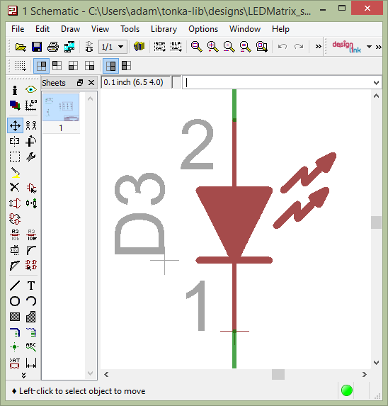
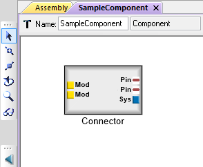

.. _concepts:

Concepts
========

.. note:: This needs to be cleaned a littl bit, but overall
   it is a good start.

Model Types
-----------

What's Inside a Component Model?
~~~~~~~~~~~~~~~~~~~~~~~~~~~~~~~~

Inside a component, you will typically see a schematic model, CAD model,
and Modelica model, along with many properties, connectors, and other
essential parts. The component model captures several qualities of the
physical component, including its geometry (3-dimensional CAD model),
its dynamic behavior (an acausal power flow and transfer function), and
its numerical properties (characteristics such as weight). The component
also has connectors, which allow connection to other components.

.. image:: images/LED_Diagram_lores.png
   :alt: Image

The META Component Model aggregates these various models, providing a
single set of properties and connectors. When two components are
composed via these connectors, they are joined in many analysis domains
at once.

Component Model Assets
~~~~~~~~~~~~~~~~~~~~~~

Schematic Models
^^^^^^^^^^^^^^^^

**Schematics** represent the elements of an electrical system using
abstracted symbols of components. Schematics excel at providing a clean,
efficient view of an electronic system. In electronic design the
location of the symbols in a schematic do not necessary correlate with
the physical location of the components. META currently uses **Eagle**
models to represent a component's schematic model.

   *EAGLE Model of a Light-Emitting Diode (LED)*

NGSPICE Models
^^^^^^^^^^^^^^

**SPICE** is a time-tested simulation tool for electronic circuits.
`NGSPICE <http://ngspice.sourceforge.net>`__ is an open-source version
that is used by the META tools. META components can use **NGSPICE**
models to represent their electrical behavior. They can do this by
either parameterizing common SPICE primitives or by providing their own
implementations in standalone files.

Modelica Models
^^^^^^^^^^^^^^^

The dynamics of a system are expressed in the Modelica language, which
uses a mix of *causal* relationships (directional input or output is
assigned to each port) and *acausal* relationships (power flows in
either direction based on the context, as in most physical systems).
Modelica models are used to simultaneously model components of multiple
engineering domains such as electrical, hydraulic, mechanical, and
thermal. For the purposes of Ara modules, we will be focusing on the
power and thermal abilities provided by the Modelica solver.

Within META components are Modelica models that contain a set of
Modelica ports and parameters. These ports represent the dynamics
interfaces for the represented component, while the parameters capture
the elements of the model that may be altered.

.. figure:: images/01-diode-in-modelica.png
   :alt: Diode Model in Modelica

   *Modelica Model of a Diode*

SystemC Models
^^^^^^^^^^^^^^

`SystemC <http://www.accellera.org/downloads/standards/systemc>`__ is a
versatile discrete event simulation framework for developing event-based
behavioral models of hardware, software and testbench components. These
models are captured in C++ using the SystemC class library, utility
functions and macros. The library also contains a discrete event
scheduler for executing the models. The models can be captured at
arbitrary levels of abstraction, but *cycle-accurate* and
*transaction-level* (TLM) models are the most typical. Due to the
discrete event model of computation, the simulation is executed in
*logical* time and is not tied to the wall clock (*real time*). Each and
every event in SystemC has a well-defined timestamp in the simulated
clock domain. Concurrency is a simulated concept, the actual execution
of the simulator engine is single threaded by design. In the Ara
development ecosystem, SystemC is well suited for capturing and
experimenting with new peripheral modules, bus protocols and embedded
software (*firmware*) and to validate interaction patterns among these
and with the applications running on the core platform.

RF Models
^^^^^^^^^

An RF model of a META component comprises three-dimensional geometric
shapes associated with materials of different electromagnetic
properties. The META tools currently support models that are in the
CSXCAD format supported by the **OpenEMS** simulator.
`OpenEMS <http://openems.de>`__ uses a finite-difference time-domain
(FDTD) approach, where the problem space is first discretized along a
rectilinear grid, then the electric (E) and magnetic (H) fields are
cyclically updated in each timestep, for each grid point, using a
finite-difference approach. As the direct simulation output is the
*time-domain* evolution of the fields, frequency-domain characteristics
of the model are deduced from the Fourier-transformed response to an
adequately constructed excitation signal. In the context of the Ara
module development, OpenEMS allows us to evaluate antenna performance
(Zin, S11, directivity, etc.) and estimate the maximum SAR prior to
production and FCC regulatory testing.

.. figure:: images/01-inverted-f.png
   :alt: Stripline antenna model in OpenEMS

   *RF model of a 2.4 GHz Inverted-F antenna*

CAD Models
^^^^^^^^^^

The precise three-dimensional geometry of a META component is expressed
with a **CAD model**. Key connection points on the component are marked
with *datums*, which are joined with the datums of other connected
components to generate a three-dimensional model of a system. By relying
on these connection points, instead of on relative-position offsets, a
component can be composed with many different types of components
automatically.

CAD model elements within META components contain references to any
datums *(planes, axis, coordinate systems, and points)* that are
required to define interfaces between components. The block can also
contain parameters, which can be used to change the geometry of the
model based on values given in a design.

.. figure:: images/01-01-led-cad-model.png
   :alt: LED CAD model

   *CAD model of a Light-Emitting Diode (LED)*

Properties & Parameters
^^^^^^^^^^^^^^^^^^^^^^^

Components will typically contain a number of different **properties**
and **parameters**. Properties and parameters are ways of capturing
values that describe components. **Properties** are values that are
fixed for a given component and cannot be changed directly by a designer
using that component. **Parameters** are values that can be varied by a
system designer. For example, in the case of a drive shaft where the
designer can have one manufactured to a custom length, the component
model for that drive shaft will have length as a parameter.

A property may also be calculated automatically based on the values of
other properties or parameters. In the example of a drive shaft, the
mass of the drive shaft is calculated from the length.

This extends to the domain models as well. Again in the case of the
drive shaft example, the user-selected length can be assigned to a
parameter of the CAD model, adjusting the 3D geometry based on the
designer's selection. The calculated mass can be assigned to a parameter
of the dynamics model, ensuring that the correct inertia is used when
simulating its behavior.

.. figure:: images/01-01-properties-of-a-resistor.png
   :alt: Resistor properties

   *Properties of a resistor*

Connectors
^^^^^^^^^^

META components also contains **connectors**, which define interfaces
across multiple domain models. For the case of an electrical pin
connecting to a printed circuit board (PCB), the joining of two
connectors can capture the geometry (the center axis and mount plane
where the pin and board meet) and the schematic diagram relation (which
pins/nets are being joined) at the same time.

In the screenshot below, the connector ***Cathode*** represents both an
electrical terminal from the ***SchematicModel*** and an electrical
interfaces from the ***ModelicaModel***.

.. image:: images/01-01-connectors-in-LED-model.png
   :alt: Connectors in LED model

The simplified diagram below abstractly shows the structure of a similar
component, with its individual domain-specific interfaces grouped into
connectors.

.. image:: images/LED_Diagram_lores.png
   :alt: Image

Component Composition
~~~~~~~~~~~~~~~~~~~~~

Components are designed to be composed with other components via their
**Connectors**. When two component connectors are composed, then their
corresponding **Role** elements are also matched, and the
**DomainPorts** so mapped will be connected together in a generated
domain model.

In the example shown below, two components each have embedded Domain
Models of type **ModelicaModel**. They also each feature **Connector**
objects that share a common definition. The **role** objects within each
**connector** instance are mapped to the **Modelica connectors** of each
component's Modelica model. In the generated Modelica model, the
corresponding Modelica class representing each component is
instantiated, and their connectors are joined by following the *Modelica
Connector -> Role -> Connector -> Connector -> Role -> Modelica
Connector* chain from the source META composition.

.. image:: images/CompositionExample.png
   :alt: Composition Example

Modeling Systems
----------------

The first step in designing a system in META is creating a model of the
system. A model is defined as an abstract representation of the design.
A model is *abstract* if it does not contain all details about the
system, but contains sufficient detail to express design choices with a
minimal amount of effort. This level of detail is controlled by the
designer, allowing a rapid definition of conceptual designs, with
addition of detail as the design is refined. The META Language has been
designed to strike a compromise between the conceptual and detailed
models. These compromises will be clarified as we review the language
and tools.

META emphasizes a component-based design methodology. Therefore,
following the previous section's discussion of the modeling of a
component, we will describe component connectivity, testing models, and
design spaces.

The Component Assembly
~~~~~~~~~~~~~~~~~~~~~~

Components can be combined into a system or subsystem description by
creating a Component Assembly Model. Assemblies are combinations of
components that implement a desired function or behavior. For example,
the subsystem could produce torque to create acceleration of a vehicle,
or it could produce air flow to cool a heat exchanger.

In META models, component assemblies are built by creating references to
one or more components and then creating relationships between their
interfaces.

Assemblies may be *nested*, that is, assemblies may contain other
assemblies. Assemblies may have externally visible ports to allow
connections to flow across subsystem boundaries.

Design Spaces
-------------

In a conventional design process, the designer can only capture a single
design architecture, with one choice of components. This method has
several drawbacks:

-  Requirements often change during the design process, sometimes
   necessitating a redesign.

-  Component and subsystem behavior is discovered during the design
   process, and the optimal choice of architecture and components may
   not be apparent until late in the design process.

-  The design is applicable to a single target use, and can require
   substantial rework for other applications.

Instead, META introduces the concept of a *design space*. The design
space allows the models to contain multiple alternatives for components
and assemblies. Any component or assembly can be substituted for another
component or assembly with the same interface.

The META model editor offers a simple syntax for expressing design
options. An *alternative* container is used to contain each valid
option. The container presents a consistent interface with the outside
system, while inside it contains mappings from its interface to the
interfaces of each option.

The design space is the set of all options, considering all the
alternatives. Consequently, the design space can get very large. While
this is a powerful mechanism to expand the range of designs under
consideration, a mechanism is also needed to limit the design space to a
manageable size. For this purpose, design space *constraints* can be
specified and evaluated by the Design Space Exploration Tool (DESERT).

.. figure:: images/01-03-design-alternatives-in-gme.png
   :alt: Design alternatives in GME

   *Design Alternatives captured in the META tool*

Design space constraints are simple, static operations & equations that
can be specified for the properties and identities of components, as
well as assemblies in the design alternative space. Operations on the
properties can include total weight and cost, thresholds on a component
property, or identity. An example of an identity constraint is that a
designer would want all four tires on a truck to be of the same type.

.. figure:: images/01-03-property-constraint.png
   :alt: Design alternatives in GME

   *A property constraint in the META tool*

The DESERT Tool uses scalable techniques to apply these constraints to
very large design spaces to rapidly prune the choices to a manageable
size. For example, a basic automotive drivetrain model may contain 288
configurations, capturing engine, transmission, and tire options. After
applying constraints related to matching mechanical interfaces, the
number of configurations drops to 48.

Typical design spaces can easily reach 10 billion configurations. After
constraint application, the number of configurations can be reduced to
thousands within seconds. Constraints can cover logical concerns, such
as power compatibility, or user specified preferences such as "*only
consider designs with X brand processors*". The remaining valid designs
can be subjected to deeper (and more computationally expensive)
analysis.

Design space creation and exploration is a process of expansion and
contraction of the design space. It can be a powerful tool to build
adaptable and flexible designs.

Test Benches
------------

In the META Tools, a **Test Bench** is a virtual environment used to run
experiments on a system. Test benches define a testing context for a
system, providing sources of stimulus and loading elements that gather
experimental data. In META, a user can dictate the test conditions for
their experiment themselves or choose from a library of pre-configured
test benches that represent design requirements or other criteria. In
addition to the configuration of test conditions, the user can customize
the data gathered through the execution of a test bench.

While most test benches are used to perform analyses, other test benches
perform design services for the user. For example, a user that has
completed a META design can run a test bench to auto-generate a
schematic of their design. Additionally, the user can run a CAD assembly
test bench to build a 3D model of their design.

A common use for test benches is the evaluation of system performance.
In this application, a test bench is an executable specification of a
system requirement. The parts of a Test Bench include:

-  **Test Drivers:** Replicating the intended stimulus to the system.

-  **Wraparound Environment:** Providing the interfaces at the periphery
   of the system such as the external humidity, temperature, etc.

-  **Metrics Evaluation:** Measurements of the system properties
   converted into a value of interest. The metrics are also tied to
   requirements, which can convert the metric to a design “score”.

-  **System Under Test:** Either a single design or a design space (many
   designs). In the case of a design space, the test bench can be
   applied over the entire set of feasible designs.

.. figure:: images/01-04-example-test-bench.png
   :alt: example test bench

   *An example test bench: **NewDC\_\_SimpleLEDCircuit** is the **System
   Under Test**, while the other **Test Components** provide the
   **Wraparound Environment**.*

Ara Test Benches
~~~~~~~~~~~~~~~~

The following test bench types are available for Ara Module Developers:

-  **Schematic Generation**: Takes an existing META design and generates
   an EAGLE circuit schematic.

-  **Board Fit**: Runs a PCB layout tool to assess if the module design
   will fit on a standard Ara chip size.

-  **CAD Assembly**: Using PCB layout information, this test bench
   assembles a CAD model of the design.

-  **Thermal Test**: Uses Modelica to to assess the runtime temperatures
   of components. Returns temperatures and limit violations.

-  **Power Usage**: Uses Modelica to estimate power usage of the module
   design.

-  **SystemC Tests**: Executing cycle-accurate and/or transaction-level
   simulation of digital test benches and component assemblies.

-  **RF Analysis**: Performs EM-field simulations to derive antenna
   parameters and estimate the maximum SAR.

-  **Android Emulator**: Uses the Eclipse's Android emulator to simulate
   the software & hardware interaction of elements. Software crashes and
   other issues can be predicted this way. This is an extension of the
   SystemC testing framework with a special communication bridge
   component to the Android Emulator or to a physical phone.

-  **Cost Estimation**: Generates a bill of materials (BOM) and
   estimates cost and lead time for designs.

-  **Acoustic Analysis**: *Under development*.

-  **Finite Element Analysis**: *Under development*.

-  **Firmware Generation**: *Under development*.

Additionally, test benches can be used to run simple customized tests on
many designs using Python post-processing "blocks". Existing test
benches can be modified for the user's purposes.

Connectors
----------

**Connectors** are a powerful concept for raising the level of
abstraction for component composition. Think of them like a *bus* that
can aggregate multiple **Ports**, each with a **Role**.

An Example
~~~~~~~~~~

Consider the following example. In the component assembly
***Assembly***, there are two component instances called
***Component1*** and ***Component2***. They are both instances of
***SampleComponent***. Each has a *connector* called ***Connector***.
They are joined together within the assembly.

.. image:: images/10-example-assemblyview.png

If we navigate inside ***SampleComponent***, we can see its connector.

If we navigate inside ***Connector***, we can see the *ports* that make
up its *Roles*. Each *role* is a port of a specific type, and has a
unique name.

In this example, we have:

-  A *ModelicaConnector* with role ***ModelicaConnector1***
-  A *ModelicaConnector* with role ***ModelicaConnector2***
-  A *Pin* with role ***Pin1***
-  A *Pin* with role ***Pin2***
-  A *SystemCPort* with role ***SystemCPort***

.. image:: images/10-example-connector-internals.png

By aggregating all of these port types into a single *connector*, we're
able to connect them to another component all at once. By joining these
two connectors, we are "virtually" connecting all the role ports as
well.

Effectively, this model is equivalent to the "elaborated" version
depicted below, but using only 1 connection instead of 5.

.. image:: images/10-example-elaborated.png

Mixed Compositions
~~~~~~~~~~~~~~~~~~

The top structure is equivalent with the bottom structure. Note that
***Connector*** within the component assembly ***MixedComposition*** is
identical to ***Connector*** within ***SubAsm***.

.. image:: images/10-mixed-composition--original.png

.. image:: images/10-mixed-composition--elaborated.png

Exceptional Cases
~~~~~~~~~~~~~~~~~

It's best practice for *connectors* to be identical on both sides of a
*connector composition*. However, the **META** tools will try to resolve
ambiguous matches.

Names of Roles Don't Match
^^^^^^^^^^^^^^^^^^^^^^^^^^

If the name of a role within the first connector doesn't any role names
in a second connector, the **META** tools will try to find a match.

1. Within the first connector, is the role the only one of its port
   type?

   -  *e.g.: Is it the only Pin within the first connector?*
   -  If not, ***can't match***

2. Does the second connector have a role of the same port type?

   -  *e.g.: Does the second connector have a role of type Pin?*
   -  If not, ***can't match***

3. Is that role's port type unique within the second connector?

   -  *e.g.: Is it the only Pin within the second connector?*
   -  If not, ***can't match***

4. If all of the above, ***match the two roles***.

Consider this example. Two *component assemblies* are composed via
***SubAsm1***'s ***Connector1*** and ***SubAsm2***'s ***Connector2***.

.. image:: images/10-exceptional--mismatched-names--assembly.png

Looking inside each connector, we see that they each have one *role* of
each port type, but their names are different.

.. image:: images/10-exceptional--mismatched-names--connector2.png

.. image:: images/10-exceptional--mismatched-names--connector1.png

Since each role's port type is unique within its connector, the **META**
tools will try to match up the roles. The equivalent "elaborated"
version is depicted below. Note especially the console messages, which
tell us that a **non-name match** was established between these ports.

.. image:: images/10-exceptional--mismatched-names--elaborated.png

The warning tells us which *roles* from which *connectors* were matched
due to this inference, instead of by name:

::

    [Warning] Non-name match: Port 1ModelicaConnector in Connector Connector1 and Port 2ModelicaConnector in Connector Connector2 
    [Warning] Non-name match: Port 1Pin in Connector Connector1 and Port 2Pin in Connector Connector2 
    [Warning] Non-name match: Port 1SystemCPort in Connector Connector1 and Port 2SystemCPort in Connector Connector2 

