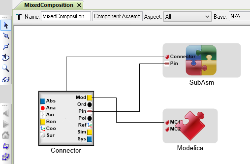

.. _connectors:

Appendix B: Connectors Explained
================================

**Connectors** are a powerful concept for raising the level of
abstraction for component composition. Think of them like a *bus* that
can aggregate multiple **Ports**, each with a **Role**.

An Example
~~~~~~~~~~

Consider the following example. In the component assembly
***Assembly***, there are two component instances called
***Component1*** and ***Component2***. They are both instances of
***SampleComponent***. Each has a *connector* called ***Connector***.
They are joined together within the assembly.

.. image:: images/10-example-assemblyview.png

If we navigate inside ***SampleComponent***, we can see its connector.

.. image:: images/10-example-connector-within-component.png

If we navigate inside ***Connector***, we can see the *ports* that make
up its *Roles*. Each *role* is a port of a specific type, and has a
unique name.

In this example, we have:

-  A *ModelicaConnector* with role ***ModelicaConnector1***
-  A *ModelicaConnector* with role ***ModelicaConnector2***
-  A *Pin* with role ***Pin1***
-  A *Pin* with role ***Pin2***
-  A *SystemCPort* with role ***SystemCPort***

.. image:: images/10-example-connector-internals.png

By aggregating all of these port types into a single *connector*, we're
able to connect them to another component all at once. By joining these
two connectors, we are "virtually" connecting all the role ports as
well.

Effectively, this model is equivalent to the "elaborated" version
depicted below, but using only 1 connection instead of 5.

.. image:: images/10-example-elaborated.png

Mixed Compositions
~~~~~~~~~~~~~~~~~~

The top structure is equivalent with the bottom structure. Note that
***Connector*** within the component assembly ***MixedComposition*** is
identical to ***Connector*** within ***SubAsm***.

.. image:: images/10-mixed-composition--elaborated.png

Exceptional Cases
~~~~~~~~~~~~~~~~~

It's best practice for *connectors* to be identical on both sides of a
*connector composition*. However, the **META** tools will try to resolve
ambiguous matches.

Names of Roles Don't Match
^^^^^^^^^^^^^^^^^^^^^^^^^^

If the name of a role within the first connector doesn't any role names
in a second connector, the **META** tools will try to find a match.

1. Within the first connector, is the role the only one of its port
   type?

   -  *e.g.: Is it the only Pin within the first connector?*
   -  If not, ***can't match***

2. Does the second connector have a role of the same port type?

   -  *e.g.: Does the second connector have a role of type Pin?*
   -  If not, ***can't match***

3. Is that role's port type unique within the second connector?

   -  *e.g.: Is it the only Pin within the second connector?*
   -  If not, ***can't match***

4. If all of the above, ***match the two roles***.

Consider this example. Two *component assemblies* are composed via
***SubAsm1***'s ***Connector1*** and ***SubAsm2***'s ***Connector2***.

.. image:: images/10-exceptional--mismatched-names--assembly.png

Looking inside each connector, we see that they each have one *role* of
each port type, but their names are different.

.. image:: images/10-exceptional--mismatched-names--connector2.png

.. image:: images/10-exceptional--mismatched-names--connector1.png

Since each role's port type is unique within its connector, the **META**
tools will try to match up the roles. The equivalent "elaborated"
version is depicted below. Note especially the console messages, which
tell us that a **non-name match** was established between these ports.

.. image:: images/10-exceptional--mismatched-names--elaborated.png

The warning tells us which *roles* from which *connectors* were matched
due to this inference, instead of by name:

::

    [Warning] Non-name match: Port 1ModelicaConnector in Connector Connector1 and Port 2ModelicaConnector in Connector Connector2 
    [Warning] Non-name match: Port 1Pin in Connector Connector1 and Port 2Pin in Connector Connector2 
    [Warning] Non-name match: Port 1SystemCPort in Connector Connector1 and Port 2SystemCPort in Connector Connector2 

