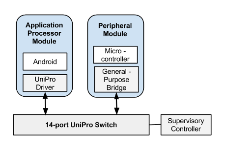
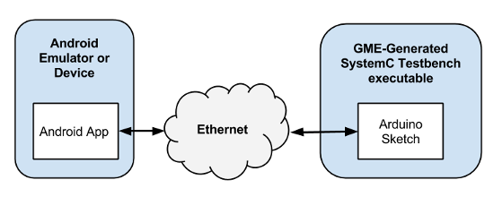
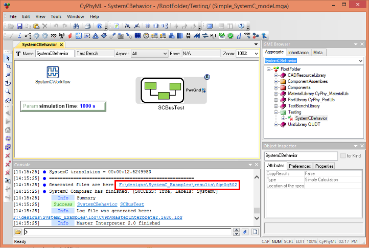
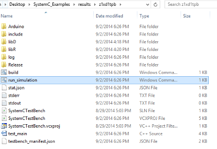
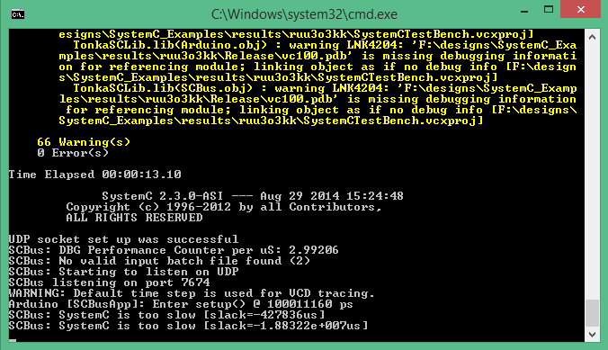
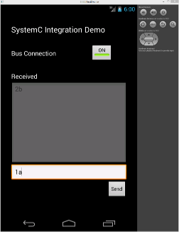
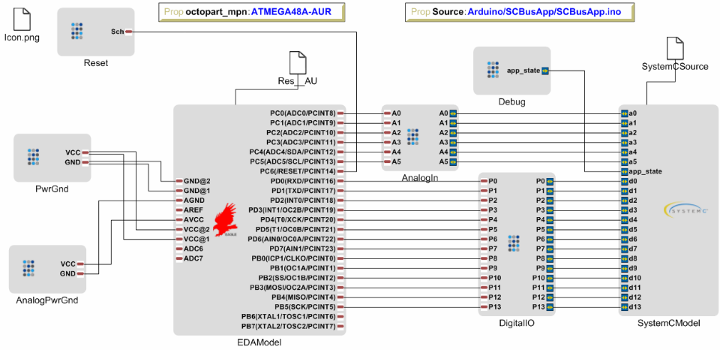
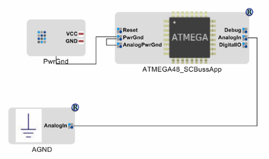

- - -
## Android/Firmware Communication Example
This section presents an example of the Android/Firmware communication capability of the META tools.

With the production Ara platform, modules will communicate with apps via the ***UniPro*** bus built into the Endo. This example uses the **SCBus** bridge to emulate this communication between module and application, allowing you to prototype app/firmware interactions without having to build hardware or acquire an *Ara Development Kit*.

The <b>[Simulation Architecture Overview](@ref simulation-architecture-overview)</b> section describes how the **SCBus** bridge works. <b>[Running the Demonstration Model](@ref running-the-demonstration-model)</b> will show you how to get the sample application and firmware up and running on your own computer. The final section, <b>[A Detailed Look](@ref a-detailed-look)</b>, will go into further detail on each element, and will help you use the simple example as a jumping-off point for your own designs.

### Simulation Architecture Overview
The figure below shows a high-level overview of the example system being modeled. An *Application Processor Module* and a *Peripheral Module* communicate with each other via UniPro.  In this example, Android software running on the *Application Processor* can communicate with firmware running on a microcontroller on the *Peripheral Module*.
 
 

*High-Level Overview of the Modeled ARA System*

This <i>High-Level Overview</i> borrows from <b>Figure 5.1 - Module to Module Communication (with Native UniPro Support and Bridge ASICs)</b> on page 58 of the <i>Project ARA Module Developer Kit (MDK) Release 0.11</i>.  The test environment used to model this ARA system is shown in the following figure.
 
 

*High-Level Overview of the Test Environment*

Compare this figure to the previous one.  On the left is an Android emulator or a cell phone, corresponding to an ARA AP module.  The emulator/cell phone runs an Android app corresponding to the one running on the AP module.  On the right is a *SystemC* hardware behavioral simulation, representing an ARA peripheral module. The <a href="http://arduino.cc/en/Tutorial/Sketch"><b>Arduino Sketch</b></a> block corresponds to microcontroller firmware running on a microcontroller in the Peripheral Module.

Instead of UniPro, this test environment uses <a href="http://en.wikipedia.org/wiki/User_Datagram_Protocol"><b>User Datagram Protocol</b></a> (UDP) packets sent over a wired or wireless Ethernet network to link the emulator/cell phone and the *SystemC* hardware behavioral simulation.  Alternatively, if both an Android emulator process and a SystemC test process are running on the same PC, the network can be internal to the PC. 

The Android app in the test environment is a regular Android app, except it also imports the **SCBus** <i>(SystemC Bus)</i> package that allows it to communicate with the SystemC test process over UDP.  

The SystemC hardware behavioral simulation communicates with the Android app as follows: The SystemC test process includes a simulated ATmega microprocessor, which runs user-supplied Arduino Sketch (`.ino`) firmware. The firmware uses the simulated ATmega's UART to communicate with the Android app. The **SCBus** function within the simulation handles the mapping between the simulated UART's data and the UDP-based **SCBus** protocol.

### Resources
The example META project for this feature can be found on the <a href="index.html" target="new"><b>Downloads</b> page</a>. The modeling project includes two `.xme` files.

| Meta Project Filename | Description |
| :------- | :---------- |
| `Simple_SystemC_model.xme` | A simple design featuring only a microcontroller on which to run the example firmware. |
| `SAMI_SystemC_model.xme` | Based on the Ara Prototype Module, this includes a microcontroller which runs the example firmware. |

The example Android app for this feature is included with the META tools install.

| Android App Project Path | Description |
| :--- | :---------- |
| `C:/Users/Public/Documents/META Documents/SystemC_Android/SystemCTest` | A simple Android app that uses the communication bridge discussed in this demo |

### Running the Demonstration Model
Running the demonstration involves three main parts:

1. Generating the SystemC-based simulation from the CyPhy model.
2. Compiling and running the example Android app.
3. Interacting with the app and observing the results.

#### Opening the Model and Generating the Hardware Simulation
After downloading the modeling project described in the **Resources** section above, unzip it to a directory. Open `Simple_SystemC_model.xme` to load the project.

To generate the simulation, open the ***SystemCBehavior*** test bench, found at path `/Testing/SystemCBehavior`. Execute the test bench by running the **Master Interpreter**. Be sure that **Post to META Job Manager** is selected.

Once the new job completes in the **Job Manger**, open the results folder by clicking the link that reads <i>"Generated files are here"</i>, as shown below:

The results folder will contain a number of artifacts, including a file named `run_simulation.cmd`. This is the command that we'll run later to execute the hardware simulation, but we'll wait until we get the Android app up and running.

#### Opening and Running the Android App
The example Android application is included with the META tools install, and its location is described in the **Resources** section above. Currently, the example application is only configured to compile using the **Eclipse ADK**. Support for **Android Studio** is in the works.

Compile the **SystemCTest** project and run it in an emulator. Once the app has loaded, you're ready to start running the Hardware Simulation.

*Note: The details of compiling Android apps varies by the environment, and isn't covered here. For more information, check the documentation that comes with your Android development environment.*

#### Running the Hardware Simulation
Now build and execute the hardware simulation by running `run_simulation.cmd` from the results folder. When prompted, choose to allow the simulation to communicate on both _Public_ and _Private_ networks:

Once the compilation is finished, the window will begin to display status messages, as shown below. Now, we can begin interacting with the simulation using the Android app.

#### Interacting With the Simulation
Click the app's ***Bus Connection*** button, so that its state switches to <i>"On"</i>. Enter numbers or text into the white text box near the bottom. Click ***Send*** to transmit the data to the hardware simulation.

The data sent by the app is read by the simulated microcontroller firmware by reading from a virtual serial port. The firmware takes each character of input and increments it by one. Thus, "1" will become "2", and "a" becomes "b". Once the microcontroller firmware has processed the input, the result is sent back via the virtual serial port, is received by the Android app, and finally is displayed in the large grey text box.

### A Detailed Look
This section goes into detail about the firmware and Android code used for this example.

#### Microcontroller Firmware
The microcontroller simulation model loads and executes user-provided firmware as part of its execution. This subsection will discuss the how the runtime firmware's location is specified, what syntax is supported, and what the example program does.

##### How the Runtime Firmware's Location is Specified
The runtime firmware of the demonstration model is in an Arduino sketch (`.ino`) file named `SCBusApp.ino`. The path to this file is specified via a property reference named ***Source***, within the ***ATMEGA48_SCBussApp*** component model (shown near the top right of the figure below).

The path to the `SCBusApp.ino` file in the ***Source*** property is relative to the project's root directory. To run different firmware in the simulation, this is the property to change.

 

*ATMEGA48_SCBussApp component model*

##### Connecting All Analog Inputs
Also seen in the right of the ***ATMEGA48_SCBussApp*** component model is the ***SystemCModel***. The ***SystemCModel*** has cerulean-colored *SystemCPorts*, representing the inputs and outputs of the SystemC ATmega model. For the demo, most of these ports aren't used and need not be externally connected. The exceptions are ports <b><i>a0-a5</i></b>, the analog input ports. SystemC requires that all input ports be driven; otherwise, generating the SystemC executable will fail. To prevent this, the analog inputs are connected to a SystemC analog ground component in the *Component Assembly* where the ***ATMEGA48_SCBussApp*** component is instantiated, as shown in the figure below.

 

*SCBusTest Component Assembly*

##### Supported Firmware Syntax
Arduino sketch firmware is described in the <a HREF="http://arduino.cc/en/Reference/HomePage"><b>Language Reference</b></a> of the Arduino website. At present, only a subset of the Arduino sketch language features are supported in the SystemC model. Specifically, importing libraries is not supported. In general, syntax that is part of the *C* programming language is supported, including control structures, comments, and operators. 

Supported Arduino-specific constants include **HIGH**, **LOW**, **INPUT**, **OUTPUT**, and **INPUT_PULLUP**.

Supported Arduino Sketch functions:

~~~~{.cpp}
void pinMode(int pin, int mode);
void digitalWrite(int pin, int val);
int digitalRead(int pin);
int analogRead(int pin);
void analogWrite(int pin, int val);
unsigned long millis();
unsigned long micros();
void delay(int ms);
void delayMicroseconds(unsigned int us);
int serial_read();
int serial_available();
void serial_write(int val);
~~~~

*NOTE: In the demo firmware, the serial communication functions **read**, **write**, and **available** are overridden, providing the interface between the firmware and the UDP-based **scbus**.*

##### What the Example Firmware Program Does
The SCBusApp.ino firmware receives data bytes from the UART, increments them, and returns them over the UART.  So, for instance, if an Android app sent the ASCII data bytes representing the characters "a", "b", and "c" to the SystemC test process via the scbus, the `SCBusApp.ino` firmware should receive those bytes, increment them, and return them, resulting in the Android app receiving the bytes "b", "c", and "d". The firmware also sets the duty cycle of a PWM output based on the value of the received byte. (On an Arduino, this would alter the brightness of an LED.)

The `SCBusApp.ino` firmware is reproduced below. It has an initial comment and some `const int` statements that can be mostly ignored. Then, like standard Arduino sketch firmware, it has `setup()` and `loop()` functions. The `setup()` function is called during initialization, and the `loop()` function is called afterward.

In this example, the `setup()` function initializes the simulated UART to 9600 bits per second, and the `loop()` function continually checks for a data byte from the UART.  Once such a byte is available, the loop function:

1. Reads the byte,
2. Uses it to set the PWM duty cycle of the simulated ATmega's pin 13, and
3. Writes the received byte, incremented, back to the serial port.

~~~{.cpp}
// SCBus firmware example

const int analog0Pin = 22;
const int analog1Pin = 19;
const int pwm0Pin = 13;
const int pwm1Pin = 14;
const int pwm2Pin = 15;

const int ANALOG_MAX = 1023;
const int ANALOG_MIN = 0;
const int PWM_MAX = 255;

void setup() {
  Serial.begin(9600);
}

void loop() {
  if (Serial.available() > 0) {
    int inByte = Serial.read();

    // Use incoming value as PWM duty cycle
    analogWrite(pwm0Pin, inByte);
    
    // Send back some data
    Serial.write(inByte + 1);
  }
}
~~~

Although this sketch firmware doesn't need to know the network address of the app it communicates with, the simulated processor does need to know it. Currently the network address is coded in the processor component model as `127.0.0.1:2003`, so it is expecting to connect to an Android emulator on the same PC.

#### Android Application Code
The Android application uses a library called **SCBus** to communicate with the simulated firmware. To use **SCBus**, one of the application's classes must implement the **SCBusListener** interface. If an instance of this class is passed into the **open()** method of an **SCBus** instance, then the **dataReceived(byte[])** method of the listener will be invoked when data is received.

**The Example Application**

In the example below, the **MainActivity** of the app implements the **SCBusListener** interface. An instance of **SCBus** is stored as a member variable of this class, and it's initialized when the class is created.

The operation of the **SCBus** class can be turned on an off via the **open(SCBusListener)** and **close()** methods. In the example, this is toggled with the button marked ***BusConnection***. When ***BusConnection*** is enabled, its handler, **onBusButton()** calls either the **open()** or **close()** method of the **SCBus** instance. The **open(SCBusListener)** method accepts the running instance of **MainActivity**, and when data is received from the microcontroller simulation, its **dataReceived(byte[])** method is invoked. The callback function then writes that data to the text box.

~~~{.java}
package tonka.systemctest;

import tonka.scbus.SCBus;
import tonka.scbus.SCBusListener;
[...]

public class MainActivity extends Activity implements SCBusListener {

    private final String TAG = "SystemCTest";
    private SCBus bus;
    
    @Override
    protected void onCreate(Bundle savedInstanceState) {
        super.onCreate(savedInstanceState);
        setContentView(R.layout.activity_main);
        
        bus = new SCBus();
    }

    public void onBusButton(View view) {
        boolean on = ((ToggleButton) view).isChecked();
        if (on) {
            bus.open(this);
            
        } else {
            bus.close();
        }
        Button sendButton = (Button) findViewById(R.id.sendButton);
        sendButton.setEnabled(on);
    }
    
    public void onSendButton(View view) {
        EditText text = (EditText) findViewById(R.id.sendText);
        bus.send(text.getText().toString().getBytes());
        text.setText("");
    }
    
    protected void onDestroy() {
        Log.d(TAG, "onDestroy");
        bus.close();
        super.onDestroy();
    }

    [...]

    @Override
    public void dataReceived(byte[] data) {
        Log.d(TAG, "dataReceived :" + new String(data));
        EditText text = (EditText) findViewById(R.id.receivedText);
        text.append(new String(data));
    }
}
~~~

This concludes the discussion of the Android/Firmware communication example.

