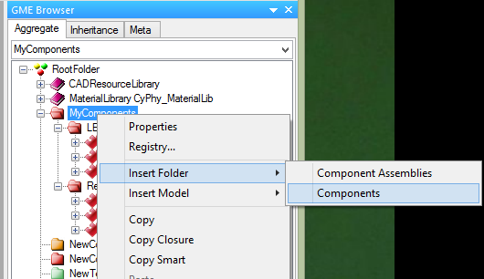

Chapter 6: Using the Component Library {#chapter-5-using-the-component-library}
======================================

## Browsing Your Component Library
You can access the components in your project by using the **GME Browser** (on the right hand side of the screen). 

Components are contained in special folders of a **red** color, also known as **Components** folders. It's not important which folder a given component is in -- folders are only for organization. **Components** folders can be _nested_, so you can organize them as you like:

To create a new folder, right-click on the parent folder, and choose **Insert Folder -> Components**.

To move a component from one folder to another, just drag-and-drop it to the new folder.

## Getting Components
To build designs in META, you'll need to import some **Components**. **Component packages** are ZIP files that include everything needed to use a component in design and simulation, such as 3D CAD models, EAGLE schematics, and icons.

Components can be exchanged freely between users or downloaded from websites.

MetaMorph Software has provided a limited component library with the alpha release of the META tools. A link to it can be found [here](index.html).

## Importing Components
Components can be shared in two forms, either as an `.acm` file with some other files and folders around it, or as a `.zip` package that includes all the file dependencies within it.

**To import a Component:**

1. Click the **Component Importer** on the **GME Toolbar**.
    
2. If you are importing a...
    1. Component **ACM** file, navigate to and select the `.acm` file. The importer will find the other files that this component depends on and import them into your project's backend folders.
    2. Component **ZIP** package, navigate to and select the `.zip` file. The ZIP file includes all of the files needed to use the component, and they'll be copied into your project's backend folders.
3. The **GME Console** will display a link to the imported component, and also its path within the ***Components*** folder tree of your model project.

This process can be repeated for any components you feel will be necessary for your design. You can import multiple components at the same time by selecting all of them.

## Exporting Components
The META tools include a utility which will create component packages from the components in your META project. These packages are ZIP files which contain everything that's needed to use a component.

**To export a single component:**

1. Open that component by double-clicking on it. 
2. Click the **Component Exporter** button:
    
3. You'll be prompted for a location in which to save the component package ZIP file.
4. A component package ZIP file will be produced in the folder you selected.

**To export *all* of the components in your META project:**

1. Close all of your editing windows.
2. Click the **Component Exporter** button:
    
3. You'll be prompted for a location in which to save your component package ZIP files.
4. For each component in your META project, a component package ZIP file will be produced in the folder you selected.