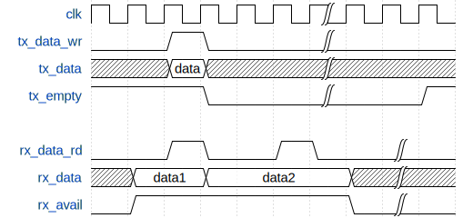

___
## SystemC Modeling

SystemC is a versatile discrete event simulation framework for developing event-based behavioral models of hardware, software and testbench components. In the Tonka development ecosystem, SystemC is well suited for capturing and experimenting with new peripheral modules, bus protocols and embedded software (*firmware*) and to validate interaction patterns among these and with the applications running on the core platform.

### SystemC Modeling Concepts

The SystemC behavioral model is part of the component description in CyPhyML. For developing new components and/or to provide SystemC models for existing ones, the following steps should be executed (e.g. for `ComponentX`):

- The behavioral model should be captured in SystemC (C++) source code. Ideally, this could be done by creating `ComponentX.cpp` and `ComponentX.h`. Currently, the model (`ComponentX.cpp`) should be compiled and linked to the `TonkaSCLib` library. Later, we will support on-demand compilation of these models in the testbenches
- A surrogate model has to be created in CyPhyML, capturing important interface-level information of the model. This includes the ports of the module, its parameters and the header file (`ComponentX.h`) which needs to be included in any testbench or assembly which uses this component.

Note, that the same approach is used for *testbench components*. However, the suggested design style is to capture the testbench logic only in the header file (`ComponentX.h`) and leave the implementation file empty (or does not provide one). This way, the testbench component will not depend on the TonkaSCLib library.

The following modeling concepts (visual language elements) are used in CyPhyML for capturing SystemC information:

#### SystemCModel

These models can be created within each component, if the component has a SystemC behavior model. This model element represents the entire SystemC model for the component. Optional parameters: *Author*, *Notes*, *FilePathWithinResource*. These parameters are not used by the current generator tools.

#### Resource

At least one of this model element should be created and connected to each `SystemCModel` instance. The *Path* parameter captures the path to the header file (`ComponentX.h`). Usually this is relative to the root of the TonkaSCLib include root. The code generator tools use this information to generate valid uses of the model.

#### SystemCPort

Each of these objects represent a SystemC port, thus they need to be kept in sync with the port declaration in the C++ code. The code generator tools uses text matching between the visual port object's name and the C++ declaration. The following attributes can be set on port objects:

- *DataType*: Note that CyPhyML and the current code generator tools support `sc_signal<>`-like ports only, The data type is the template parameter of these signals. Valid options are: *bool*, *sc_int*, *sc_uint*, *sc_logic*, *sc_bit*.
- *DataTypeDimension*: in case of *sc_logic* and *sc_bit*, this defines the bus width, in case of *sc_uint* and *sc_int* this is the size (in bits) of the integer. For *bool* types, this parameter is ignored.
- *Definition*: not used by the generator
- *DefinitionNotes*: not used by the generator
- *Directionality*: wether the port is input, output or bi-directional. In connectors or places, where the directionality can/should be inferred, use *not_applicable*.
- *InstanceNotes*: not used by the generator
- *Function*: this provides some hint for the code generator, marking special *clock* and *reset* ports for streamlined testbench generation

Note, that SystemC port can be agregated in `Connector` objects along with other port/interface objects of various design aspects. This is indeed the preferred way to expose ports from the component model. 
  

### SystemC Model Library

The current code generators require that all SystemC models are built and linked in the *TonkaSCLib* static library. This can be done, but adding the models to the SystemC solution. The infrastructure also provides a compiled version of the standard *SystemC Library* (current version: 2.3.0), *TonkaSCLib* depends on this. Both *Debug* and *Release* builds are available in the generated testbenches.

### Code Generation

The code generator should be invoked in a *TestBench* model, which contains exactly one workflow definition (*WorkflowRef*), one or more *TestComponent*(s) and a *SystemUnderTest* assembly or component. The generator collects all leaf-nodes with SystemC behavior models and will generate include statements for the appropriate header files. It also generates instantiation code and wiring statements along with boilerplate code for signal tracing and invoking the SystemC scheduler. The generated C++ file is included in a new project and solution which is instrumented with the binary version of *TonkaSCLib* and *SystemC Library*.

### SystemC / Android Integration

Currently, Android applications are either executed on a heavily modified **QEMU virtual platform** (*Android Emulator*) or on the actual phone hardware. The primary goal of both approaches is to validate functional requirements and to test application behavior in real-time. The emulator and the phone hardware do not provide any real-time guaranties, the application (and middleware/framework) software is executed as fast as possible, while the operating system (through the Android Framework libraries) provides read access to a real-time clock on the platform. This model of computation is very different from the DE model provided by SystemC. Yet, there is a valid need for providing a bridge between these two execution domains.

The main benefit of integrating the Android Emulator or Phone with SystemC is to be able to **co-simulate Android application software with virtual peripherals and embedded firmware.**

The key challenges in this integration task are:

- Implement a robust and accurate time synchronization facility between the two execution environments. Since, there is little control on the timing on the Android emulation or hardware platform, the primary goal is to execute the SystemC simulation in lockstep with the Android domain
- Implement two-way communication between the two simulation domains. Communication primitives should follow a typical high-level bus interface API and should provide a timestamped byte stream interface in both directions.

The current implementation provides an abstract bus interface on both sides (Android and SystemC), called *SCBus*. On the Android platform this virtual bus is implemented as a Framework library, which can be used in any Android application - whether it is running in the Emulator or on a phone. The bus library provides a simple API for connecting to the bus, sending and receiving arbitrary messages (byte arrays) to and from the simulated peripherals. 

The `SCBus` class provides the following operations:

- `SCBus::open(SCBusListener listener, String server)`: initiates a connection to the SystemC simulator (`Server`). All incoming messaged will be received by the `SCBusListener listener` object (see later)
- `SCBus::close()`: closes the connection to the SystemC simulator
- `SCBus::send(byte[] data)`: sends (with timestamp) an arbitrary data array to the other side of the virtual bus

The `SCBusListener` interface is used to receive incoming messages. Note, that while communication with the SystemC simulator is executed in background tasks within the bridge, the receiver callback will be called in the main GUI thread, which enables a streamlined application development.

- `SCBusListener::dataReceived(byte[] data)`: received a byte buffer from the SystemC side of the bus

On the SystemC side of the bus, one needs to include the `SCBus` component in the design - typically in the CyPhy model as part of the component assembly. This module provides a simple *UART-like* digital interface to the rest of the SystemC domain:

    SC_MODULE(SCBus) {

        // ports
        sc_in<bool>   clk;
        sc_in<bool>   rst;

        sc_in<bool>   tx_data_wr;
        sc_in<sc_uint<8>> tx_data;
        sc_out<bool>  tx_empty;

        sc_in<bool>   rx_data_rd;
        sc_out<sc_uint<8>> rx_data;
        sc_out<bool>  rx_avail;
        ...
    }

All port signals are synchronous with the incoming `clk` signal, except `rst` which is asynchronous/active high. The bus interface component contains unbounded (within practical limits) FIFOs in both directions. The status of these FIFOs can be checked with the `tx_empty` and `rx_avail` signals. The transmit FIFO can be written by preparing data on `tx_data` and strobing `tx_data_wr` for one clock cycle. Similarly, data can be fetched from `rx_data` and the next value will be provided after a pulse on `rx_data_rd`. The following timing diagram shows this simple protocol.

<!--
    http://wavedrom.googlecode.com/svn/trunk/editor.html

    {signal: [
  {name: 'clk', wave: 'p.....|...'},
  {name: 'tx_data_wr', wave: '0.10..|...'},
  {name: 'tx_data', wave: 'x.2x..|..x', data: ['data']},
  {name: 'tx_empty', wave: '1..0..|..1'},
  {},
  {name: 'rx_data_rd', wave: '0.10.10.|.'},
  {name: 'rx_data', wave: 'x2.=...x|.', data: ['data1', 'data2']},
  {name: 'rx_avail', wave: '01.....0|.'},
]}
-->

#### Implementation Details

The current bridge uses UDP messages both for synchronization and data message passing. A simple keep-alive mechanism (every second) ensures that messages are sent at at least this rate even if no user data is available. Each message contains a timestamp, which is taken on the transmitter side at the moment when the message is generated using the real-time on Android and the current simulation (DE) time in SystemC. On the Android side of the bus the timestamps of incoming messages are only used to give warnings of severely outdated (or future) packets. These warning messages are available through the `adb logcat` facility.

Timestamps of outgoing messages from the Android side are used for synchronizing the SystemC simulator to the wall-clock (Android real-time clock) as close as possible. The current synchronization algorithm is as follows:

1. The SystemC simulator (SCBus module) maintains the current simulated time (how far the discrete event simulator ran) and the current estimated real-time (based on incoming messages and its own real-time clock).
2. In every simulation macro-step the SCBus module strives to advance the simulation for 1ms (quantum) in wall time. It first executes the DE part to reach this target time point, then it busy waits for actually reaching this time instant (it detects and warns, if the DE simulation takes longer and no busy waiting is necessary).
3. After each quantum, the module checks for incoming messages and adjusts its wall clock estimate to the latest value of the incoming timestamps if the difference is above a set threshold (expected accuracy). It never alters the current simulation time (DE) value.
4. Then it places all incoming data to its receive FIFO and sends outgoing messages with the contents of its transmit FIFO.
5. Finally, it goes to step 1

With the current infrastructure, approximately 1ms timesync accuracy can be expected and a maximum of ~10kHz clocks can be used in the SystemC module(s) if cycle accurate models are built.
