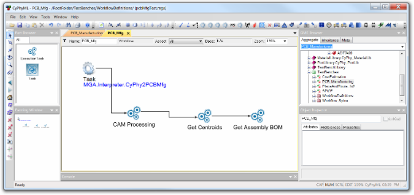

- - -
## PCB Manufacturing
**Location:** `TestBenches / AraTestBenches / PCB_Manufacturing`

This test bench automates the generation of files needed for PCB manufacturing and assembly.  Specifically, it can produce:
- Extended Gerber files and an Excellon drill file,
- a CSV file giving the location and rotation angle of each component, and
- an Assembly Bill of Materials (BOM).

### Configure
If you are _not_ using pre-loaded files supplied in the demo, you'll need to first run the ***PlaceAndRoute*** and ***CostEstimation*** test benches on your design, and, for now, manually copy their results into the design subfolder.  (The design subfolder is located in the `designs` folder, and has a random-looking name.  Its name can be determined by checking the "Path" attribute of the top-level component assembly.)  
For general instructions on running test benches, refer to the section [Using Test Benches](@ref using-test-benches).  

You'll also need an Eagle CAM job file for your design.  This file specifies, among other things, which Gerber plot files will be produced, and the mapping of Eagle board layers to Gerber plot files. Eagle comes with some sample CAM files, and some can be downloaded from PCB manufacturers, but making customized ones in Eagle CAD is not hard.

The value of the testbench's ***CAM file*** parameter must be set to the path of the CAM file.  This path can be either absolute or relative to the project folder.  

<i>Configured copy of the **PCB manufacturing** testbench with **AstableMultivibrator** as the system under test.</i>

### Metrics
This test bench produces no metrics.

### Outputs
| Filename | Description |
| :------- | :---------- |
| `assemblyBom.csv` | The generated assembly BOM file.
| `schema_centroids.csv` | The generated centroids file, with component locations and rotations.
| <i>(names depend on CAM file)</i> | Gerber plot files.  Names as specified in the CAM file.
| <i>(names depend on CAM file)</i> | Excellon drill file.  Name as specified in the CAM file.

### Workflow Details
In GME, the ***PCB_Mfg*** workflow consists of an initial __MGA.Interpreter.CyPhy2PCBMfg__ task, and three execution tasks, named ***CAM Processing***, ***Get Centroids***, and ***Get Assembly BOM***.  Each of these is explained in more detail below.

<i>The **PCB_Mfg** test bench.</i>

The __MGA.Interpreter.CyPhy2PCBMfg__ task starts when the **CyPhy Master Interpreter** runs from the ***PCB Manufacturing*** testbench.  This task copies input files from the design subfolder into the testbench's results folder, and starts a script to start the three execution tasks.

The ***CAM Processing*** execution task runs an Eagle CAM job on the design's board file, to produce Gerber files and n Excellon drill files.  The mapping of Eagle board layers to Gerber and Excellon files is specified via a standard Eagle CAM file.   The path to the CAM file is specified in META as the value of a test bench parameter named ***CAM file***.  The resulting Gerber and Excellon files will be named as specified by the CAM job file.

The ***Get Centroids*** execution task runs an Eagle User-Language Program (ULP) that creates a CSV file giving the location and rotation angle for each component on the board.  The resulting file is named `schema_centroids.csv`.

The ***Get Assembly BOM*** execution task produces a BOM CSV file, called `assemblyBOM.csv`, based on the EAGLE model's reference designators. It does this by taking the cost estimation BOM and a cross reference between META components and Eagle CAD component reference designators.

### Assumptions
The ***PCB manufacturing*** test bench is currently experimental.  The only output devices supported by the _CAM Processing_ execution task are extended Gerber and Excellon devices.
