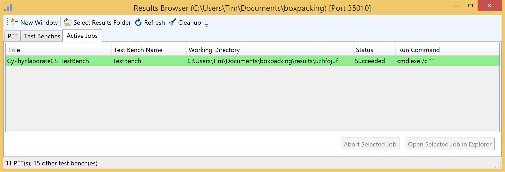

## Active Jobs Tab

### Active Jobs List Pane

This pane lists all the active jobs.

#### Column Headers

**Title**

# TestBenchResult: This is the only type of Test Bench List items.

**Test Bench Name**

This name is taken from the OpenMETA model at the time of execution by the Master Interpreter

**Working Directory**

This the directory that the job is executing/was executed in. You can open this directory by right-clicking a job and selecting 'Open in Explorer' or by highlighting the job and clicking 'Open Selected Job in Explorer.'

**Status**

This is the status taken from the Test Bench Manifest. The possible values are as follows:

* Succeeded: 
* Failed: 
* Running: 
* In Queue: 

**Run Command**

This is command that is called by the job executor to invoke the job (?).

#### Action Buttons

**Abort Selected Job**

This button will kill the selected job (or PET?).

**Open Selected Job in Explorer**

This button will open Windows Explorer at the location of the execution directory for the highlighted job.