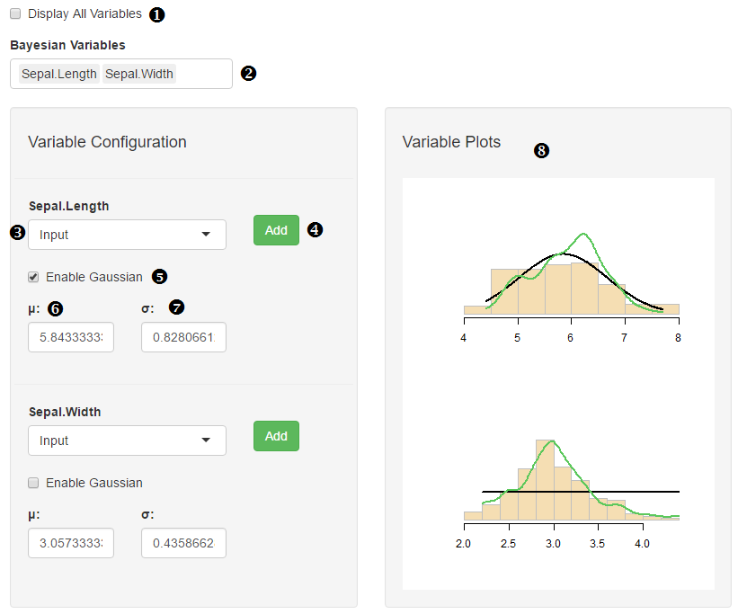

## Uncertainty Quantification

**1. Display All Variables**
	Checking this box sets all the variables in the data set to appear in the bayesian tab. 

**2. Bayesian Variables**
When ‘Display All Variables’ is deselected, this box allows users to specify which variables they would like to run bayesian analysis on.

**3. Variable Type**
	This drop down list sets the type of variable we are dealing with.

**4. Add**
	<insert function here>

**5. Enable Gaussian**
This will setup a gaussian-shaped curve to appear on the plots section (left-hand side of page).

* _Mean:_
	Sets the mean of the gaussian - default is the mean of the variable.
* _Standard Deviation:_
Sets the standard deviation of the gaussian - default is the standard deviation of the variable.

**6. Plots**
This section displays all the plots-histogram, plot of data set (on a single variable), and a possibly a gaussian.
