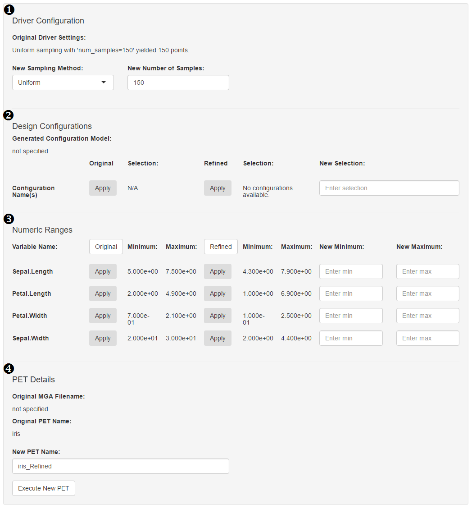

## PET Refinement

Provide brief description of this page.

**1. Driver Configuration**

_New Sampling Method:_

_New Number of Samples:_

**2. Design Configuration**

**3. Numeric Ranges**

_Original Numeric Ranges:_
This section displays the min and max value, for each variable, before any filtering has been applied.  Clicking ‘Original’ inserts all these value to the New Ranges (whereas clicking 1 apply adds the ‘new’ value for just a single row).

_Refined Numeric Ranges:_
This section displays the min and max value, for each variable, post-filtering.  Clicking ‘Refined’ inserts all these value to the New Ranges (whereas clicking 1 apply adds the ‘new’ value for just a single row).

_New Numeric Ranges:_
This section allows a user to set a new min and max value for each variable.  These values will appear in the ‘Export Ranges’ output.

**4. PET Details**
