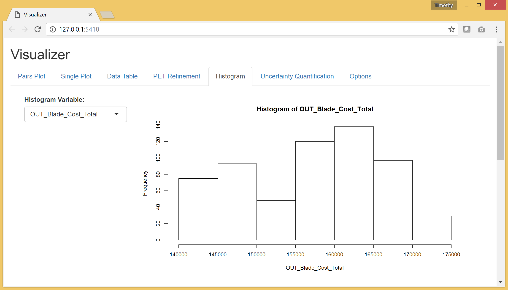

## Custom Tabs

In addition to the default tabs, the Visualizer is extensible to allow for custom, user-defined tabs to be added. The Visualizer is built using [R](https://www.r-project.org/) and a package called [Shiny](https://shiny.rstudio.com/). We implemented a simple method of adding custom tabs that allows the user to construct a single .R file that includes the definition of both the UI and the backend functionality of a tab.

### Basic Tab Structure

The basic structure of a custom tab is very simple. It must have the three following variable and function definitions present to be valid:

* `title`: This should be the desired title of the tab in the UI as a string.
* `ui()`: This function should should have no parameters and return a Shiny UI function that defines the desired UI.
* `server(input, output, session, data, info)`: This function is passed the following parameters:

  * `input`: This is the Shiny 'input' list. You will use this to access inputs generated in the UI.
  * `output`: This is the Shiny 'output' list. You will use this to assign values to outputs referenced in the UI.
  * `session`: This is the Shiny 'session' object. It is used by some of the more advanced Shiny functions.
  * `data`: This data frame includes the raw data that was passed to the Visualizer by the Results Browser.
  * `info`: This list includes relevant information about the dataset. It currently only has one element called `variables` which is a named list of lists that includes information about each variable. Each variable list includes:

    * `name`: the name of the variable. This is the same as the name of this list.
    * `nameWithUnits`: the name of the variable with the units include in parentheses.
    * `type`: Either "Design Variable" or "Objective".
	
	
E.g. In your `server` function, you could find the type of the first variable by evaluating `info$variables[[1]]$type`.

### Histogram Example Tab

Below is an example tab definition .R file.

~~~{.R}
title <- "Histogram"

ui <- function() {
  
  fluidPage(
    br(),
    column(3,
      selectInput("sandboxVar", "Histogram Variable:", c())
    ),
    column(9,
      plotOutput("sandboxPlot")
    )
  )
  
}

server <- function(input, output, session, data, info) {
  
  varNames <- names(data)
  varClass <- sapply(data,class)
  varNums <- varNames[varClass != "factor"]
  
  updateSelectInput(session, "sandboxVar", choices = varNums, selected = varNums[1])
  
  output$sandboxPlot <- renderPlot({
    if(input$sandboxVar != "")
      hist(data[[input$sandboxVar]],
           main = paste("Histogram of" , paste(input$sandboxVar)),
           xlab = paste(input$sandboxVar))
  })
  
}
~~~

The UI, defined in `ui()`, is simply a select box for the user to choose which variable to process for the histogram and a placeholder for the histogram plot itself.

The `server` function is where we describe the backend processing that produces plots and other outputs for the UI. The body of this function begins by creating a list, `varNums`, of all the variables of type numeric. It then updates the options presented to the user (which was originally defined as an empty list) in the "Histogram Variable" select box according the `varNums` list. Finally it defines the plot to be a histogram of the variable selected in the "Histogram Variable" select box with a title and x-axis label.

The rendered tab looks like this:

This example can be found at `C:\Program Files (x86)\META\bin\Dig\tabs\examples\exampleTab1.R` (or wherever you installed OpenMETA) and used as the basis for creating tabs of your own.

### Adding Your Own Tab

#### Creating the File

Navigate to `C:\Program Files (x86)\META\bin\Dig\tabs\` to see all the currently configured user-defined tabs. Each file here corresponds to a single tab in the Visualizer. To create a tab of your own simply copy the example tab from `./examples` to this folder and modify it to suit your needs. The next time you launch the Visualizer, your tab will be included in the tabset.

_Note: The tabs are added in the order that they appear in this directory, so it may be useful to prepend an number to the filename._

#### Developing your Application

We recommend using [RStudio](https://www.rstudio.com/) to develop your custom tabs. It offers syntax highlighting, code completion, and debugging support. After downloading and installing the software, you should be able to open the `Dig.Rprog` project file at `C:\Program Files (x86)\META\bin\Dig\` and launch the Visualizer directly from RStudio.

To enable breakpoints in RStudio in your tab file code you will have to uncomment (Ctrl-Shift-C) the `debugSource` call towards the top of `server.R` file.

~~~{.R}
customTabEnvironments <- lapply(customTabFiles, function(filename) {
  env <- new.env()
  source(file.path('tabs',filename), local = env)
  # debugSource(file.path('tabs',filename), local = env)
  env
})
~~~
 
