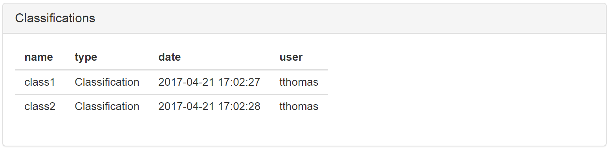

## Framework Features

The Visualizer Framework provides an abstraction layer between the Results Browser and the tabs that it hosts. As such it provides the following services to the tabs:

1. Reads in the data and wraps it as a Shiny reactive data frame.
2. Provides a global concept of _Filtered_ and _Colored_ data that tabs can access.
3. Provides a place to save user _Comments_ and _Sets_.
4. Gives tabs the ability to add columns to the raw data frame as _Classifications_.
5. Saves the session state (including UI inputs and certain data the tabs specify) on close and restores the session when the Visualizer is later launched from the same config file.

To facilitate interaction with the Visualizer framework itself, a footer is provided at the bottom of all the tabs that request it. This request is made by placing a `footer <- TRUE` statement in their definition. For example, the "Histogram.R" example tab below requests this footer. 

### Filters

The 'Filters' section is the first section in the Visualizer footer.

**<s>1. View All Filters**
This selects between displaying ether filters for every variable or just filters for those variables chosen in the pairs tab (see Display Variables).</s>

**2. Reset Visible Filters**
This button will return the visible filters to their original state (fully opened).

**3. Filters**
These filters (3 filters are shown above in the picture), will carve out the dataset to include only the points that fit within the ranges for each variable.  If you limit the dataset to have 0 points a message will appear in the pairs plot telling you that “there are no data points that fit the current filtering scheme”. 

**4. Exact Entry Window**
When a slider is 'double-clicked', a new window opens up allowing the user to specify an exact range for the filter.  The window shows the name of the variable along with text fields for minimum and maximum range.

**5. Apply (exact entry)**
This button applies the new values set for the filter.  Any field left blank or containing non-numeric numbers is ignored when this button is clicked.

### Coloring

### Classifications

