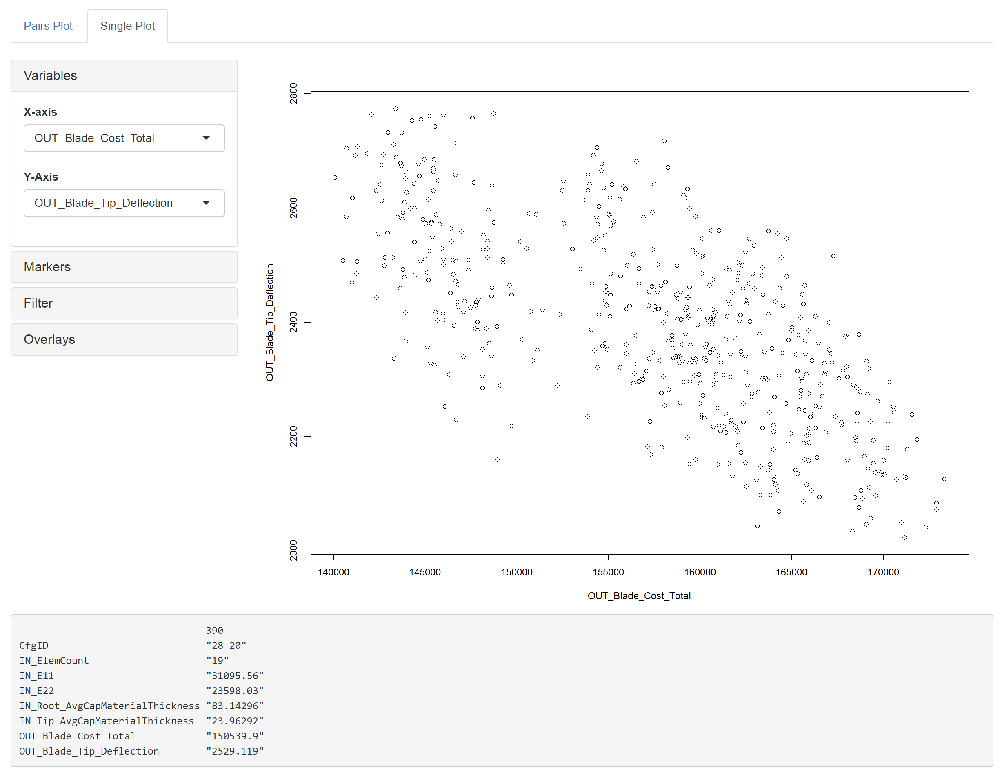

### Explore Tab

The first sub-tab in the _Explore_ tab is the _Pairs Plot_ tab.

#### Variables

* **Display Variables:** This is where you set what the variables are displayed on the main plot  

* **Render Plot:** This button is available only if 'Render Automatically' option is unselected.  Clicking this button produces a plot based on current user settings.

#### Plot Options

* **Render Automatically:** This option causes the pairs plot to automatically update anytime a setting is changed.  If this box is unselected, a ‘Render Plot’ button appears in the _Variables_ panel where the plot will wait to update until a user clicks this button. This is useful when changing the variables for the plot when working with a large dataset or relatively large number of variables.
* **Overlay Trendlines:** Activating this option displays trendlines pairs plot.
* **Display upper panel:** Activating this option displays the upper panel as well as the lower panel of the pairs plot. 

#### Markers

* **Plot Markers:** This selects the marker used to create the plot.
* **Marker Size:** This selects the relative size of each of the points.

#### Export

* **Dataset:** Downloads a csv file containing all the data used to create the current plot.
* **Plot:** Downloads a pdf of the plot display.

#### Info Pane

This box shows the information about the data set.  "Total Points" shows how many data points are in the set.  "Current Points" shows how many points are being used for plotting.

---

The second sub-tab in the _Explore_ tab is the _Pairs Plot_ tab.

#### Variables

* **X variable:** Set the variable for the x axis.
* **Y variable:** Set the variable for the y axis.

#### Markers

* **Plot Markers:** This selects the marker used to create the plot.
* **Marker Size:** This selects the relative size of each of the points.

#### Filter

A user can click and drag a selection on the plot, and once a selection is made, these buttons will adjust the global filters for the x and/or y variable to match the range of the selection.

#### Overlays

* **Add Pareto Plot:** This enables the addition of a pareto plot and allows you to specify the objectives.
* **Add Contour Plot:** This enables the addition of a contour plot and allows you to specify the third variable for the contour.

#### Near Points Info

By clicking on the graph, data points near the click will display their info in this panel.
