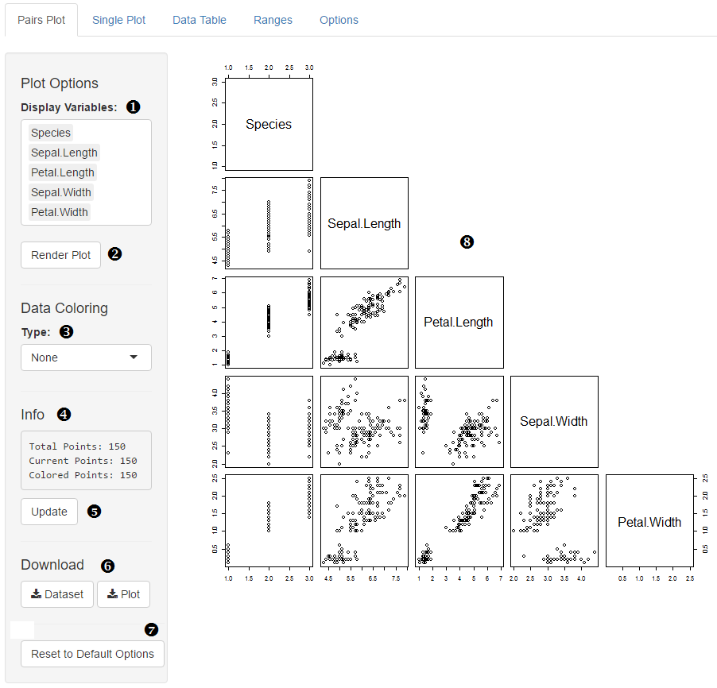

### 'Explore' Tab

**1. Display Variables**

This is where you set what the variables are displayed on the main plot  

**2. Render Plot**

This button is available only if ‘automatically rerender plot’ option is unselected.  Clicking this button produces a plot based on current user settings.  As a result of this mode, changing user settings will leave the plot unchanged as a user makes modifications to the app (until clicking this button).

**3. Data Coloring**

* _Max/Min:_ Color the data by setting a range on a specific variable (a range bar and variable picker show up once you select this option).  Default colors are red for points below the range, yellow for points in the range, and green for points above the range.  Colors can be changed in the options tab.

* _Discrete:_ Color the data by each individual discrete variable.  A variable picker for all the discrete variables in the dataset shows up once you select this option.  The coloring palette can not be modified by the user.

* _Highlight:_ Color the data by only the points selecting by the highlight brush in the single plot tab.  

**4. Info Pane**

This box shows the information about the data set.  Total points show how many data points are in the set.  Current and visible points show how many points are being used for plotting.  Information on colored points show up once a coloring method is selected.

**5. Update info pane**

This button is available only if ‘automatically refresh info pane’ option is unselected.  Clicking this button causes the info pane to update based on current plotting/filtering.  

**6. Download Dataset/Plot**

* _Dataset:_ Downloads a csv file containing all the data in the set, post-filtering.

* _Plot:_ Downloads a pdf of the plot display [7].

**7. Reset to Default Options**

This button returns the state of the pairs tab to look like the above picture.  It affects items 1, 2, and 3. 

**8. Plot Display**

This is where the scatter plot matrix is displayed.

**1. X variable**

Set the variable for the x axis.

**2. Y variable**

Set the variable for the y axis.

**3. Adjust sliders**

A user can click and drag on the graph [5], and once a selection is made, these buttons will adjust the filters for the x and/or y variable to only contain the data inside the selection.

**4. Highlight**

Once a user makes a selection by click-and-drag, this button will send the user to the pairs plot tab and color all the data points inside that selection.  Default blue (color can be changed in options tab.

**5. Plot display**

This is where the plot gets displayed.

**6. Near Points Info**

	By clicking on the graph, data points near the click will display their info in this panel.

