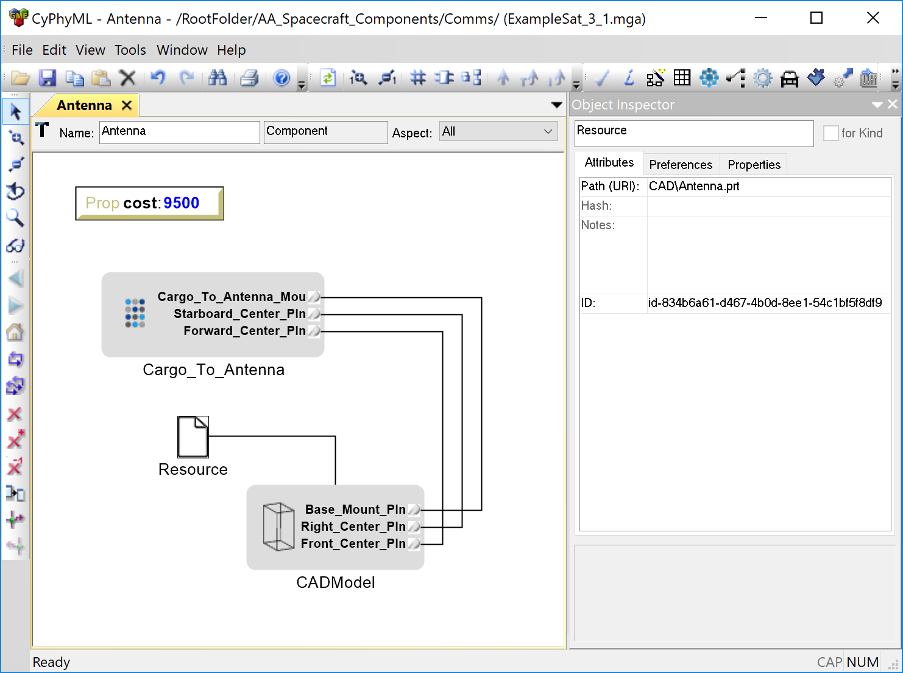
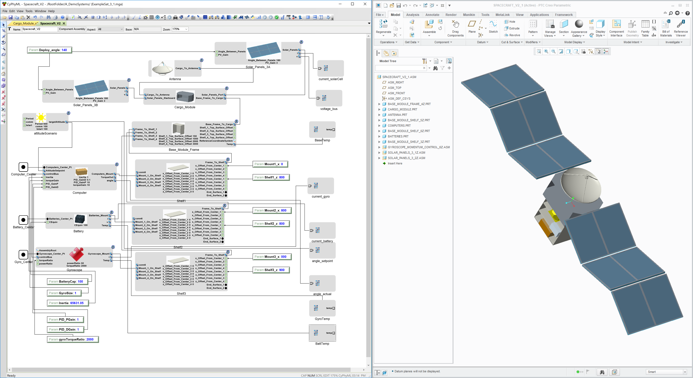

.. _cad_concepts:

============
CAD Concepts
============

This section briefly describes the the process for adding CAD resources to
OpenMETA Components and generating CAD assemblies by integrating a number of
OpenMETA Components into an OpenMETA Component Assembly and launching
:ref:`Metalink`.

OpenMETA currently has a single publically-available CAD integration:
PTC Creo Parametric 3.0. For this reason, the below concepts will be
explained using Creo.

Constraint Methodology
~~~~~~~~~~~~~~~~~~~~~~

Key connection points on CAD resources are marked with *datums*,
which can be constrained in OpenMETA to the datums of other connected
components to generate an assembly. By expressing these constraints in OpenMETA
on these connection points, instead of relative-position offsets, a
complex component can be automatically composed out of 
other simpler components using fixed and/or partially constrained joints.

Preparing CAD Parts and Assemblies
~~~~~~~~~~~~~~~~~~~~~~~~~~~~~~~~~~

Each part that is used in an OpenMETA model first needs to be prepared in the
native CAD environment. *Datums* that will be used for constraints as well as
any *Parameters* that will be used to adjust the dimensions of the part in OpenMETA
need to be added at this time.

.. figure:: images/antenna_planes.png

   Antenna part with three datum planes to define a mounting interface

In the *Antenna* CAD part above, you can see three planes at the base of
the antenna that will be used to express where it should mount to another
component in the system.

CAD Models
~~~~~~~~~~

A CAD resource (part or assembly) referenced in an OpenMETA component is expressed
inside an OpenMETA component with a **CAD Model**. CAD Model models contain
references to any datums *(planes, axis, coordinate systems, and points)*
that are required to define interfaces between components. The block can also
contain parameters, which can be used to change the dimensions in the
model based on values given in OpenMETA.

.. figure:: images/cad_model_in_component.png
   :alt: CAD Model in an OpenMETA Component

   CAD Model in an OpenMETA Component

Each OpenMETA component has a corresponding folder in the ``components/`` folder in the
project directory; this is where any domain specific files are stored.
The *Resource* atom that is connected to the CAD Model above specifies the location of
the referenced native CAD file relative to the component directory.

CAD Models and Resources can be added to a component manually, but this becomes
rather tedious when there are many CAD files that need to be added.
The :ref:`component_authoring_tool` described in the next section automates the
creation of the CAD Models and associated Resources for a given CAD part or assembly.

.. _component_authoring_tool:

Component Authoring Tool
~~~~~~~~~~~~~~~~~~~~~~~~

The Component Authoring Tool (CAT) makes it easy to create CAD Model models within OpenMETA
components by simply selecting the part file that you want to be added to the component.
Open the CAT by opening the OpenMETA component for which you wish to add a CAD resource
and clicking the |CAT_TOOL| button on the toolbar.

.. |CAT_TOOL|:: images/cat_tool.png

The CAT can be used to add many different types of domain models to an OpenMETA component,
but to add a CAD resource, simply click the "Add CAD" button.

CAD Joint Connectors
~~~~~~~~~~~~~~~~~~~~

OpenMETA Connectors allow us to wrap multiple domain ports into
a single exposed connector on an OpenMETA component.
For CAD purposes we often wrap a collection of datums that represent
a joint into a single connector.
Below you can see the three planes of the antenna part being wrapped
by a single "Mount" connector.

   Antenna component with a "Mount" Connector

See the :ref:`connectors` section of the :ref:`concepts` chapter for more information on Connectors.

Composing Assemblies
~~~~~~~~~~~~~~~~~~~~

Composing CAD assemblies in OpenMETA is as simple as adding components
to an OpenMETA Component Assembly and creating a connection between the
desired connectors.

.. figure:: images/simple_assembly.png
   :alt: Simple OpenMETA Assembly

   Simple OpenMETA Assembly

After an assembly is created, you can view the composed CAD geometry
by executing :ref:`cad_test_bench` or running :ref:`metalink`;
both processes are described below.

.. _cad_test_bench:

CAD Test Benches
~~~~~~~~~~~~~~~~

Add the created component assembly as the System-Under-Test (SUT)
in a CAD TestBench

.. _metalink:

Metalink
~~~~~~~~

Examples
~~~~~~~~

With Creo installed, check out the :ref:`spacecraft_model` walkthrough.

   Image of the Spacecraft Component Assembly and CAD Representation

