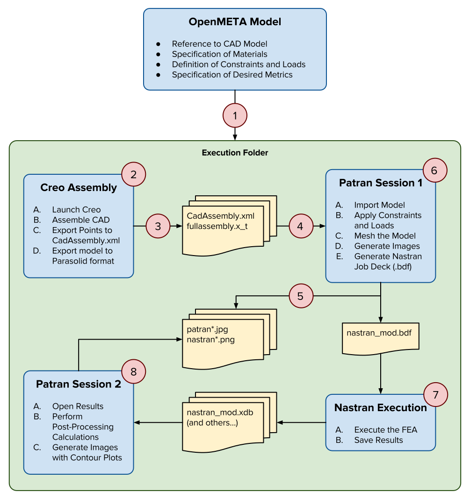

.. _fea:

Finite-Element Analysis (FEA)
=============================

OpenMETA is capable of executing an FEA analysis on a CAD model.
The diagram and the description below details the full workflow.

1. The OpenMETA Master Interpreter generates an execution directory with
   everything needed to execute the job.
2. All the composed parts specified in the OpenMETA Component Assembly
   are assembled using PTC Creo.
3. Creo exports a list of named points and a Parasolid file of the model.
4. MSC Patran imports the model, converting the geometry to surfaces.
5. The model is meshed and Patran exports images of the resulting mesh.
6. Patran attaches material properties, constraints, and loads to the model
   based on the contructs in the OpenMETA model and prepares a deck for
   analysis using Nastran.
7. Nastran executes the analysis.
8. Patran opens the Nastran results, performs post-processing, and generates
   contour plot images of the stress.

   Diagram of the OpenMETA Structural FEA Test Bench Workflow

This rest of this sub-chapter will serve as a tutorial that demonstrates the FEA
analysis capability of OpenMETA. This tutorial builds upon the skills learned
in :ref:`led_tutorial`, so it may be necessary to complete that chapter
prior to attempting this one.

.. toctree::
   :maxdepth: 1
   :caption: Sections

   fea_tutorial_preparation
   fea_create_openmeta_component
   fea_build_openmeta_component_assembly
   fea_build_fea_testbench
   fea_perform_analysis
