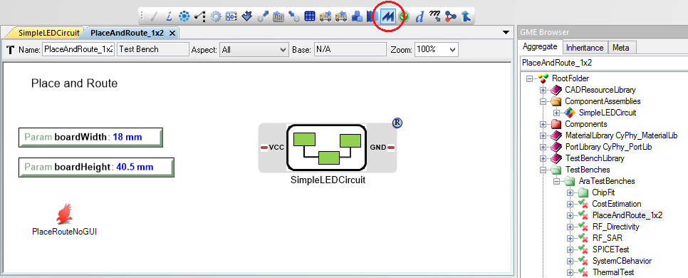
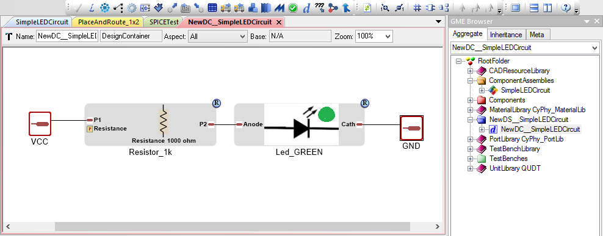
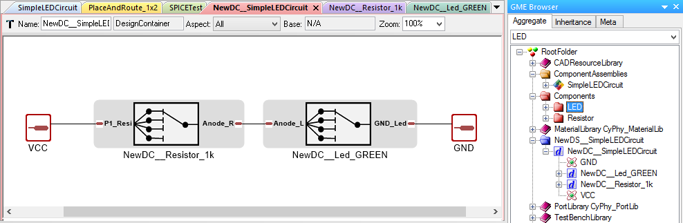

.. _ledtutorial:

LED Tutorial
============

This chapter will serve as a tutorial that illustrates the OpenMETA
design concepts. We will build a beginner-level circuit to teach the
basic fundamentals of the tools.

Through this tutorial you will learn how to:

-  Build a Component Assembly
-  Generate schematics
-  Perform electrical analysis and simulation
-  Generate a Design Space
-  Generate schematics for all designs on a Design Space
-  Perform analysis and simulation on all designs on a Design Space

Getting Started
---------------

To view all the results of this tutorial you should install Autodesk EAGLE as
described in the :ref:`eda` subchapter. If you choose not to install EAGLE, you
will still be able to complete the whole tutorial.

Downloading the Tutorial Zip File
~~~~~~~~~~~~~~~~~~~~~~~~~~~~~~~~~

To complete this tutorial you will need to download the `LED Tutorial
Model <http://docs.metamorphsoftware.com/alpha-releases/design-models/LED_Tutorial_Files.zip>`__.

Setting Up Directory
~~~~~~~~~~~~~~~~~~~~

1. Once you've downloaded the tutorial model, unzip it and double-click
   ``LED_Tutorial.xme`` to open it in the **GME**.
2. Save the project to the directory provided by GME (where your ``.xme`` file
   is located), taking note of this directory as you will need to access
   this location later in the tutorial.

.. note:: Resources in the OpenMETA model are referenced relative to the
   ``.mga`` or ``.xme`` project file and this relationship must be maintained.
   For example, you must not move the ``components/`` folder that is included
   in this example.

Building a Basic LED Circuit Model
----------------------------------

In this first secftion, we'll build a
simple LED circuit. Engineers often use multiple types of analysis
software to test their designs. This practice takes time; you need to
learn each piece of software and compose a model for each one that will
test for a parameter. However, the OpenMETA tools allow you to run
multiple types of analyses by composing just one model.

Creating a New Component Assembly
~~~~~~~~~~~~~~~~~~~~~~~~~~~~~~~~~

In the OpenMETA tools, we build a design by instantiating
components and joining their interfaces, yielding a *Component
Assembly*. We call this process *composition*. From this composed
design, we can generate new models and run analyses.

We begin by connecting our components in a single component assembly.
Let's set up our **Component Assembly** by making a new folder and
model.

In the **GME Browser** window:

1. Right-click on the **RootFolder**, and choose **Insert Folder -->
   Component Assemblies**.
2. Right-click on **ComponentAssemblies**, and choose
   **Insert Model --> Component Assembly**.
3. Rename this new component assembly **SimpleLEDCircuit**.

Browsing the Component Library
~~~~~~~~~~~~~~~~~~~~~~~~~~~~~~

In the **GME Browser** window:

1. Expand the **RootFolder** to see the folders in your project.
2. Expand the **Components** folder, as well as its subfolders (LED
   and Resistor), to see the available components.

We have included six components into your project file: three resistors
and three LEDs.

.. image:: images/03-02-component-library.png
   :alt: Component Library

.. _populate_the_component_assembly:

Populate the Component Assembly
~~~~~~~~~~~~~~~~~~~~~~~~~~~~~~~

Double-clicking on **SimpleLEDCircuit** will open a white canvas.

To populate a component assembly, the components need to be copied and
pasted into the canvas as *references*. There are two ways to do this.
We will show you the two different methods as we instantiate the LED and
Resistor components.

Instantiate an LED using Method 1:
^^^^^^^^^^^^^^^^^^^^^^^^^^^^^^^^^^

1. In your **GME Browser**, locate **Led_GREEN** in the
   **Components** folder.
2. Right-click on it and choose **Copy**.
3. Right-click on your white canvas, and choose **Paste Special --> As
   Reference**.

Instantiate a resistor using Method 2:
^^^^^^^^^^^^^^^^^^^^^^^^^^^^^^^^^^^^^^

1. In your **GME Browser**, locate **Resistor_1k**.
2. **Drag and drop** the resistor onto your white canvas with a
   **right-click**.
3. Select **Create Reference**.

.. warning:: Do not drag with left-click as this will remove the component from
   its containing folder and void any references that point to this component.
   Undo this with :kbd:`(Control-z)` or by selecting ":menuselection:`Edit -->
   Undo`" from the menu.

In the future, you can use whichever method you prefer, since they
produce the same result.

.. _joining_the_component_interfaces:

Joining the Component Interfaces
~~~~~~~~~~~~~~~~~~~~~~~~~~~~~~~~

The flow of current in this simple design will be as follows:
:menuselection:`Voltage Source --> 1k Resistor --> LED --> Ground`. Since we
don't have a power source or ground connection yet, we'll start by joining the
:menuselection:`1k Resistor --> LED`.

1. Change your cursor to **Connect Mode** by pressing :kbd:`(Control-2)` or
   clicking the **Connect Mode** button |connectmode| in the toolbar.
2. Click the icon next to **P2** of the Resistor.
3. Click the icon next to **Anode** of the LED.

If something goes wrong, you can backtrack with "undo" :kbd:(Control-Z) or
:menuselection:`Edit --> Undo`. If you need to remove connections use
**Disconnect Mode**: :kbd:`(Control-3)` or
|disconnectmode|.

When you are done, return to **Edit Mode**: :kbd:`(Control-3)` or
|editmode|.

Creating External Interfaces
~~~~~~~~~~~~~~~~~~~~~~~~~~~~

Our circuit is still missing a power source and sink. We must create two
external connectors into our circuit: power supply and electrical
ground.

Create new external connectors for your component assembly
^^^^^^^^^^^^^^^^^^^^^^^^^^^^^^^^^^^^^^^^^^^^^^^^^^^^^^^^^^

1. In the **Part Browser** window on the left side, locate the **Pin**
   (see the figure below).
2. Drag and Drop two **Pins** into your component assembly with
   **left-click**.
3. Rename the pins to **VCC** and **GND**.

.. image:: images/03-02-pin.png
   :alt: pin part in part browser

Connect external connectors to components
^^^^^^^^^^^^^^^^^^^^^^^^^^^^^^^^^^^^^^^^^

Recall the circuit architecture that we have planned: :menuselection:`Voltage Source
--> 1k Resistor --> LED --> Ground`. We'll use the same method as
connecting the ports of two components.

1. Return your cursor to **Connect Mode** (see `above`__).
2. Create a connection from **VCC** to **P1** of the Resistor.
3. Create a connection from **GND** to **Cath** of the LED.

__ joining_the_component_interfaces_

Although we're counting on the power and electrical ground to be
provided externally, we've implemented the architecture we proposed at
the beginning of the section: :menuselection:`Voltage Source --> LED --> 1k
Resistor --> Ground`. Your component assembly should look like the figure below.

.. figure:: images/03-02-completed-assembly.png

   *Completed LED and Resistor Assembly*

Generating a Schematic
----------------------

The OpenMETA tools support generating schematics and layouts from **EAGLE**.
For this type of analysis we will use the **PlaceAndRoute_1x2** test bench,
which generates manufacture-ready files of our component assembly for a
20mm x 40mm printed circuit board.

.. _configuring-a-test-bench:

Configuring a Test Bench
~~~~~~~~~~~~~~~~~~~~~~~~

1. In your **GME Browser**, expand the :menuselection:`TestBenches --> ARA
   TestBenches` folders.
2. Locate the **PlaceAndRoute_1x2** test bench.
3. Double-click it to open it.
4. Create a reference of **SimpleLEDCircuit** in the **Test Bench** by
   copying and pasting as a *reference* using the `same method as
   before`__.
5. Select the Reference role type: *TopLevelSystemUnderTest*.

__ populate_the_component_assembly_

.. note:: The procedure described in steps 4 and 5 is the same for referencing
   a design within any OpenMETA Test Bench.

Running a Test Bench
~~~~~~~~~~~~~~~~~~~~

A test bench is executed by running the **Master Interpreter**. You can find
its icon on the **GME Toolbar**:

1. Click the **Master Interpreter** icon.
2. Make sure **Post job to META manager** is checked.
3. Click **OK**.
4. Once your job successfully completes and turns green in the **Active Jobs**
   tab of the :ref:`resultsbrowser`, right-click it and select Show in explorer.

In the folder, you will find a number of different files. One of them is
the generated Eagle schematic: **schema.sch**. Double-click it and open
it with **Eagle**.

.. note:: If this is your first time using Eagle, a dialogue box might ask
   how you want to run Eagle without a license. Click run as Freeware.

.. image:: images/03-03-schema-sch.png
   :alt: Generated Eagle Schematic

You'll see the green LED and 1k resistor that we selected. You may also
notice that the two parts are not connected with lines, but instead with
*nets*. Generated schematics will not include lines, but will instead
use nets like this that identify any number of pins that are connected
together.

If your job does not execute properly, send us a note at
**beta@metamorphsoftware.com**.

Performing Circuit Analysis
---------------------------

Next we will perform a circuit analysis via **SPICE**, a circuit simulation
software, on our **SimpleLEDCircuit** component assembly.

1. Open up the **SPICETest** test bench.
2. Create a reference of **SimpleLEDCircuit** using the `same method as
   before`__.
3. Connect the corresponding pins, **VCC** and **GND**, of the
   **SimpleLEDCircuit** to those of the **Test Components**.
   (Connecting GND to either Test Component will work)

   __ populate_the_component_assembly_

Now we are going to run a simulation that provides 5V DC to **VCC**
while establishing an electrical ground for **GND**.

Generating Results
~~~~~~~~~~~~~~~~~~

1. Locate the **Master Interpreter** icon near the top and click it.
2. Make sure **Post to META Job Manager** is checked.
3. Click **OK**.

.. image:: images/03-04-SPICE-Test-bench.png
   :alt: SPICE Test

The :ref:`resultsbrowser` will launch if it is not already open and begin
running your simulation. After a few more moments, the new job
should change from blue to green. If there is an
error and the test bench fails, it will turn red.

Viewing Results in Spice Viewer
~~~~~~~~~~~~~~~~~~~~~~~~~~~~~~~

1. Once your job successfully completes and turns green, right-click it
   and select **Show in explorer**.
2. Double-click the ``LaunchSpiceViewer.bat`` file.

As you can see, this circuit draws about **23.5 milliWatts** of power
with about **4.5 milliAmps** of current.

Adding Design Space Concepts
----------------------------

So far, we constructed a simple LED circuit consisting of a *single* LED
and a *single* resistor. In the OpenMETA tools, this is referred to as a
*Design Point*. In this section, we'll modify our simple LED circuit to
use a selection of resistors and LEDs in our design by creating a
**Design Space**.

This section of the tuturial builds upon the previous sections, so
you'll need to use the model that you built. Alternatively, you can open
``Walkthrough_LED_part2.xme``, which includes all of the work from the
previous sections.

Refactoring a Design Point into a Design Space
~~~~~~~~~~~~~~~~~~~~~~~~~~~~~~~~~~~~~~~~~~~~~~

We must first convert our *component assembly* to a *design container*
and then convert each *component* into a *design container*.

1. Open up **SimpleLEDCircuit** and make sure nothing in the canvas is
   selected.
2. Click the **Design Space Refractorer** icon (3 blue colored
   boxes). |Design Space Refactorer icon|
3. Go to the **GME Browser** Window and locate and expand the blue
   **NewDS__SimpleLEDCircuit** folder.
4. Double-click **NewDC__SimpleLEDCircuit** to open it.

You'll notice that it looks *exactly* like your previous component
assembly. It has preserved the component names, port names, connections,
and layout. However, since we now have a design container, we can begin
adding variability to the design space.

Convert Component into Alternative
~~~~~~~~~~~~~~~~~~~~~~~~~~~~~~~~~~

Starting with the 1k resistor:

1. Select **Resistor_1k**.
2. Click the **Design Space Refactorer** tool, again.
3. When prompted, choose to convert the selected Component to a new
   **DesignContainer**.

.. image:: images/03-03-ds-refactor-prompt.png
   :align: center

4. Double-click the new **Design Container** that replaced your 1k
   resistor.
5. Drag in references of the other two resistors from the **Components**
   folder. See method 1 or 2 `above`__.
6. Mimic the connections of **Resistor_1k** so that each resistor in
   the design space matches the paradigm: :menuselection:`P1_Resistor_1k -->
   resistor_X --> Anode_Resistor_1k`

__ populate-the-component-assembly

.. image:: images/03-05-new-dc-resistors.png
   :alt: Resistors in New Design Space

Go back to **NewDC__SimpleLEDCircuit** and repeat steps 1-6 for
**Led_GREEN** by creating references of the other two LEDs, Blue and
Red, inside the design container. When you are done, it should look like
this:

Generating Design Points
~~~~~~~~~~~~~~~~~~~~~~~~

Since we have three alternative resistors and three alternative LEDs, we
can select up to nine configurations.

1. Select the **Design Space Exploration Tool**. (Blue letter 'd' on the
   toolbar) |Design Space Exploration Tool|
2. Click **Show CFGs**.
3. Verify that there are nine configurations and select **Export All**.
4. Click **Return to CyPhy**.

It won't look like anything happened but there will be nine simulations
(one for each **Design Point**) the next time you run a test bench.

Running Tests on Multiple Designs
---------------------------------

Now that we've created a single *Design Space* that yields 9 potential
*Design Points*, we can use test benches to evaluate them more quickly.
By configuring a test bench with a *Design Space* as the *System Under Test*,
we can easily run that test bench against any or all of the potential
*Design Points*.

We will now run three test benches on our
**NewDC__SimpleLEDCircuit** and view all the results in the OpenMETA Visualizer.
You are already familiar with configuring a test bench from the
`Configuring a Test Bench`_ section above; the only difference
is here you will be creating a reference of **NewDC__SimpleLEDCircuit**
instead of **SimpleLEDCircuit**.

Don't forget to choose **TopLevelSystemUnderTest** as a reference
role type.

Generating Schematics
~~~~~~~~~~~~~~~~~~~~~

1. Configure the **PlaceAndRoute_1x2** Test Bench with our new design
   space, **NewDC__SimpleLEDCircuit**.
2. Click the **Master Interpreter** icon.
3. Click **Select All** to select all configurations.
4. Make sure **Post to META Job Manager** is checked.
5. Click **OK**.

.. image:: images/03-06-design-space-eagle.png
   :alt: Place and Route test

Right-click on any job and choose Show in explorer to browse the
generated artifacts. You can open up the ``schema.sch`` file as before
to view the resulting **Eagle** file.

Performing a SPICE Analysis
~~~~~~~~~~~~~~~~~~~~~~~~~~~

Now that we've shown how to generate schematics from all *design points*
in a *design space*, let's perform some analysis. We'll perform circuit
analysis via **SPICE** as before.

1. Configure the **SPICETest** test bench with our new design space,
   **NewDC__SimpleLEDCircuit**.
2. Make the same connections as before with **VCC** and **GND**.
3. Click the **Master Interpreter** icon.
4. Click **Select All** to select all configurations.
5. Make sure **Post to META Job Manager** is checked.
6. Click **OK**.

Performing Parts Cost Estimation
~~~~~~~~~~~~~~~~~~~~~~~~~~~~~~~~

The OpenMETA tools include a test bench for estimating the parts cost of a
design. For a given design, it will check current part prices based on
the part quantity and specified number of designs.

1. Configure the **CostEstimation** test bench with our new design
   space, **NewDC__SimpleLEDCircuit**.
2. Click the **Master Interpreter** icon.
3. Click **Select All** to select all configurations.
4. Make sure **Post to META Job Manager** is checked.
5. Click **OK**.

.. |Design Space Refactorer icon| image:: images/03-03-ds-refactor-icon.png
.. |Design Space Exploration Tool| image:: images/04-design-space-exploration-tool-icon.png
.. |connectmode| image:: images/connectmode.png
.. |disconnectmode| image:: images/disconnectmode.png
.. |editmode| image:: images/editmode.png
