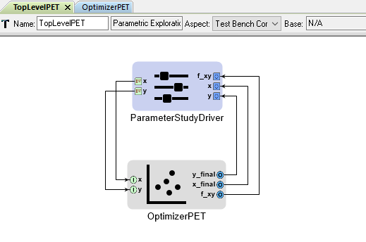
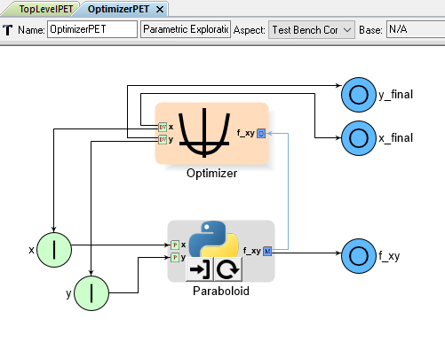
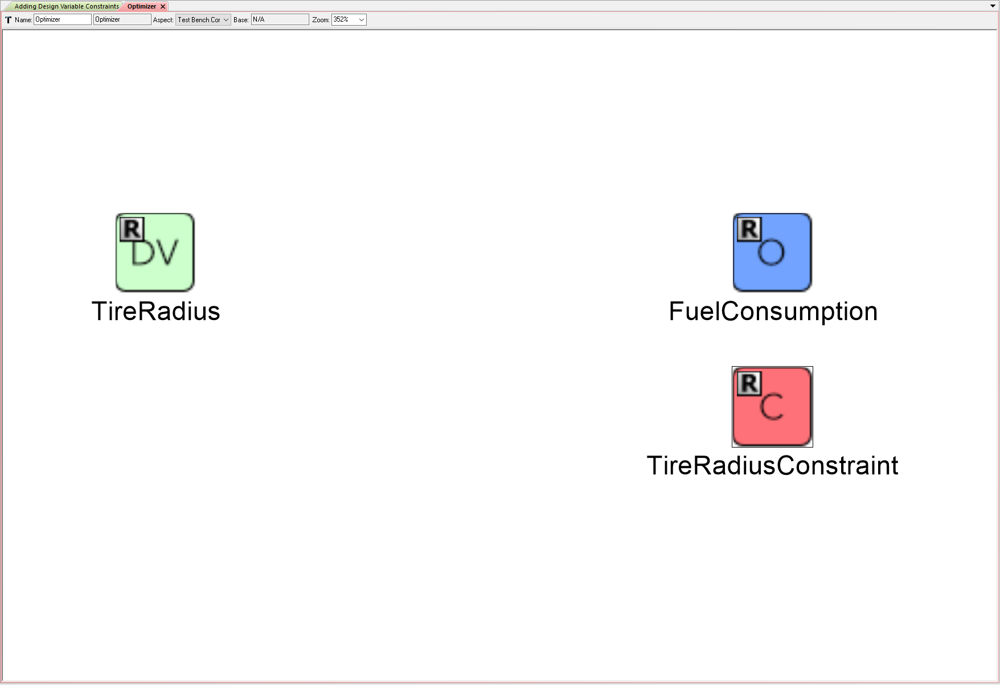
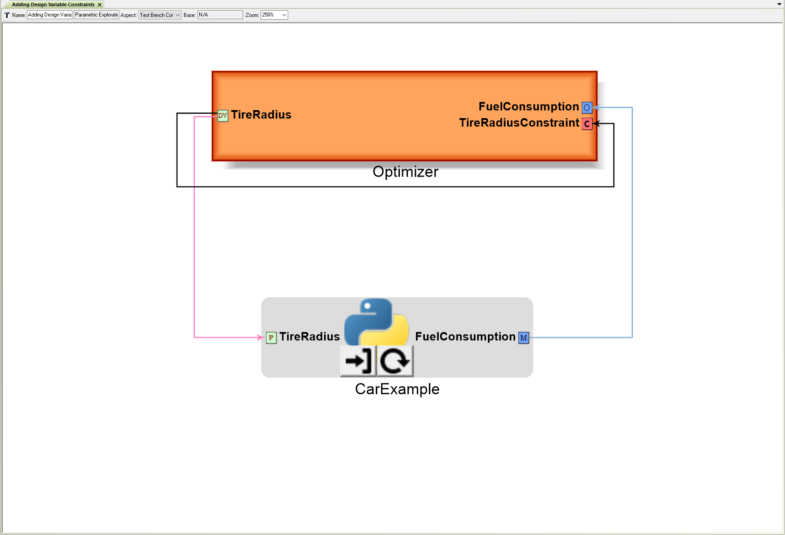
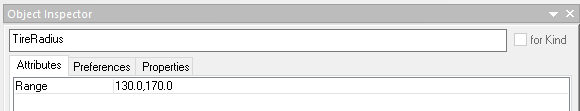

.. _pet_advanced_topics:

Advanced Topics
===============

Optimization
------------

.. TODO: Fill out the subsection topics outlined below.

Hot Start vs. Cold Start
~~~~~~~~~~~~~~~~~~~~~~~~

It is fairly common to have an Optimizer PET Driver that 
runs repeatedly as part of a larger Design of Experiments
(e.g. see :ref:`pet_nesting_with_drivers`).

In these situations the user can choose between "Hot Start"
and "Cold Start." 

What is "Hot Start?"
^^^^^^^^^^^^^^^^^^^^

In "Hot Start," each time the nested Optimizer
PET is called by the higher-level Parameter Study PET, it
starts the optimization process using the final Design Variable
values that it solved for during the last Parameter Study iteration.

.. figure:: images/NestedPETsWithDrivers_1.png
   :alt: text

   The TopLevel PET contains a Parameter Study Driver and a nested OptimizerPET

.. figure:: images/NestedPETsWithDrivers_2.png
   :alt: text

   The OptimizerPET contains an Optimizer Driver and a Python Wrapper Component

In the "Hot Start" example above, for the first iteration of the TopLevel PET's
Parameter Study Driver, the Optimizer PET starts the optimization process
using the Design Variable **y**'s initial value of 0.0; however, for each subsequent
iteration of the top-level Parameter Study Driver, the lower-level Optimizer Driver
uses the previous iteration's final value of **y** as its starting point.

For many cases, "Hot Start" is faster and more efficient. Because the top-level
Parameter Study Driver generally changes its Design Variables in an incremental fashion,
the lower-level Optimizer Driver's previous solution is usually much closer to the new
solution vs. whatever its initial Design Variable values were.

"Hot Start" is the default behavior for the Optimizer PET Driver's 
COBYLA optimization method.

What is "Cold Start?"
^^^^^^^^^^^^^^^^^^^^^

In "Cold Start," each time the nested Optimizer PET is called by the higher-level
Parameter Study PET, it starts the optimization process using the same initial
Design Variable values.

.. figure:: images/NestedPETsWithDriversColdStart_1.png
   :alt: text

   The TopLevel PET contains a Parameter Study Driver, a Constants block, and a nested OptimizerPET

.. figure:: images/NestedPETsWithDriversColdStart_2.png
   :alt: text

   The OptimizerPET contains an Optimizer Driver and a Python Wrapper Component

In the "Cold Start" example above, the lower-level Optimizer Driver's Design Variable
**y** is connected directly to the Problem Input **y**, which is being driven
from the Constants block in the top-level PET.

As a result, for every iteration of TopLevel PET's Parameter Study Driver, the Optimizer
PET starts its optimization process using the same starting point for its Design Variable **y**.

The advantage of "Cold Start" is that it prevents individual optimizations from interfering with
one another. Occasionally, with the Optimizer Driver's COBYLA method, an optimizer run can diverge,
causing the Design Variable values to violate their range constraints. In a "Hot Start" setup, one
divergence will likely "ruin" all subsequent Optimizer Driver runs, but in a "Cold Start" setup, the
forced restart limits the impact of outliers on the entire set of results.
   
Setting Initial Conditions
~~~~~~~~~~~~~~~~~~~~~~~~~~

Occasionally, an optimization problem's objective function will feature numerous local minima
(or maxima), making it harder to find a global minimum using just an Optimizer Driver.

In these situations, it may be useful to nest a PET with an Optimizer Driver inside another
PET with a Parameter Study Driver as shown below.

   The TopLevel PET contains a Parameter Study Driver and a nested OptimizerPET

   The OptimizerPET contains an Optimizer Driver and a Python Wrapper Component

The Parameter Study Driver in the top-level PET varies the initial values of **x** and **y**.
These are then passed into the lower-level PET to provide the Optimizer PET with different
starting points each time. This strategy increases the chances of finding the global minima.

Adding Design Variable Constraints
~~~~~~~~~~~~~~~~~~~~~~~~~~~~~~~~~~~

A constrained optimization problem is one where an Objective
is being minimized with respect to Design Variables that are
restricted to a specific range.

*E.g. one might wish to minimize
a car's fuel consumption per mile with respect to tire radius while
requiring that the tire radius remain between 13" and 17".*

OpenMETA supports constrained optimization via the Optimizer PET Driver's
COBYLA Function (COBYLA = Constrained Optimization BY Linear Approximation);
however, the user must manually connect each Design Variable to a matching
Optimizer Constraint and set the Optimizer Constraint's MinValue and(or)
MaxValue to the Design Variable's desired minimum and maximum values.

.. figure:: images/AddingDesignVariableConstraint_2.png
   :alt: text

   TireRadius's desired range entered into corresponding Optimizer Constraint's Attributes

   TireRadius Design Variable connected directly to corresponding Optimizer Constraint

(In contrast no such workaround is needed if the Parameter Study PET Driver
is being used).

Checking Optimization Results
~~~~~~~~~~~~~~~~~~~~~~~~~~~~~

The Optimizer PET Driver is a powerful tool but it cannot be used blindly.

Some functions (in particular non-convex functions) are quite difficult to optimize,
and the Optimizer may not be able to reliably locate the global minimum.

The Optimizer PET Driver may...

- fail to converge within the maximum number of iterations
- locate a local minimum and not the global minimum
- violate Optimizer Constraints in order to converge

The user must make sure that the final answer provided by the Optimizer
does not significantly violate any of the Objective Constraints and that
the Optimizer converged before executing the maximum number of iterations.

If the function contains numerous minima/maxima, the user might consider
exploring the design space with another PET Driver (such as the Parameter Study)
or setting up a multi-start Optimization problem by nesting the Optimizer PET
inside a higher-level PET with a Parameter Study Driver providing different initial
values to the Optimizer PET's Design Variables.

.. ADD: Quick example/tutorial of multi-start optimization

Scaling/Normalizing Design Variables
~~~~~~~~~~~~~~~~~~~~~~~~~~~~~~~~~~~~

The Optimizer PET Driver may struggle to converge if it contains Design Variables
with ranges that differ by several orders of magnitude.

*E.g. one might wish to optimize a car's fuel consumption per mile with respect
to tire radius and weight, where tire radius can vary from 13" to 17" and weight
can vary from 3200 lbs. to 4200 lbs. The range of the weight Design Variable is
more than two orders of magnitude greater than the range of the tire radius
Design Variable. Since the difference in magnitudes between the two Design Variable
is so great, the Optimizer may struggle to successfully converge in this case.*

Therefore, it is generally good practice to *rescale* or *normalize* Design Variables
with ranges that differ by several orders of magnitude (or more).

*E.g. in the car example above, the user could rescale the tire radius Design Variable
(+ associated Optimizer Constraint - this is a constrained optimization problem!)
to vary from 130 to 170 units and the weight Design Variable
(+ associated Optimizer Constraint!) to vary from 320 to 420 units. The user could
then insert PythonWrapper components to undo the scaling between the Design Variables
and the CarExample PythonWrapper.*

.. figure:: images/ScalingDesignVariables_1.png
   :alt: text

.. caption

   Scaled TireRadius Design Variable

.. figure:: images/ScalingDesignVariables_3.png
   :alt: text

   Scaled Weight Design Variable

.. figure:: images/ScalingDesignVariables_4.png
   :alt: text

   Scaled TireRadius Constraint

.. figure:: images/ScalingDesignVariables_5.png
   :alt: text

   Scaled Weight Constraint

.. figure:: images/ScalingDesignVariables_6.png
   :alt: text

   Undoing scaling for system analysis

.. note:: You would have to generate **DivideBy10** and **MultiplyBy10** blocks
   yourself. See the :ref:`pet_analysis_blocks_python_wrappers` section for
   details on creating your own Python Wrapper blocks.

Optimizing Non-convex Functions
~~~~~~~~~~~~~~~~~~~~~~~~~~~~~~~

.. note:: This section is under construction. Please check back later for updates!
