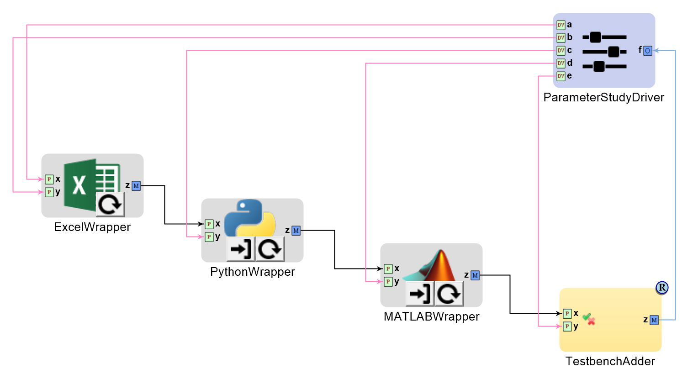
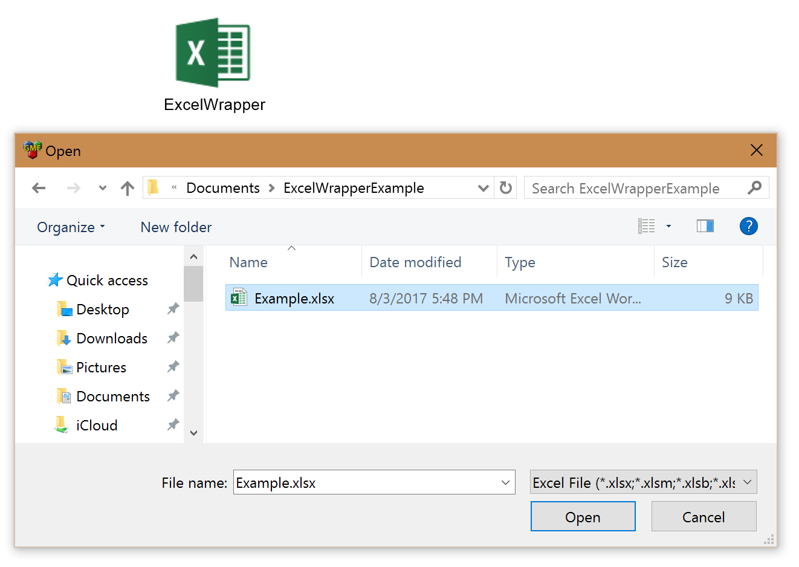
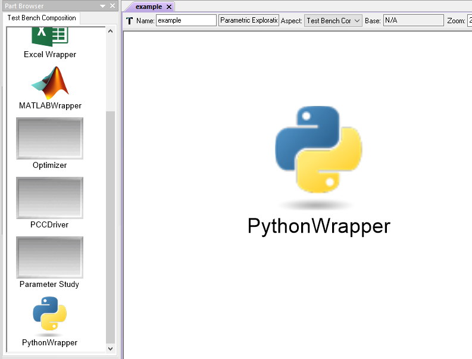
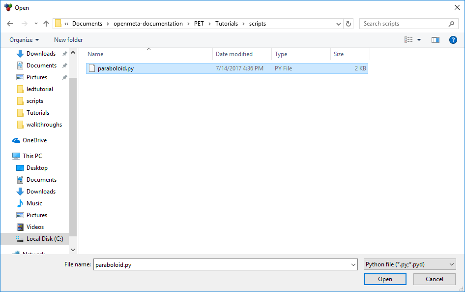
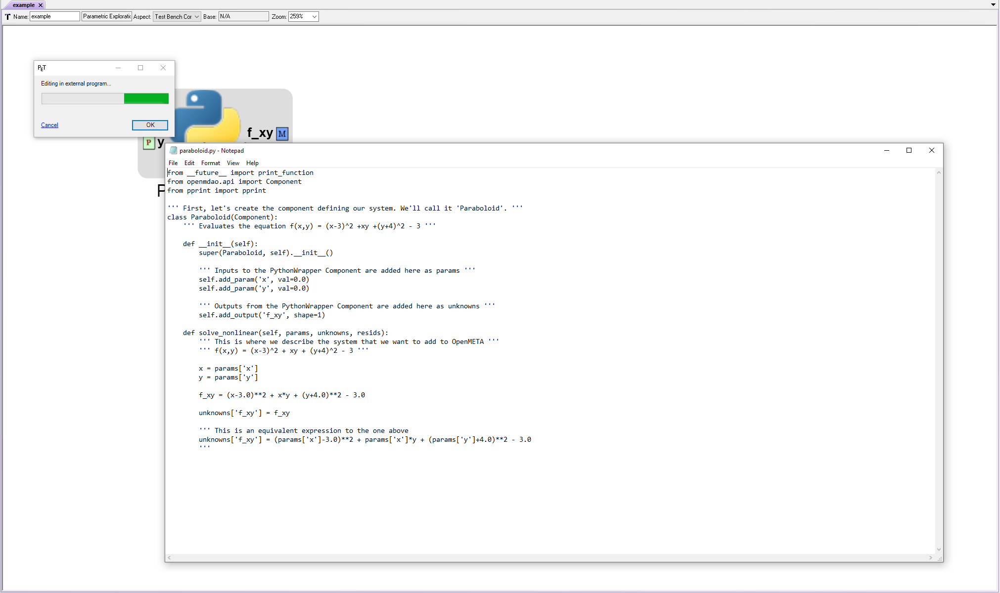
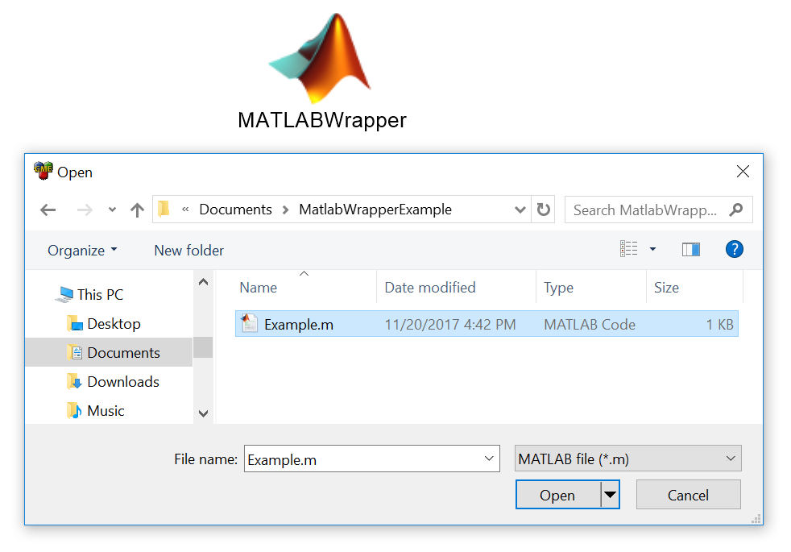
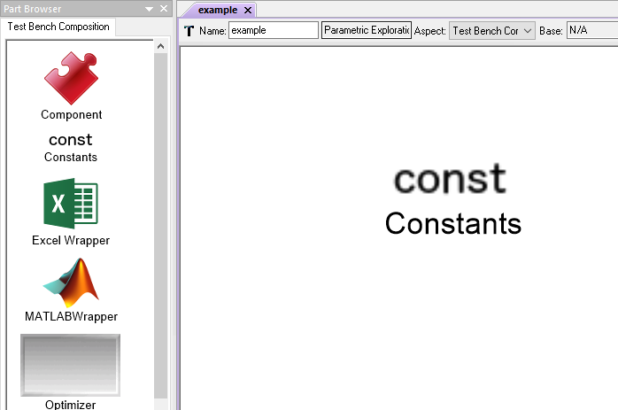
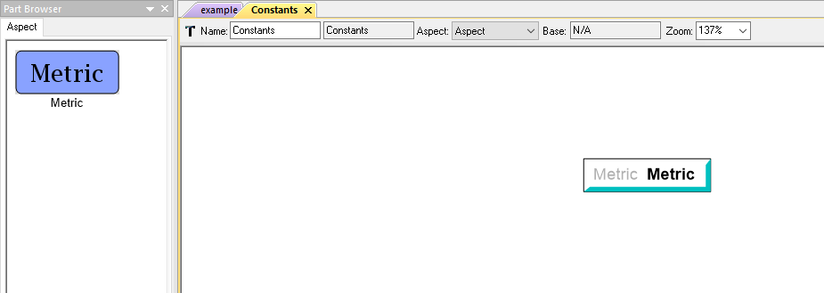
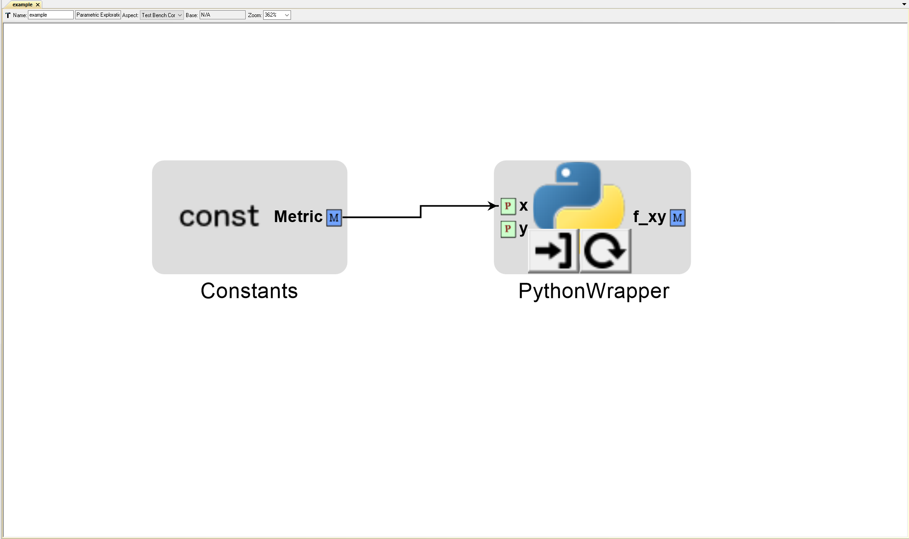

.. _pet_analysis_blocks:

PET Analysis Blocks
===================

PET Analysis Blocks are Test Benches and External Tool Wrappers that can be
placed within a PET to model the system to be analyzed. Therefore, PET Analysis
Blocks serve as modular building blocks that can be combined within a single PET
to perform a full-system analysis using subanalyses from multiple domains.

   
   An example PET with all three types of available wrappers and a Test Bench.

In addition to the complex analyses that can be performed using
Test Benches as you saw in the previous :ref:`testbenches` chapter,
virtually any external execution tool can be integrated using one of
the provided wrappers. We have used the Python Wrapper to drive
analysis tools

For examples of PETs with different analysis blocks see the
`Analysis Blocks <https://github.com/metamorph-inc/openmeta-examples-and-templates/tree/master/analysis-blocks>`_
project in the 
`Openmeta Examples And Templates <https://github.com/metamorph-inc/openmeta-examples-and-templates>`_
repository.

Test Benches
------------

For more information on composing Test Benches, please see the
:ref:`testbenches` chapter.

Adding a Test Bench to a PET
~~~~~~~~~~~~~~~~~~~~~~~~~~~~

When you want to use a Test Bench in a PET, you need to add a
*reference* to the Test Bench. This is done in the same manner that
you add components to Component Assembly. Just as described in the
:ref:`populate_the_component_assembly` section of the LED Tutorial,
this is accomplished in one of two ways:

-  You can **Drag-and-drop** the desired Test Bench onto a PET
   canvas with a **Right-click** and select **Create Reference** from
   the drop-down menu.
   
   .. figure:: images/AddTestBenchToPET.png
   

-  Or you can **Right-click** on the desired Test Bench and select **copy**
   from the drop-down menu and then **Right-click** in the PET canvas
   and select **Paste Special -> As Reference** from the context menu.
   
   .. figure:: images/AddTestBenchToPETAlternatively.png

Excel Wrappers
--------------

Preparing an Excel Spreadsheet
~~~~~~~~~~~~~~~~~~~~~~~~~~~~~~

Before adding an Excel Spreadsheet, you must name all the cells that you desire
to be exposed in the Excel Wrapper analysis block. You can do this in Excel in
one of two ways:

#. selecting a cell and then typing a name in the **Name Box** in the upper left
   portion of the Excel window, or

#. using the **Name Manager** tool in the **Formula** tab on the ribbon.

Any cells that are formulas will be interpreted as outputs; all others will be
interpreted as inputs.

.. figure:: images/ExcelWrapperConfig.png
   :alt: text

   An Excel Spreadsheet Being Prepared For Use As an Analysis Block

Adding Excel Wrappers to a PET
~~~~~~~~~~~~~~~~~~~~~~~~~~~~~~

To add an Excel Wrapper to a PET, simply drag the Excel Wrapper icon from the
Part Browser and onto the PET canvas. Double-click on the Excel Wrapper and use 
the **Open** dialogue to select the Excel file to be added to the PET.

You should then see your component with the exposed inputs and outputs in the
PET Canvas.

.. figure:: images/ExcelWrapperAdditionComplete.png
   :alt: text

.. _pet_analysis_blocks_python_wrappers:

Python Wrappers
---------------

These serve as the most generic integration point. Practically any Python model or
tool can be added to a PET using Python Wrappers.

Adding Python Wrappers to a PET
~~~~~~~~~~~~~~~~~~~~~~~~~~~~~~~

To add a Python Wrapper to a PET, simply drag the Python Wrapper icon from the
Part Browser and onto the PET canvas.

   A Python Wrapper in a PET

A Python Wrapper can be loaded with specially-formatted Python scripts.

Below is a template Python Wrapper OpenMDAO Component script:

.. code-block:: python
   :name: Paraboloid.py
   :caption: Paraboloid.py
   :linenos:

   from __future__ import print_function
   from openmdao.api import Component
   from pprint import pprint

   ''' First, let's create the component defining our system. We'll call it 'Paraboloid'. '''
   class Paraboloid(Component):
       ''' Evaluates the equation f(x,y) = (x-3)^2 +xy +(y+4)^2 - 3 '''

       def __init__(self):
           super(Paraboloid, self).__init__()

           ''' Inputs to the Python Wrapper Component are added here as params '''
           self.add_param('x', val=0.0)
           self.add_param('y', val=0.0)

           ''' Outputs from the Python Wrapper Component are added here as unknowns '''
           self.add_output('f_xy', shape=1)

       def solve_nonlinear(self, params, unknowns, resids):
           ''' This is where we describe the system that we want to add to OpenMETA '''
           ''' f(x,y) = (x-3)^2 + xy + (y+4)^2 - 3 '''

           x = params['x']
           y = params['y']

           f_xy = (x-3.0)**2 + x*y + (y+4.0)**2 - 3.0

           unknowns['f_xy'] = f_xy

           ''' This is an equivalent expression to the one above
           unknowns['f_xy'] = (params['x']-3.0)**2 + params['x']*y + (params['y']+4.0)**2 - 3.0
           '''

.. note:: For more information on OpenMDAO Component scripts and how to write them, reference
   the OpenMDAO documentation: http://openmdao.readthedocs.io/en/1.7.3/usr-guide/basics.html#component
			
Loading Python Wrappers
~~~~~~~~~~~~~~~~~~~~~~~

To load a Python Wrapper, double-click on the Python Wrapper and use the
file explorer to select the Python script to be added to the PET.

   Loading a Python Wrapper with a Python script

.. figure:: images/PythonWrapperComponent.png
   :alt: text

   A Python Wrapper loaded with a Python script

Reloading Python Wrappers
~~~~~~~~~~~~~~~~~~~~~~~~~

.. note:: You have to manually reload Python Wrappers whenever you
   change the exposed Params and Unknowns within the Python script.
   
   Reloading also allows you to quickly switch between different
   versions of a Python script in your PET.

To load a Python Wrapper with a different Python script (or reload the same script), 
left-click on the |RELOAD| button and select the desired Python file.

.. |RELOAD| image:: images/icons/reload.png
      :alt: Load icon
      :width: 25px

   Reloading a Python Wrapper with a Python script

.. figure:: images/PythonWrapperComponent.png
   :alt: text

   A Python Wrapper loaded with a Python script

Editing Python Wrappers
~~~~~~~~~~~~~~~~~~~~~~~

To edit a Python Wrapper script from within OpenMETA, left-click on the |EDIT| icon

.. |EDIT| image:: images/icons/edit.png
      :alt: Edit icon
      :width: 25px

   Editing a Python Wrapper script
   
MATLAB Wrappers
---------------

MATLAB Wrappers allow the user to execute custom MATLAB scripts
and functions in the context of a PET.
There are two types of MATLAB scripts that can be integrated:
*Function Files* and *Bare Files*. The MATLAB Wrapper
determines the type by examining the script file.

Currently, only MATLAB version 2016a and later are supported.

Function Files
~~~~~~~~~~~~~~

In a *Function File* you define a function with the same name as
the script filename and this becomes the entry point for the script.
There are a few restrictions in the current implementation:

-  Only scalar (double) type values are allowed as inputs and outputs.
-  There can be more than one function declared in the script, but the
   wrapper will only use the function with the same name as the script
   filename. These names are case-sensitive and must match exactly.

Below is a *Function File* example of a MATLAB Wrapper script:

.. code-block:: matlab
   :caption: Example.m
   :name: Example.m

   function [sum, product] = Example(x, y, z)
   sum = x + y + z
   product = x * y * z
   end

Bare Files
~~~~~~~~~~

In a Bare File you define the inputs and outputs of the script by a
set of specially-formatted comments at the beginning of the file.
These comments allow you to define the data type of all the inputs
and outputs.

Below is a *Bare File* example of a script that doubles a number
of different types of inputs:

.. code-block:: matlab
   :caption: Double.m
   :name: Double.m

   % variable: output1 double output
   % variable: output2 double[] output
   % variable: output3 string output
   % variable: output4 string[] output
   % variable: input1 double input
   % variable: input2 double[] input
   % variable: input3 string input
   % variable: input4 string[] input

   output1 = input1 * 2
   output2 = input2 * 2
   output3 = strcat(input3, input3)
   output4 = [input4, input4]

MATLAB Data Type Conversion
...........................

OpenMETA uses the Python `OpenMDAO <http://www.openmdao.org/>`_
framework to execute PETs. Since the data passed between analysis
blocks is managed by Python, the table below describes the conversions
that occur when data is passed into or out of a MATLAB Wrapper block.

===============  =================  ===============
Python           to MATLAB          to PYTHON 
===============  =================  ===============
Double           Double             Double 
1x1 Numpy Array  Double             Double 
1x2 Numpy Array  1x2 Array          1x2 Numpy Array
String           String             String
List of Strings     Cell Array      List of Strings
===============  =================  ===============

For examples of the conversion see the
``RootFolder/ParametricExploration/ComplexExamples/MatlabConversions`` PET in the
`Analysis Blocks <https://github.com/metamorph-inc/openmeta-examples-and-templates/tree/master/analysis-blocks>`_
project in the 
`Openmeta Examples And Templates <https://github.com/metamorph-inc/openmeta-examples-and-templates>`_
repository.

Configuring MATLAB Wrappers
~~~~~~~~~~~~~~~~~~~~~~~~~~~

To add a Matlab Wrapper to a PET, simply drag the Matlab Wrapper icon from the
Part Browser and onto the PET canvas.

.. figure:: images/MatlabWrapper.png
   :alt: A MatlabWrapper Added to the PET Canvas

To configure a MATLAB Wrapper, double-click on the MATLAB Wrapper and use the
Open dialogue to select the MATLAB script to be added to the PET.

   Loading a MATLAB Wrapper with a MATLAB script

   A MATLAB Wrapper loaded with a MATLAB script
   
If you subsequently want to make changes to the script, you can do so
directly from GME by using the Edit ( |EDIT| ) button. Alternatively, 
if you make edits to your script outside of GME, you can reload the
script using the Reload ( |RELOAD| ) button.

.. tip::
   
   You can change the default editor in GME by opening
   :menuselection:`Tools --> Options` and checking **Enable External
   Text Editor**
   
   .. figure:: images/ExternalEditor.png
      :alt: GME Options Dialogue
      
      Configuring Notepad++ as the External Editor

Constants Blocks
----------------

These allow the user to set constant scalar values that can then be used to drive
other Analysis blocks within a PET.

Adding Constants Blocks to a PET
~~~~~~~~~~~~~~~~~~~~~~~~~~~~~~~~

To add a Constants Block to a PET, simply drag the Constants block icon from the
Part Browser and onto the PET canvas.

   A Constants block in a PET

Populating Constants Blocks with Metrics
~~~~~~~~~~~~~~~~~~~~~~~~~~~~~~~~~~~~~~~~

Constants Blocks within a PET can contain Metrics that hold scalar values.

To add a Metric to a Constants Block, double-click on the Constants Block
to open it, then drag the Metric icon from the Parts Browser into the Constants
Block canvas. The Metric can be renamed and its value can be set via
Object Inspector > Attributes > Value.

   A Metric in a Constants block

.. figure:: images/MetricValue.png
   :alt: text

   A Metric's value being set

   A Constants's Metric connected to a PET Analysis Block

Multiple Metrics can be added to the same Constants Block. Each one will display as
a separate port on the Constants Block model.

.. figure:: images/MetricMultiple.png
   :alt: text

   Two Metrics with set values in a Constants block

.. figure:: images/MetricConnectedMultiple.png
   :alt: text

   Two Constants's Metric connected to a PET Analysis Block
