.. _pet_drivers:

PET Drivers
===========

A PET Driver allows the user to:

#. Provide varying inputs to a system defined by PET Analysis Blocks
#. Record the system outputs for each set of inputs

.. _pet_drivers_parameter_study:

Parameter Study
---------------

The Parameter Study varies system inputs and records designated system outputs
for each set of inputs.

Adding a Parameter Study to a PET
~~~~~~~~~~~~~~~~~~~~~~~~~~~~~~~~~

To add a Parameter Study to a PET, simply drag the **Parameter Study** icon from the
Part Browser and onto the PET canvas.

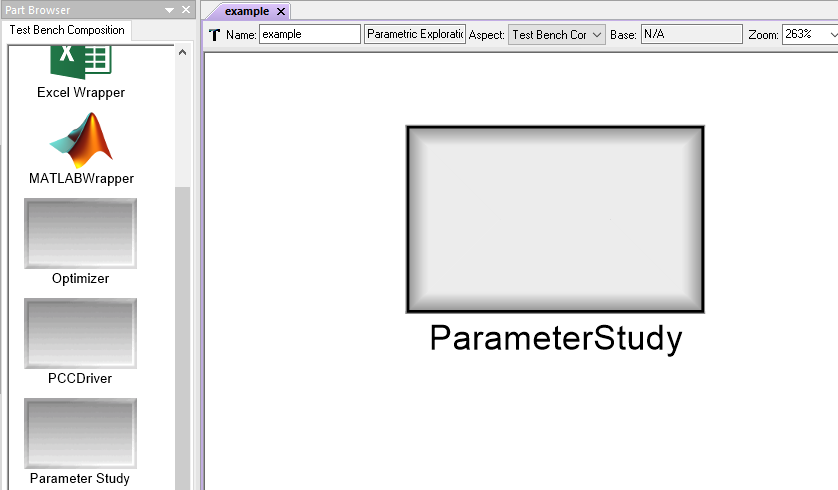

   A Parameter Study in a PET

Design Variable
~~~~~~~~~~~~~~~

A Design Variable is an atom that can be placed inside a Parameter Study.
A Design Variable placed inside a Parameter Study will appear as a port
on the Parameter Study's PET model and can be connected to PET Analysis
Blocks.

Over the course of a PET run, a Parameter Study Driver
typically changes each Design Variable's value many times in order to
provide the system being analyzed with different inputs - of course the
Design Variables have to be connected to PET Analysis blocks for this to work!

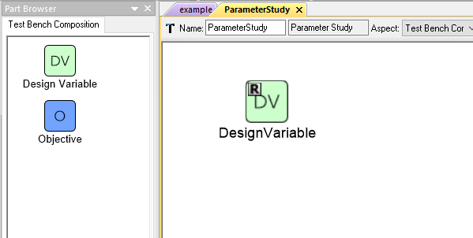

   A Design Variable in a Parameter Study PET Driver

.. figure:: images/DesignVariableConnected.png
   :alt: text

   A Parameter Study PET Driver's Design Variable connected to a PET Analysis Block

Adding a Design Variable to a Parameter Study Driver
^^^^^^^^^^^^^^^^^^^^^^^^^^^^^^^^^^^^^^^^^^^^^^^^^^^^

To add a Design Variable to a Parameter Study Driver, simply drag
the **Design Variable** icon from the Part Browser and onto the PET canvas.

Design Variable Range
^^^^^^^^^^^^^^^^^^^^^

Each Design Variable has **Range** attribute
that can be set by the user.

To set a Design Variable's range:

#. Left-click on the Design Variable
   and edit the **Range** attribute in the **Object Inspector**.

#. Enter the Design Variable's minimum value followed by
   a comma followed by the Design Variable's maximum value.
   (e.g. Entering **-50,34** in a Design Variable's **Range** attribute
   will limit that Design Variable to values between **-50** and **+34 inclusive**).

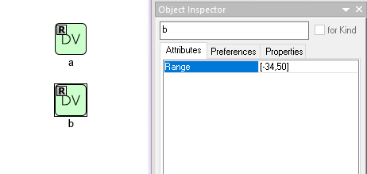

   Setting a Design Variable's range

Objective
~~~~~~~~~

An Objective is an atom that can be placed inside a Parameter Study.
An Objective placed inside a Parameter Study will appear as a port
on the Parameter Study's PET model and PET Analysis Blocks can be
connected to it.

At every iteration of the Parameter Study, the Objective will record
the value of the Metric connected to it.

Adding an Objective to a Parameter Study Driver
^^^^^^^^^^^^^^^^^^^^^^^^^^^^^^^^^^^^^^^^^^^^^^^

To add an Objective to a Parameter Study Driver, simply drag
the **Objective** icon from the Part Browser and onto the Parameter Study canvas.

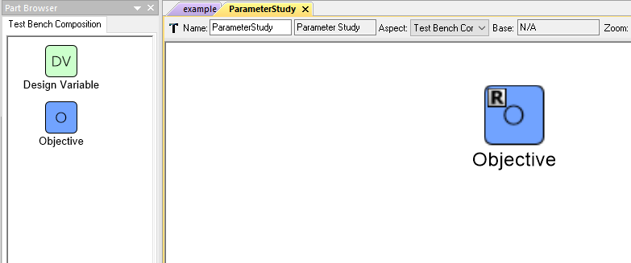

   An Objective in a Optimizer PET Driver

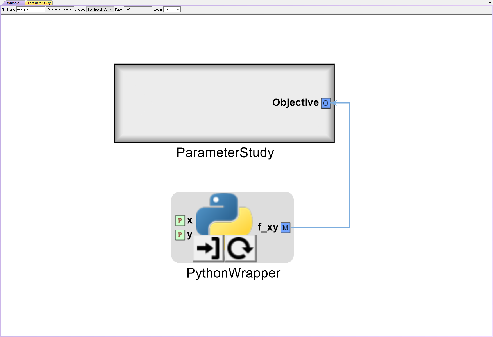

   A PET Analysis Block connected to an Optimizer PET Driver's Objective

Parameter Study Attributes
~~~~~~~~~~~~~~~~~~~~~~~~~~

Several critical Parameter Study attribute can be accessed by left-clicking
a Parameter Study and then looking under the **Attributes** tab of the
**Object Inspector** window.

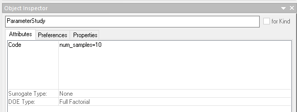

   A Parameter Study's Attributes

Code
^^^^

Entering **num_samples=** followed by an integer number
(e.g. **num_samples=10**) sets the number of Parameter Study samples.

.. note:: The number of Parameter Study iterations (or data points)
   depends on both **num_samples** and the **DOE Type**.

.. Surrogate Type:
.. ^^^^^^^^^^^^^^^

.. ADD: This section.

DOE Type:
^^^^^^^^^

The DOE Type determines the sampling method by which
the Parameter Study explores the Design Variable space.

Different DOE Types can be selected by left-clicking
the **DOE Type** menu and selecting the desired method.

Full Factorial
**************

The Full Factorial type generates **DV^num_samples** input cases where
**DV** is the number of Design Variables and **num_samples** is set
in the **Code** attribute. The levels for each Design Variable are evenly
distributed across the Design Variable's range with one level
at the minimum value and and one level at the maximum value.

If **num_samples=1**, then each Design Variable will have one level,
and that level will be the Design Variable's respective minimum value.
If **num_samples=2**, then each Design Variable will have two levels,
and those levels will be the Design Variable's respective minimum and
maximum levels.
If **num_samples=3** or greater, then Design Variable will have
additional levels evenly distributed across its range.

When the PET is run, a full factorial exploration of the design
space will occur - e.g. if the PET has two Design Variables x and y,
both with a **Range** of **-10,+10** and **num_samples=3**, then
the PET will test the following *(x,y)* inputs: *(-10,-10), (-10,0),
(-10,+10), (0,-10), (0,0), (0,+10), (+10,-10), (+10,0), (+10,+10)*.

Central Composite
*****************

We don't actually know how this doohickey works (or if it even works), but you
are welcome to give it a go and let us know what you find.

Opt Latin Hypercube
*******************

The Opt Latin Hypercube type is a predetermined-samples driver that seeks to
produce good coverage across all the dimensions. This is preferred to a Uniform
type of sampling in most cases as you have a higher probability of an
evenly-sampled independent variables set.

Uniform
*******

The Uniform type generates **num_samples** input cases where **num_samples**
is set in the **Code** attribute. The input cases are evenly distributed across
the ranges of all Design Variables.

If **num_samples=1**, then, in the resulting single input case, each
Design Variable will be set to its minimum value.

.. _pet_drivers_optimizer:

Optimizer
---------

The Optimizer varies system inputs in order to minimize a single system output.
Like the Parameter Study, the Optimizer records the systems inputs and designated
outputs at every iteration.

However, unlike the Parameter Study, the Optimizer uses the designated system outputs
to change the system's inputs as well as decide when the optimization process
has reached a satisfactory stopping point.

Adding an Optimizer to a PET
~~~~~~~~~~~~~~~~~~~~~~~~~~~~

To add an Optimizer to a PET, simply drag the **Optimizer** icon from the
Part Browser and onto the PET canvas.

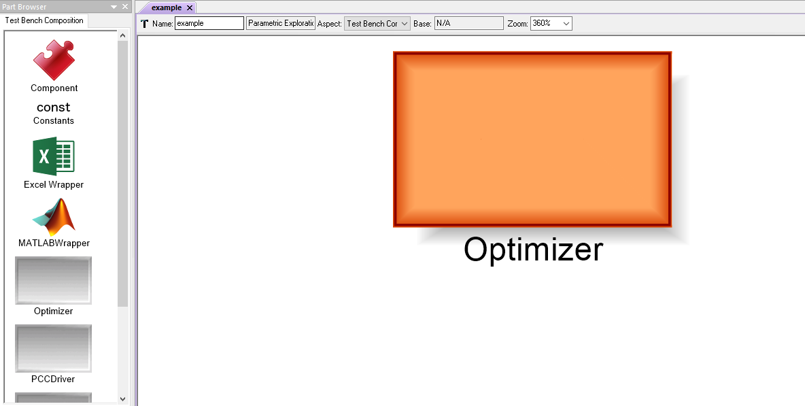

   An Optimizer in a PET

****

Design Variable
~~~~~~~~~~~~~~~

A Design Variable is an atom that can be placed inside an Optimizer.
A Design Variable placed inside a Optimizer will appear as a port
on the Parameter Study's PET model and can be connected to PET Analysis
Blocks.

Over the course of a PET run, a Optimizer Driver
changes each Design Variable's value many times in order to
minimize the Objective - of course the Design Variables have to be
connected to PET Analysis blocks for this to work!

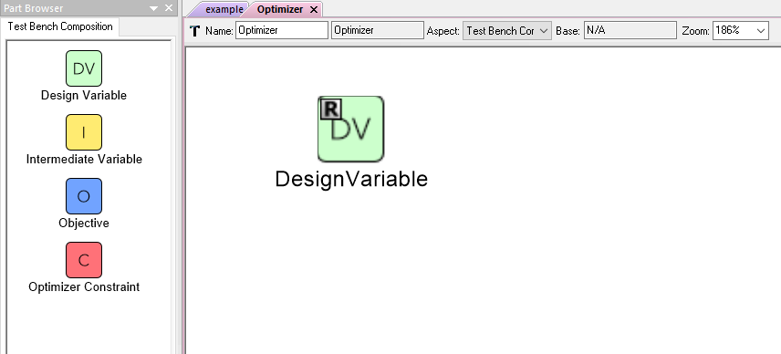

   A Design Variable in an Optimizer PET Driver

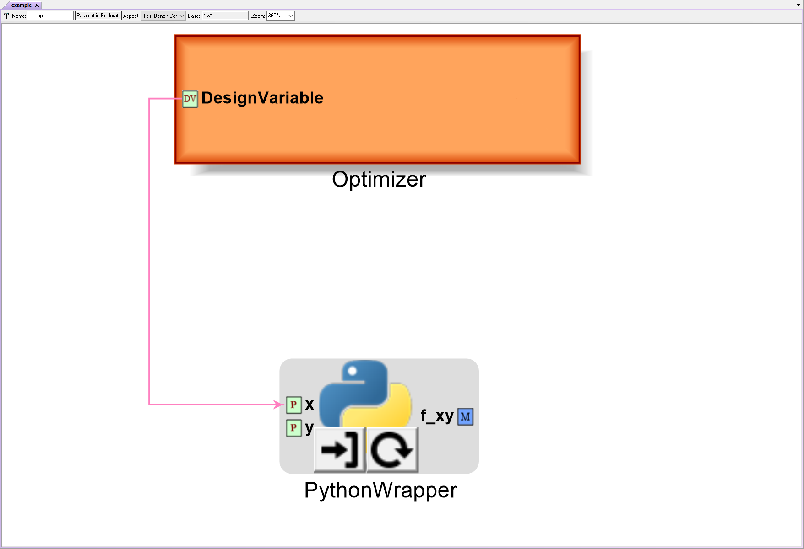

   An Optimizer PET Driver's Design Variable connected to a PET Analysis Block

Adding a Design Variable to an Optimizer Driver
^^^^^^^^^^^^^^^^^^^^^^^^^^^^^^^^^^^^^^^^^^^^^^^^

To add a Design Variable to an Optimizer Driver, simply drag
the **Design Variable** icon from the Part Browser and onto the PET canvas.

Design Variable Range
^^^^^^^^^^^^^^^^^^^^^

Each Design Variable has **Range** attribute
that can be set by the user.

To set a Design Variable's range:

#. Left-click on the Design Variable
   and edit the **Range** attribute in the **Object Inspector**.

#. Enter the Design Variable's minimum value followed by
   a comma followed by the Design Variable's maximum value.
   (e.g. Entering **-50,34** in a Design Variable's **Range** attribute
   will limit that Design Variable to values between **-50** and **+34 inclusive**).

   Setting a Design Variable's range

.. note:: The Optimizer Driver treats Design Variables differently then the
   Parameter Study driver, so setting a Design Variable's range in an
   Optimizer only sets the default optimization starting point for that
   variable to be the (minimum+maximum)/2.

.. warning:: Unfortunately (and non-intuitively) setting a Design Variable's
   range DOES NOT keep the Optimizer from setting the Design Variable's value
   outside of that range during the optimization process. In order to properly
   constrain Design Variables **for now**, the user must add an additional
   Constraint atom to the Optimizer Driver for each constrained Design Variable,
   set that Constraint atom's **MinValue** and **MaxValue** attributes to the desired
   Design Variable bounds, and connect the Design Variable to the Constraint using
   Connect Mode at the PET level (i.e. outside of the Optimizer).

.. figure:: images/DesignVariableOptimizerWorkaround.png
   :alt: text

   Constraining an Optimizer's Design Variables

   Check out the :ref:`pet_advanced_topics` chapter to learn more about how to
   finesse an optimization.

Objective
~~~~~~~~~

An Objective is an atom that can be placed inside an Optimizer.
An Objective placed inside an Optimizer will appear as a port
on the Optimizer's PET model and PET Analysis Blocks can be
connected to it.

At every iteration of the Optimizer, the Objective will record
the value of the Metric connected to it. Additionally, the Optimizer
Driver will use the Objective's recorded value to change the values
of the Design Variable(s) for the next iteration as well as to decide
when a satisfactory minimum has been achieved.

Adding an Objective to an Optimizer Driver
^^^^^^^^^^^^^^^^^^^^^^^^^^^^^^^^^^^^^^^^^^

To add an Objective to an Optimizer Driver, simply drag
the **Objective** icon from the Part Browser and onto the Optimizer canvas.

.. figure:: images/ObjectiveOptimizer.png
   :alt: text

   An Objective in a Optimizer PET Driver

.. figure:: images/ObjectiveConnectedOptimizer.png
   :alt: text

   A PET Analysis Block connected to an Optimizer PET Driver's Objective

Intermediate Variable
~~~~~~~~~~~~~~~~~~~~~

An Intermediate Variable is an atom that can be placed inside an
Optimizer. An Intermediate Variable placed inside an Optimizer
will appear as a port on the Optimizer's PET model and PET
Analysis Blocks can be connected to it.

An Intermediate Variable records the value of the Metric connected
to it at every iteration of the Optimizer but does not affect the
optimization process like the Objective does.

Adding an Intermediate Variable to an Optimizer Driver
^^^^^^^^^^^^^^^^^^^^^^^^^^^^^^^^^^^^^^^^^^^^^^^^^^^^^^

To add an Intermediate Variable to an Optimizer Driver, simply drag
the **Intermediate Variable** icon from the Part Browser and onto the Optimizer canvas.

.. figure:: images/IntermediateVariable.png
   :alt: text

   An Intermediate Variable in a Optimizer PET Driver

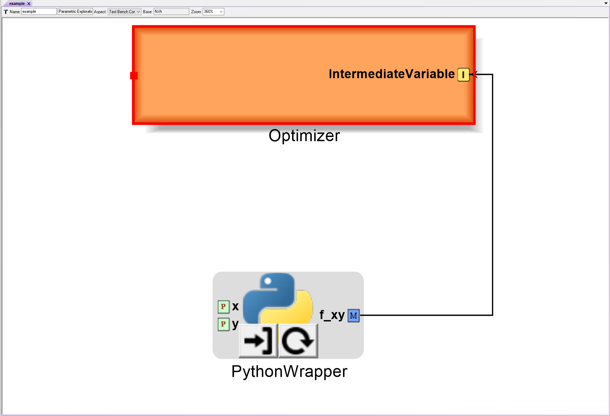

   A PET Analysis Block connected to an Optimizer PET Driver's Intermediate Variable

****

Optimizer Constraint
~~~~~~~~~~~~~~~~~~~~

An Optimizer Constraint is an atom that can be placed inside an
Optimizer. At Optimizer Constraint placed inside an Optimizer
will appear as a port on the Optimizer's PET model and PET Analysis
Blocks can be connected to it.

An Optimizer Constraint allows designated system outputs to influence
the optimization process - if *(and this is an important if)* the 
optimization method being used supports constraints!

Adding an Optimizer Constraint to an Optimizer Driver
^^^^^^^^^^^^^^^^^^^^^^^^^^^^^^^^^^^^^^^^^^^^^^^^^^^^^

To add an Intermediate Constraint to an Optimizer Driver, simply drag
the **Intermediate Constraint** icon from the Part Browser and onto the Optimizer canvas.

.. figure:: images/OptimizerConstraint.png
   :alt: text

   An Objective Constraint in a Optimizer PET Driver

.. figure:: images/OptimizerConstraintConnected.png
   :alt: text

   A PET Analysis Block connected to an Optimizer PET Driver's Objective Constraint

Optimizer Constraint MinValue & MaxValue
^^^^^^^^^^^^^^^^^^^^^^^^^^^^^^^^^^^^^^^^

Each Optimizer Constraint has **MinValue** and **MaxValue** attributes
that can be set by the user. The Optimizer Driver will do its best
to keep system outputs connected to a Optimizer Constraint within
the bound(s) defined by the **MinValue** and **MaxValue** attributes.

To set an Optimizer Constraint's MinValue and/or MaxValue attributes:

#. Left-click on the Optimizer Constraint
   and edit the **MinValue** attribute in the **Object Inspector**.

#. Enter the Optimizer Constraint's minimum value.

#. Repeat this process for the Optimizer Constraint's maximum value.

Optimizer Types
~~~~~~~~~~~~~~~~~~~~

The OpenMETA Optimizer supports a couple different optimization methods.
Users can change the optimization method and related settings by
selecting (or opening) the Optimizer Driver and editing its attributes
in the Object Inspector.

The following optimization methods are currently supported in OpenMETA...

COBYLA
^^^^^^

Uses the COBYLA function in SciPy's
`optimize` library. COBYLA supports constrained optimization without 
defined gradients (or Jacobian matrixes).

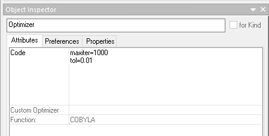

   A COBYLA Optimizer's Attributes

*Code*

Entering **maxiter=** followed by an integer 
(e.g. **maxiter=500**) sets the maximum number of iterations
that the Optimizer driver will perform when attempting to converge.
[Default: **200**]

Entering **tol=** followed by a number (e.g. **tol=0.01**)
sets the optimization tolerance. [Default: **1e-4**]

*Custom Optimizer*

Leave this field blank.

*Function*

Select **COBYLA**.

BayesOpt
^^^^^^^^

Uses the `BayesOpt <https://rmcantin.bitbucket.io/html/index.html>`_
Bayesian optimization library. BayesOpt supports unconstrained optimization.

.. figure:: images/BayesOptOptimizerAttributes.png
   :alt: text

   A BayesOpt Optimizer's Attributes

*Code*

Entering **n_iterations=** followed by an integer 
(e.g. **n_iterations=200**) sets the number of target function
evaluations. [Default: **190**]

Entering **n_iter_relearn=** followed by an integer 
(e.g. **n_iter_relearn=20** sets the number of iterations
between re-learning kernal parameters. If **n_iter_relearn=0**
then there will be no relearning. [Default: **50**]

Entering **n_inner_iterations=** followed by an integer
(e.g. **n_inner_iterations=**) sets the maximum number
of iterations (per dimension) to optimize the acquisition
function. [Default: **500**]

Entering **n_init_samples=** followed by an integer
(e.g. **n_init_samples=20**) sets the initial set of samples
/ target function evaluations. [Default: **10**]

Entering **epsilon=** followed by a double between 0.0 and 1.0
inclusive (e.g. **epsilon=0.3**) set the probability of
performing a random (blind) evaluation of the target function.
Higher values result in more forced exploration whereas lower
values result in a greater exploitation of the learned model.
[Default: **0.0** (epsilon-greedy disabled)]

.. note:: For more information on each parameter, additional
   parameters not covered here, the BayesOpt method library,
   and Bayesian optimization in general, please visit
   https://rmcantin.bitbucket.io/html/usemanual.html#params
   and its related pages.

*Custom Optimizer*

Enter
**bayesopt_openmdao.bayesopt_optimizer.BayesoptOptimizer**
in this attribute field

You will also need to
install the BayesOpt package by running the following command in a Command Prompt:

.. code::

   "C:\Program Files (x86)\META\bin\Python27\Scripts\python.exe" -m pip install --user bayesopt_openmdao

*Function*

Select **Custom**.

PCC
---

.. note:: This section is under construction. Please check back later for updates!
