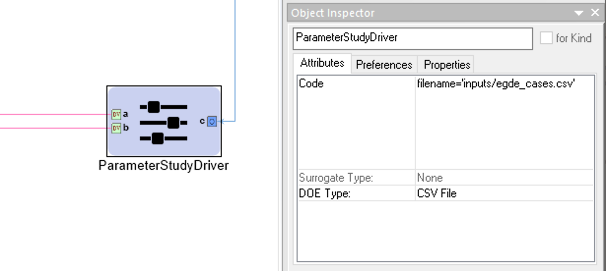

.. _pet_drivers:

PET Drivers
===========

A PET Driver allows the user to:

#. Provide varying inputs to a system defined by PET Analysis Blocks
#. Record the system outputs for each set of inputs

.. _pet_drivers_parameter_study:

Driver Basics
-------------

Adding a Driver to a PET
~~~~~~~~~~~~~~~~~~~~~~~~

To add a *PET Driver* to a PET, simply left-click and drag the driver icon from the
**Part Browser** and onto the PET canvas.

.. figure:: images/ParameterStudy.png
   :alt: Adding a Parameter Study Driver to a PET

   Adding a Parameter Study Driver to a PET

Design Variables
~~~~~~~~~~~~~~~~

A Design Variable placed inside a PET Driver will appear as a port
on the Driver's PET model and can be connected to PET Analysis
Blocks.

Adding a Design Variable to a PET Driver
^^^^^^^^^^^^^^^^^^^^^^^^^^^^^^^^^^^^^^^^
   
To add a Design Variable to a PET Driver, simply open the PET Model
by double-clicking on the PET Driver in the PET Canvas and drag
the **Design Variable** icon from the Part Browser and onto the canvas.

.. figure:: images/DesignVariable.png
   :alt: Adding Design Variables to a Parameter Study Driver
   
   Adding Design Variables to a Parameter Study Driver

Design Variable Range
^^^^^^^^^^^^^^^^^^^^^

Each Design Variable has **Range** attribute
that can be set by the user.
This range can be expressed in a few different ways:

#. A single string or numeric value. E.g. ``25.0`` or ``Diesel``.
#. A real-number interval. This can include closed or open intervals.
   If the interval is expressed without either parentheses or brackets it
   is assumed to be a closed interval. E.g. ``1,10`` signifies a closed
   interval between one and ten and ``(0,10000]`` signifies a half-closed
   interval from zero exclusive to ten thousand inclusive.
#. A semicolon-separated enumeration of either quoted strings or numbers.
   E.g. ``2;3;5;7;11;13;17;19`` or ``"red";"blue";"green"``.

.. figure:: images/DesignVariableRange.png
   :alt: text

   Setting a Design Variable's range

Objectives
~~~~~~~~~~

Objectives are used to specify which values we want to record or optimize
towards during the execution of the PET.
An *Objective* placed inside a PET Driver will appear as a port
on the PET Driver's PET model and the outputs of PET Analysis Blocks can be
connected to it.

Adding an Objective to a PET Driver
^^^^^^^^^^^^^^^^^^^^^^^^^^^^^^^^^^^^^^^^^^^^^^^

To add an *Objective* to a PET Driver, simply drag
the **Objective** icon from the Part Browser and onto
the PET Model canvas as you did with Design Variables.

.. figure:: images/ParameterStudyDriverPopulated.png
   :alt: A Parameter Study PET Driver with Design Variables **a** and **b** and Objective **c**

   A Parameter Study PET Driver with Design Variables **a** and **b**
   and Objective **c**

Parameter Study
---------------

The Parameter Study Driver generates a set of inputs based on the type
of Design of Experiments (DOE) that is being conducted. Then
the driver evaluates the analysis workflow at each of the generated
inputs sets and records the values of the objectives.

The Parameter Study is configured by setting a adjusting a number
of its attributes. These attributes can be accessed by left-clicking
a Parameter Study and then looking under the **Attributes** tab of the
**Object Inspector** window.

.. figure:: images/ParameterStudyAttributes.png
   :alt: text

   A Parameter Study's Attributes

Code
~~~~

The **Code** attribute is used to pass configuration variables
to underlying MDAO engine. For example, in the image above you can
see entering we assigned the variable ``num_samples`` the value of ``10``.

See the `DOE Types`_ section below for more
information on what code variables need to be set for each type.

Surrogate Type
~~~~~~~~~~~~~~

The **Surrogate Type** attribute is not currently documented.

DOE Types
~~~~~~~~~

The **DOE Type** attribute determines the sampling method by which
the Parameter Study explores the Design Variable space.
Different DOE Types can be selected by left-clicking
the **DOE Type** attribute field and selecting the desired method.
The different types and there accompanying configuration are described below.

Full Factorial
^^^^^^^^^^^^^^

The Full Factorial type generates **DV^num_samples** input cases where
**DV** is the number of Design Variables and **num_samples** is set
in the **Code** attribute. The levels for each Design Variable are evenly
distributed across the Design Variable's range with one level
at the minimum value and and one level at the maximum value.

If **num_samples=1**, then each Design Variable will have one level,
and that level will be the Design Variable's respective minimum value.
If **num_samples=2**, then each Design Variable will have two levels,
and those levels will be the Design Variable's respective minimum and
maximum levels.
If **num_samples=3** or greater, then Design Variable will have
additional levels evenly distributed across its range.

When the PET is run, a full factorial exploration of the design
space will occur - e.g. if the PET has two Design Variables x and y,
both with a **Range** of **-10,+10** and **num_samples=3**, then
the PET will test the following *(x,y)* inputs: *(-10,-10), (-10,0),
(-10,+10), (0,-10), (0,0), (0,+10), (+10,-10), (+10,0), (+10,+10)*.

Central Composite
^^^^^^^^^^^^^^^^^

This DOE type is currently unsupported.

Opt Latin Hypercube
^^^^^^^^^^^^^^^^^^^

The Opt Latin Hypercube type is a predetermined-samples driver that seeks to
produce good coverage across all the dimensions. This is preferred to a Uniform
type of sampling in most cases as you have a higher probability of an
evenly-sampled independent variables set.

Uniform
^^^^^^^

The Uniform type generates **num_samples** input cases where **num_samples**
is set in the **Code** attribute. The input cases are evenly distributed across
the ranges of all Design Variables.

If **num_samples=1**, then, in the resulting single input case, each
Design Variable will be set to its minimum value.

CSV File
^^^^^^^^

The CSV File type allows for an arbitrary set of test cases to be specified
in a CSV file and then executed with the given analysis workflow. This is
useful when you have a number of edge cases you need to test.

The input file is selected by placing the path, relative to the project
directory (i.e. the location of the current ``.mga`` file), in a
``filename='<path>'`` assignment in the **Code** attribute of the
Parameter Study Driver. This file will be copied to the execution
directory when the PET is executed.

   
   Example CSV File DOE Type Configuration for a Parameter Study Driver

All design variables that are unrepresented in the input CSV file will be
assigned a value that is the average of the interval specified in that design
variable's *Range* attribute in the Parameter Study Driver. Extra columns that
don't match any of the design variables are allowed in the input CSV, but
they are ignored.

.. _pet_drivers_optimizer:

Optimizer
---------

The Optimizer varies system inputs in order to minimize a single system output.
Like the Parameter Study, the Optimizer records the systems inputs and designated
outputs at every iteration.

However, unlike the Parameter Study, the Optimizer uses the designated system outputs
to change the system's inputs as well as decide when the optimization process
has reached a satisfactory stopping point.

Adding an Optimizer to a PET
~~~~~~~~~~~~~~~~~~~~~~~~~~~~

To add an Optimizer to a PET, simply drag the **Optimizer** icon from the
Part Browser and onto the PET canvas.

.. figure:: images/Optimizer.png
   :alt: text

   An Optimizer in a PET

****

Design Variable
~~~~~~~~~~~~~~~

A Design Variable placed inside a Optimizer will appear as a port
on the Parameter Study's PET model and can be connected to PET Analysis
Blocks.

Over the course of a PET run, a Optimizer Driver
changes each Design Variable's value many times in order to
minimize the Objective. The inputs of PET Analysis Blocks can be connected to it.

.. figure:: images/DesignVariableOptimizer.png
   :alt: text

   A Design Variable in an Optimizer PET Driver

.. figure:: images/DesignVariableConnectedOptimizer.png
   :alt: text

   An Optimizer PET Driver's Design Variable connected to a PET Analysis Block

Adding a Design Variable to an Optimizer Driver
^^^^^^^^^^^^^^^^^^^^^^^^^^^^^^^^^^^^^^^^^^^^^^^^

To add a Design Variable to an Optimizer Driver, simply drag
the **Design Variable** icon from the Part Browser and onto the PET canvas.

Design Variable Range
^^^^^^^^^^^^^^^^^^^^^

Each Design Variable has **Range** attribute
that can be set by the user.

To set a Design Variable's range:

#. Left-click on the Design Variable
   and edit the **Range** attribute in the **Object Inspector**.

#. Enter the Design Variable's minimum value followed by
   a comma followed by the Design Variable's maximum value.
   (e.g. Entering **-50,34** in a Design Variable's **Range** attribute
   will limit that Design Variable to values between **-50** and **+34 inclusive**).

.. figure:: images/DesignVariableRange.png
   :alt: text

   Setting a Design Variable's range

.. note:: The Optimizer Driver treats Design Variables differently then the
   Parameter Study driver, so setting a Design Variable's range in an
   Optimizer only sets the default optimization starting point for that
   variable to be the (minimum+maximum)/2.

.. warning:: Setting a Design Variable's range DOES NOT keep the Optimizer from setting 
   the Design Variable's value outside of that range during the optimization process. 
   In order to properly constrain Design Variables, the user must add an additional
   Constraint to the Optimizer Driver for each constrained Design Variable,
   set that Constraint's **MinValue** and **MaxValue** attributes to the desired
   Design Variable bounds, and connect the Design Variable to the Constraint using
   Connect Mode at the PET level *(i.e. outside of the Optimizer)*.

.. figure:: images/DesignVariableOptimizerWorkaround.png
   :alt: text

   Constraining an Optimizer's Design Variables

   Check out the :ref:`pet_advanced_topics` chapter to learn more about how to
   finesse an optimization.

Objective
~~~~~~~~~

An Objective placed inside an Optimizer will appear as a port
on the Optimizer's PET model and PET Analysis Blocks can be
connected to it.

At every iteration of the Optimizer, the Objective will record
the value of the Metric connected to it. Additionally, the Optimizer
Driver will use the Objective's recorded value to change the values
of the Design Variable(s) for the next iteration as well as to decide
when a satisfactory minimum has been achieved.

Adding an Objective to an Optimizer Driver
^^^^^^^^^^^^^^^^^^^^^^^^^^^^^^^^^^^^^^^^^^

To add an Objective to an Optimizer Driver, simply drag
the **Objective** icon from the Part Browser and onto the Optimizer canvas.

.. figure:: images/ObjectiveOptimizer.png
   :alt: text

   An Objective in a Optimizer PET Driver

.. figure:: images/ObjectiveConnectedOptimizer.png
   :alt: text

   A PET Analysis Block connected to an Optimizer PET Driver's Objective

Intermediate Variable
~~~~~~~~~~~~~~~~~~~~~

An Intermediate Variable placed inside an Optimizer
will appear as a port on the Optimizer's PET model and PET
Analysis Blocks can be connected to it.

An Intermediate Variable records the value of the Metric connected
to it at every iteration of the Optimizer but does not affect the
optimization process like the Objective does.

Adding an Intermediate Variable to an Optimizer Driver
^^^^^^^^^^^^^^^^^^^^^^^^^^^^^^^^^^^^^^^^^^^^^^^^^^^^^^

To add an Intermediate Variable to an Optimizer Driver, simply drag
the **Intermediate Variable** icon from the Part Browser and onto the Optimizer canvas.

.. figure:: images/IntermediateVariable.png
   :alt: text

   An Intermediate Variable in a Optimizer PET Driver

.. figure:: images/IntermediateVariableConnected.png
   :alt: text

   A PET Analysis Block connected to an Optimizer PET Driver's Intermediate Variable

****

Optimizer Constraint
~~~~~~~~~~~~~~~~~~~~

At Optimizer Constraint placed inside an Optimizer
will appear as a port on the Optimizer's PET model and PET Analysis
Blocks can be connected to it.

An Optimizer Constraint allows designated system outputs to influence
the optimization process - if *(and this is an important if)* the 
optimization method being used supports constraints!

Adding an Optimizer Constraint to an Optimizer Driver
^^^^^^^^^^^^^^^^^^^^^^^^^^^^^^^^^^^^^^^^^^^^^^^^^^^^^

To add an Intermediate Constraint to an Optimizer Driver, simply drag
the **Intermediate Constraint** icon from the Part Browser and onto the Optimizer canvas.

.. figure:: images/OptimizerConstraint.png
   :alt: text

   An Objective Constraint in a Optimizer PET Driver

.. figure:: images/OptimizerConstraintConnected.png
   :alt: text

   A PET Analysis Block connected to an Optimizer PET Driver's Objective Constraint

Optimizer Constraint MinValue & MaxValue
^^^^^^^^^^^^^^^^^^^^^^^^^^^^^^^^^^^^^^^^

Each Optimizer Constraint has **MinValue** and **MaxValue** attributes
that can be set by the user. The Optimizer Driver will do its best
to keep system outputs connected to a Optimizer Constraint within
the bound(s) defined by the **MinValue** and **MaxValue** attributes.

To set an Optimizer Constraint's MinValue and/or MaxValue attributes:

#. Left-click on the Optimizer Constraint
   and edit the **MinValue** attribute in the **Object Inspector**.

#. Enter the Optimizer Constraint's minimum value.

#. Repeat this process for the Optimizer Constraint's maximum value.

Optimizer Types
~~~~~~~~~~~~~~~~~~~~

The OpenMETA Optimizer comes with two different optimization methods, and can be extended
by users to include more. Users can change the optimization method and related settings by
selecting (or opening) the Optimizer Driver and editing its attributes
in the Object Inspector.

COBYLA
^^^^^^

This Optimizer Uses the COBYLA function in SciPy's
`optimize` library. COBYLA supports constrained optimization without 
defined gradients (or Jacobian matrixes).

.. figure:: images/COBYLAOptimizerAttributes.png
   :alt: text

   A COBYLA Optimizer's Attributes

*Code*

==================  =====================================================================  =======
Name                Description                                                            Default
==================  =====================================================================  =======
maxiter             maximum number of iterations when attempting to converge               200
tol                 optimization tolerance                                                 1e-4
==================  =====================================================================  =======

*Custom Optimizer*

Leave this field blank.

*Function*

Select **COBYLA**.

BayesOpt
^^^^^^^^

This Optimizer uses the `BayesOpt <https://rmcantin.bitbucket.io/html/index.html>`_
Bayesian optimization library. BayesOpt supports unconstrained optimization.

.. figure:: images/BayesOptOptimizerAttributes.png
   :alt: text

   A BayesOpt Optimizer's Attributes

*Code*

==================  =====================================================================  =======
Name                Description                                                            Default
==================  =====================================================================  =======
n_iterations        number of target function evaluations                                  190
n_iter_relearn      number of iterations between re-learning kernel parameters             50
n_inner_iterations  max iterations (per dimension) to optimize the acquisition function    500
n_init_samples      initial set of samples / target function evaluations                   10
epsilon             probability of performing a random (blind) target function evaluation  0.0
==================  =====================================================================  =======

.. note:: If **n_iter_relearn=0** then there will be no relearning.

   **epsilon** can be given a double value between 0.0 and 1.0 inclusive.
   Higher values result in more forced exploration whereas lower values result 
   in a greater exploitation of the learned model.

   For more information on each parameter, additional
   parameters not covered here, the BayesOpt method library,
   and Bayesian optimization in general, please visit
   https://rmcantin.bitbucket.io/html/usemanual.html#params
   and its related pages.

*Custom Optimizer*

Enter
**bayesopt_openmdao.bayesopt_optimizer.BayesoptOptimizer**
in this attribute field

You will also need to
install the BayesOpt package by running the following command in a Command Prompt:

.. code::

   "C:\Program Files (x86)\META\bin\Python27\Scripts\python.exe" -m pip install --user bayesopt_openmdao

*Function*

Select **Custom**.

PCC
---

.. note:: This section is under construction. Please check back later for updates!
