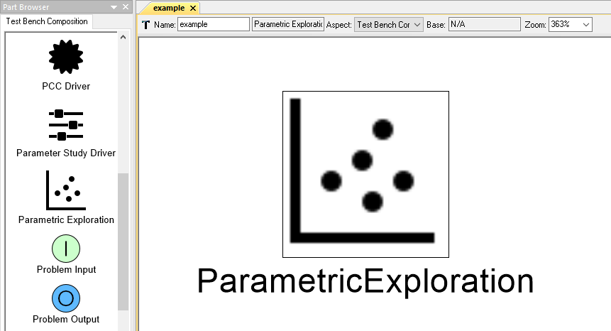
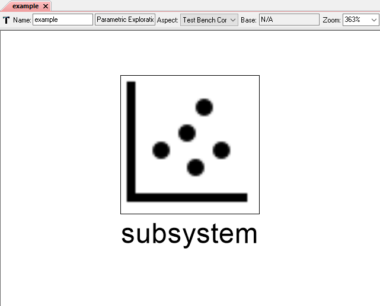
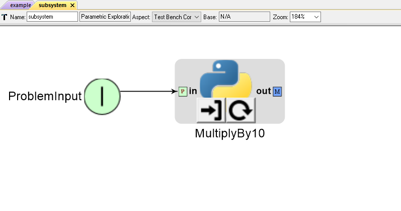
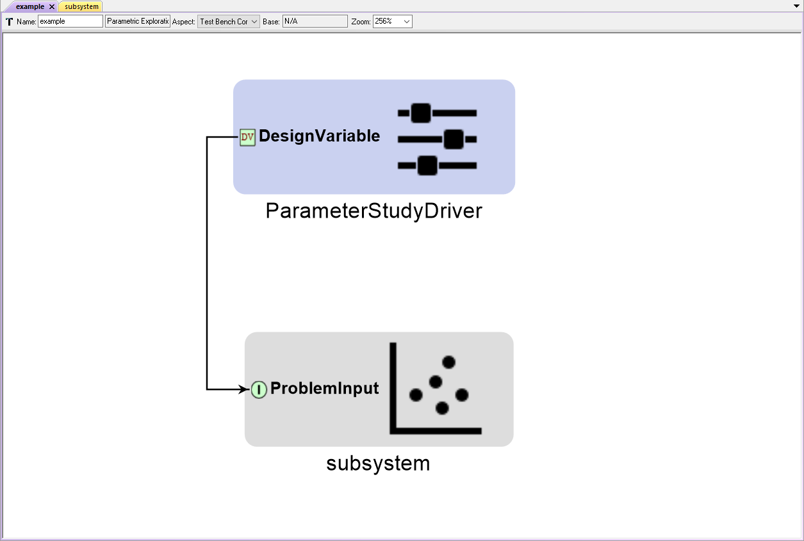
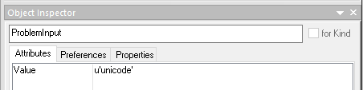
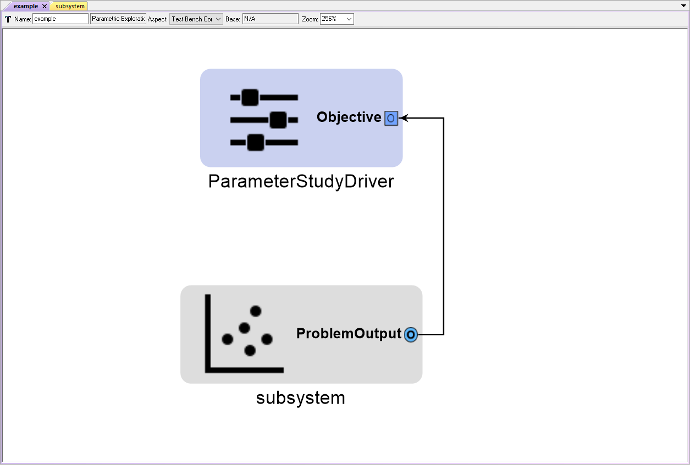

.. _pet_nesting:

PET Nesting
===========

PET Nesting allows the user to place a PET inside another PET
and make connections between two PETs using the Problem Input 
and Problem Output components.

With PET Nesting, the user can add additional levels of encapsulation
and composability to a model.

Adding a new PET to another PET
-------------------------------

To add a new PET to a PET, simply drag the **Parametric Exploration** icon
from the **Part Browser** and onto the PET canvas.

   A new PET in another PET

Adding an existing PET to another PET 
-------------------------------------

To add an existing PET to a PET:

1. In the **GME Browser** window, right-click on the PET you want to add and select **Copy.**

.. figure:: images/AddingExistingPET_1.png
   :alt: text

   Copying an existing PET

2. Then, right-click on the PET you want to add to and select **Paste.**

.. figure:: images/AddingExistingPET_2.png
   :alt: text

   Pasting an existing PET into another PET

   As shown below, the newly added PET is now displayed on the parent PET's canvas
   just like a regular PET Analysis Block

   
   PET inside PET
   
Problem Inputs
--------------

Problem Inputs allow the user to provide a nested PET with explicit inputs
that are exposed to the parent PET as Parameter (input) ports.

Adding a Problem Input to a PET
~~~~~~~~~~~~~~~~~~~~~~~~~~~~~~~

To add a Problem Input to a PET, simply drag the **Problem Input** icon from
the **Part Browser** and onto the PET canvas.

   A Problem Input connected to a Python Wrapper component
   

   A PET Driver connected to a nested PET's Problem Input

Setting a Problem Input's Value Attribute
~~~~~~~~~~~~~~~~~~~~~~~~~~~~~~~~~~~~~~~~~

By default, Problem Inputs expect to pass the double data type (e.g. 0.0).
If the Problem Input must pass another data type (e.g. a PET Analysis block
in the nested PET requires a string input), then an example of that data type
must be entered in the Problem Input's **Value** attribute via the 
**Object Inspector.** 

Under certain conditions, the Master Interpreter may
prompt you to enter example data types for all Problem Inputs (including
doubles) in a nested PET!

Example **Value** attribute entries are as follows:

- To pass the double type, enter **0.0**
- To pass the int type, enter **1**
- To pass the string type, enter **u'unicode**

   Setting a Problem Input to pass the string data type

Problem Outputs
---------------

Problem Outputs allow the user to provide a nested PET with explicit outputs
that are exposed to the parent PET as Metric (output) ports.

Adding a Problem Output to a PET
~~~~~~~~~~~~~~~~~~~~~~~~~~~~~~~~

To add a Problem Output to a PET, simply drag the **Problem Output** icon from
the **Part Browser** and onto the PET canvas.

.. figure:: images/ConnectingProblemOutput.png
   :alt: text

   A Python Wrapper component connected to a Problem Output

   A nested PET's Problem Output connected to a PET Driver

.. _pet_nesting_with_drivers:

Nesting PETs with Drivers
-------------------------

In certain cases, it may be useful to nest an Optimizer PET
within a Parameter Study PET (or another Optimizer PET). This type
of hierarchy is easy to set up as shown below.

.. figure:: images/NestedPETsWithDrivers_1.png
   :alt: text

   The TopLevel PET contains a Parameter Study Driver and a nested OptimizerPET

.. figure:: images/NestedPETsWithDrivers_2.png
   :alt: text

   The OptimizerPET contains an Optimizer Driver and a Python Wrapper Component

In the example above, the TopLevel PET provides the OptimizerPET a different value
of x for each iteration of its Parameter Study Driver.

The OptimizerPET's Optimizer Driver finds the minimum value of f_xy for that value of x
by varying its Design Variable y. The final optimized f_xy and y values are passed back
up to the TopLevel PET where they are recorded by its Parameter Study driver.

.. note:: Only the final result (of OptimizerPET's many iterations) is recorded by the TopLevel
   PET's Parameter Study Driver.
   