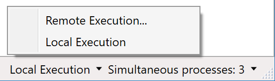
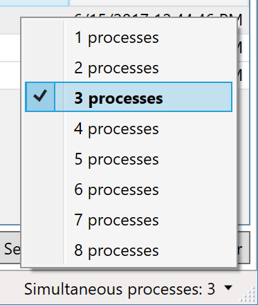
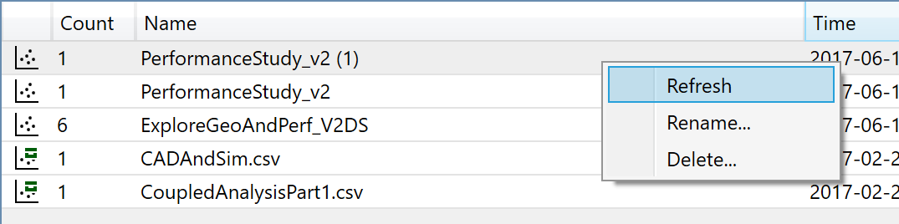
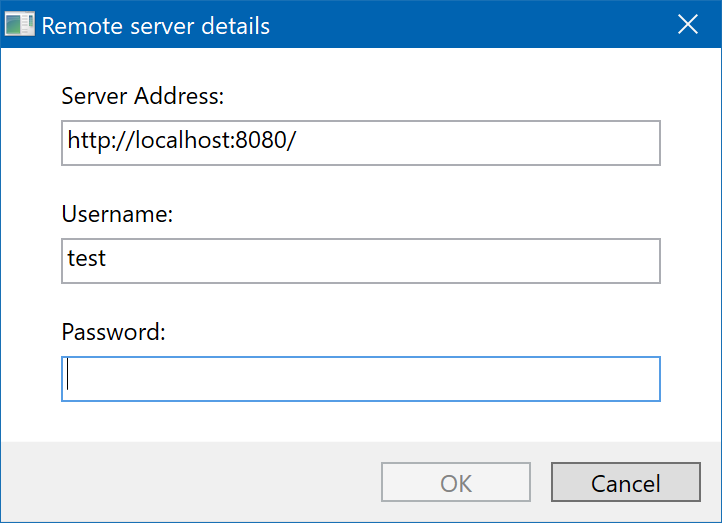

.. _resultsbrowser:

Results Browser
===============

The OpenMETA tools enable the generation of large amounts of data
through the execution of the various domain models. The amount of
analyses results can be further exacerbated with design space modeling
and the Parametric Exploration Tool.

To manage and visualize the results of OpenMETA generated analyses, we
created the :ref:`resultsbrowser` and :ref:`visualizer`, respectively.

The Results Browser provides a layer of management and organization
on top of the raw results in the file system. This chapter explains the
features of the Results Browser.

Toolbar
-------

.. image:: images/Toolbar.png
   :alt: Toolbar
   :width: 390.5px

**New Window:** This button will open a new instance of the Results Browser.

**Select Results Folder:** This button allows you to specify a new working directory for the
Results Browser. This directory must include at a minimum a
'results' folder with some results already generated.

**Refresh:** This button will force a refresh of the PET Tab and Test Benches Tab
results lists. A refresh happens automatically at the conclusion of each
active job.

**Cleanup:** This button cleans up the ``results/`` folder, by moving any untracked
folders from the ``results/`` folder to the ``_deleted/`` folder. If you
want to totally delete old data, you can remove this folder after using
the Cleanup button.

Status Bar
----------

Remote execution can be enabled from the status bar when no jobs are running.
See `Remote Execution`_ for more details.

The maximum number of simultaneous processes used by the Job Manager can be
adjusted from the status bar when no jobs are running.  This defaults to the
number of logical processors.

PET Tab
-------

.. image:: images/PetTab.png
   :alt: PET Tab
   :width: 1188px

PET Dataset List Pane
~~~~~~~~~~~~~~~~~~~~~

This pane on the left of the PET tab shows the available datasets.

Column Headers
^^^^^^^^^^^^^^

**Dataset Types:**

-  |PET_ICON| **PET:** These are results from a single execution of the Master
   Interpreter within a PET context.
-  |MERGED_PET_ICON| **Merged PET:** These are results that that were combined
   from one or more other result sets, with the Merge Selected button.  They may
   be refreshed by right-clicking and selecting "Refresh" from the context menu.
-  |ARCHIVE_ICON| **Archive:** These are archives of PET Results that were
   created with the 'Archive Selected' button [deprecated with OpenMETA 0.11] at
   the bottom of the PET Dataset Pane. They reside in .csv format in the
   ./archive folder in the root of the project.  Archives must be converted to
   the new Merged PET format (using the "Merge Selected" button while the
   archive is selected) before they can be launched in the Visualizer.
-  |PET_RESULT_ICON| **Legacy PET:** These are PET entries created using earlier
   versions of the Results Browser, which must be merged (using the "Merge
   Selected" button) before they can be launched in the Visualizer.  These are
   only shown when "Show Legacy PETs" is checked in the Settings
   (|SETTINGS_ICON|) menu.

**Count:** This shows the number of discrete configurations that were executed for
a given PET. (For an 'Archive' or 'MergedPet' this will always be
1.)

**Name:** This is the name of the PET, which is either taken from the PET name
in the OpenMETA model, or specified by the user if the result has been renamed
or merged.

**Time:** This is the time at which the PET execution was initiated by the Master
Interpreter.

.. |PET_ICON| image:: images/icons/PET.svg
      :alt: PET Icon
      :width: 16px

.. |ARCHIVE_ICON| image:: images/icons/Archive.svg
      :alt: Archive Icon
      :width: 16px

.. |PET_RESULT_ICON| image:: images/icons/PETResult.svg
      :alt: Legacy PET Icon
      :width: 16px

.. |SETTINGS_ICON| image:: images/icons/Settings_16x.svg
      :alt: Settings Icon
      :width: 16px

Action Buttons
^^^^^^^^^^^^^^

**Merge Selected:** This button will merge and archive the selected datasets into a unique
folder in the ./merged folder in the project directory that includes a
.csv of the aggregated data as well as metadata about the dataset.

Context Menu
^^^^^^^^^^^^

Right-clicking a PET or Merged PET will display a context menu:

**Refresh:**  Updates the selected dataset to include the latest data from its
source datasets.

**Rename...:**  Renames the selected dataset.

**Delete...:** Deletes the selected dataset.

PET Details Pane
~~~~~~~~~~~~~~~~

This pane shows details about the currently-highlighted dataset in the
PET Dataset Pane. The displayed information in the header includes:

-  Name of the PET
-  Location of the PET in the OpenMETA model
-  Time of execution
-  Hyperlink to the project .mga
-  Count of the individual points sampled in this PET
-  Count of the discrete configurations evaluated

Below the header is a summary of the dataset's metrics. Each of the
DesignVariables and Objectives are listed along with the minimum,
average, and maximum values represented in the dataset.

For PETs and Merged PETs, a list of saved Visualizer sessions is also displayed
in this pane.  To launch a session, select a session from the list and click
"Launch in OpenMETA Visualizer"; sessions with a |VISUALIZER_SESSION_RUNNING_ICON| icon
are already running and cannot be launched again (close the browser tab to
relaunch).  To create a new session, click "New Session..." and specify a
session name; this will create a new Visualizer session with the default
configuration.

Launching other tools from the Results Browser
^^^^^^^^^^^^^^^^^^^^^^^^^^^^^^^^^^^^^^^^^^^^^^

.. image:: images/OpenWithMenu.png
   :alt: Open With Visualizer Menu
   :width: 259.5px

Other external visualization and analysis tools can be launched from the Results
Browser by clicking the arrow button beside the "Launch in OpenMETA Visualizer"
button and choosing a tool from the dropdown menu.

Exporting results as CSV
************************

To export results as CSV, click the arrow button beside the "Launch in OpenMETA
Visualizer" button, choose "Export as CSV", then select a location to save the
exported CSV.

Opening results in Excel
************************

To open results in Excel, click the arrow button beside the "Launch in OpenMETA
Visualizer" button and choose "Open in Excel".  A new Excel document will be
opened, containing a row for each iteration of your PET and a column for each
design variable, objective, constraint, or intermediate variable.

.. note::
   When multiple version of Excel are installed, the Results Browser will
   launch the first version it encounters in the ``%PATH`` environment
   variable.

Opening results in JMP
************************

To open results in JMP, click the arrow button beside the "Launch in OpenMETA
Visualizer" button and choose "Open in JMP".  A new JMP Data Table will be
opened, containing a row for each iteration of your PET and a column for each
design variable, objective, constraint, or intermediate variable.

Test Benches Tab
----------------

.. image:: images/TestBenchesTab.png
   :alt: Test Benches Tab
   :width: 954px

Test Bench List Pane
~~~~~~~~~~~~~~~~~~~~

This pane on the left of the PET tab shows the available Test Benches.

Column Headers
^^^^^^^^^^^^^^

**Dataset Types:** 'TestBenchResult' is the only type of Test Bench List items.

**Name:** This name is taken from the OpenMETA model at the time of execution by
the Master Interpreter

**Design:** This design name is taken from the OpenMETA model at the time of
execution by the Master Interpreter

**Status:** This is the status taken from the Test Bench Manifest. The possible
values are as follows:

-  Unexecuted: The job was aborted before it was executed.
-  Failed: The job was executed, but an error was encountered.
-  OK: The job was executed without errors.

**Time:** This is the time at which the Test Bench execution was initiated by the
Master Interpreter.

Action Buttons
^^^^^^^^^^^^^^

**Open Selected in Explorer:** This button will open Windows Explorer at the location of the execution
directory for this Test Bench.

Test Bench Details Pane
~~~~~~~~~~~~~~~~~~~~~~~

This pane shows details about the currently-highlighted dataset in the
PET Dataset Pane. The displayed information in the header includes:

-  Name of the Testbench
-  Time of execution
-  Design ID
-  Design Name

Below the header is a summary of the Test Bench. Each of the five
sections provides information that is encoded in the
``testbench_manifest.json`` file.

-  **Steps:** An ordered list of the commands to be invoked for the
   execution of this Test Bench.
-  **Parameters:** The input parameters of the Test Bench, including their
   value, range, and units.
-  **Metrics:** The output metrics that resulted from the execution of the
   Test Bench, including their value and units.
-  **Artifacts:** A list of recorded artifacts from the Test Bench
   execution.
-  **Visualization Artifacts:** A list of the recorded visual artifacts from
   the Test Bench execution.

Active Jobs Tab
---------------

.. image:: images/JobsTab.png
   :alt: Active Jobs Tab
   :width: 957px

Active Jobs List Pane
~~~~~~~~~~~~~~~~~~~~~

This pane lists all the active jobs.

Column Headers
^^^^^^^^^^^^^^

**Title:** The title of the job, as generated at the time of execution by the
Master Interpreter.

**Test Bench Name:** This name is taken from the OpenMETA model at the time of execution by
the Master Interpreter.

**Working Directory:** This the directory that the job is executing or was executed in. You can
open this directory by right-clicking a job and selecting 'Open in
Explorer' or by highlighting the job and clicking 'Open Selected Job in
Explorer.'

**Status:** This is the current status of the job, according to the Job Manager. The
possible values are as follows:

-  **Succeeded:** The job was executed and finished without errors.
-  **Failed:** The job was executed, but the job was aborted or an error was
   encountered.
-  **Running:** The job is currently being executed.
-  **In Queue:** The job is waiting to be executed because the maximum
   number of simultaneous jobs has already been met.

**Run Command:** This is the command that is called by the job executor to invoke the
job.

Action Buttons
^^^^^^^^^^^^^^

**Abort Selected Job:** This button will kill the selected job.

**Open Selected Job in Explorer:** This button will open Windows Explorer at the location of the execution
directory for the highlighted job.

.. _remote_execution:

Remote Execution
----------------

Remote execution of OpenMETA jobs is available if the OpenMETA Remote Execution
Server is installed on a remote machine.

Setting up a Server
~~~~~~~~~~~~~~~~~~~

The OpenMETA Remote Executor Server is not currently shipped with public
releases of OpenMETA.
If you are interested in this feature of OpenMETA, please contact us for
more information.

Establishing a Server Connection
~~~~~~~~~~~~~~~~~~~~~~~~~~~~~~~~
   
To switch to remote execution, click the "Local Execution" dropdown on the
status bar, and select "Remote Execution..." from the menu.

In the dialog that appears, enter the URL for the remote execution server as
well as your username and password for the remote execution server (given to
you by the server administrator) and click "OK".  All jobs will then be executed
remotely rather than locally.

Although the passwords are not stored for security reasons, a list of
Recent Servers is saved for ease of reconnection.

.. image:: images/RemoteExecutionConnectionEstablished.png
   :alt: An established remote execution connection
   :width: 417px

To return to local execution, click the "Remote Execution" dropdown on the
status bar, then select "Local execution" from the menu.

Job Distribution
~~~~~~~~~~~~~~~~

When the Results Browser is configured to run jobs under remote execution,
the jobs' *labels* are then used by the server to distribute each job to a
suitable worker machine. See the :ref:`job_labels` subsection of the Test
Benches chapter for more information.

Remote Job Statuses
~~~~~~~~~~~~~~~~~~~

Jobs executing remotely have the following additional statuses:

-  **Succeeded:** The job was executed and finished without errors.
-  **Failed:** The job was executed, but the job was aborted or an error was
   encountered.
-  **Running:** The job is currently being executed.
-  **In Queue:** The job is waiting to be executed because the maximum
   number of simultaneous jobs has already been met.
