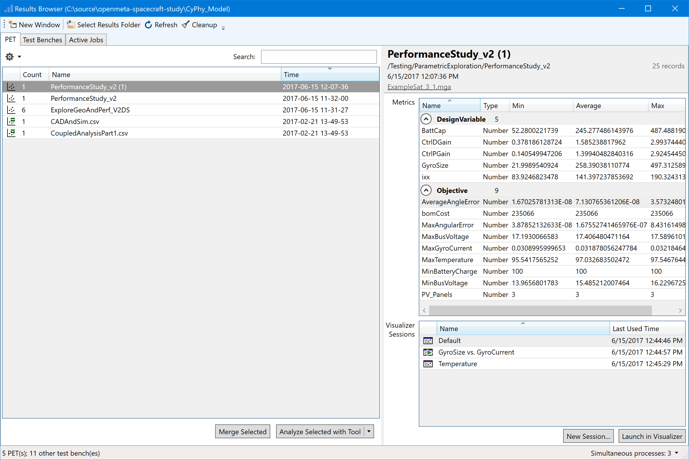
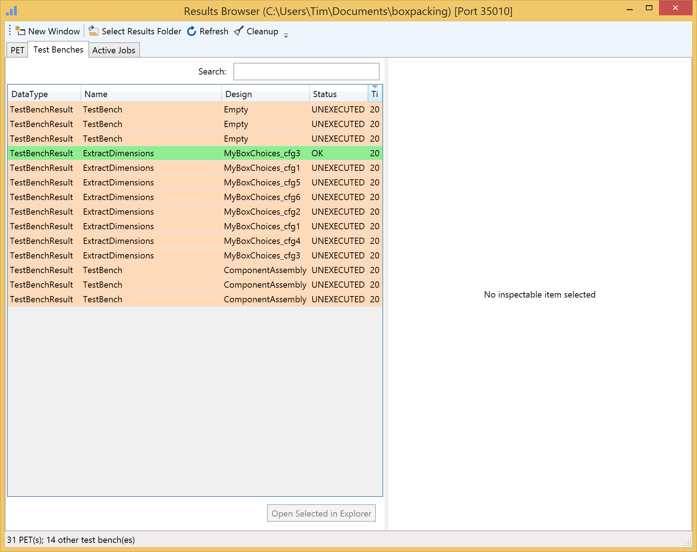

.. _resultsbrowser:

Results Browser
===============

This is a point-by-point guide describing each function of the Results
Browser.

Toolbar
-------

**New Window**

This button will open a new instance of the Results Browser.

**Select Results Folder**

This button allows you to specify a new working directory for the
Results Browser. This directory must include at a minimum a
'results' folder with some results already generated.

**Refresh**

This button will force a refresh of the PET Tab and Test Benches Tab
results lists. A refresh happens automatically at the conclusion of each
active job.

**Cleanup**

This button cleans up the ``results`` folder, by moving any untracked
folders from the ``results`` folder to the ``_deleted`` folder. If you
want to totally delete old data, you can remove this folder after using
the Cleanup button.

PET Tab
-------

PET Dataset List Pane
~~~~~~~~~~~~~~~~~~~~~

This pane on the left of the PET tab shows the available datasets.

Column Headers
^^^^^^^^^^^^^^

**Dataset Types**

-  PetResult: These are results that were aggregated from a single
   execution of the Master Interpreter and are linked together only by
   sharing the same created timestamp. They are spread out across a
   number of unique folders in the results directory that correspond
   directly to the number of configurations that were executed by the
   master interpreter.
-  MergedPet: These are results that that were processed from one or
   more PetResult entries. The Reslts Browser creates these MergedPet
   entries by merging the data from the source PetResult(s) and placing
   that resulting .csv file along with a number of metadata files into a
   single unique folder in the ./merged folder in the project directory.
   When a PetResult is launched into the Visualizer, the user will be
   prompted to enter a name as a MergedPet must be created now before
   lanuching the Visualizer.
-  Archive: These are archives of PET Results that were created with the
   'Archive Selected' button [deprecated with OpenMETA 0.11] at the
   bottom of the PET Dataset Pane. They reside in .csv format in the
   ./archive folder in the root of the project

**Count**

This shows the number of discrete configurations that were executed for
a given PetResult. (For an 'Archive' or 'MergedPet' this will always be
1.)

**Name**

This name is taken from the OpenMETA model at the time of execution by
the Master Interpreter

**Time**

This is the time that the PET execution was initiated by the Master
Interpreter.

Action Buttons
^^^^^^^^^^^^^^

**Merge Selected**

This button will merge and archive the selected datasets into a unique
folder in the ./merged folder in the project directory that includes a
.csv of the aggregated data as well as metadata about the dataset.

**Analyze Selected with Tool**

This button is under development; more documentation is forthcoming.

**Open Selected in Visualizer**

This button will launch the visualizer with selected (checked)
dataset(s) after prompting the user to created a MergedPet. If more than
one is selected it will attempt to merge them. If none are selected, it
will launch the highlighted dataset.

PET Details Pane
~~~~~~~~~~~~~~~~

This pane shows details about the currently-highlighted dataset in the
PET Dataset Pane. The displayed information in the header includes:

-  Name of the PET
-  Location of the PET in the OpenMETA model
-  Time of execution
-  Hyperlink to the project .mga
-  Count of the individual points sampled in this PET
-  Count of the discrete configurations evaluated

Below the header is a summary of the dataset. Each of the
DesignVariables and Objectives are listed along with the minimum,
average, and maximum values represented in the dataset.

Test Bench Tab
--------------

Test Bench List Pane
~~~~~~~~~~~~~~~~~~~~

This pane on the left of the PET tab shows the available Test Benches.

Column Headers
^^^^^^^^^^^^^^

**Dataset Types**

'TestBenchResult' is the only type of Test Bench List items.

**Name**

This name is taken from the OpenMETA model at the time of execution by
the Master Interpreter

**Design**

This design name is taken from the OpenMETA model at the time of
execution by the Master Interpreter

**Status**

This is the status taken from the Test Bench Manifest. The possible
values are as follows:

-  Unexecuted: The job was aborted before it was executed.
-  Failed: The job was exectuted, but an error was encountered.
-  OK: The job was exectuted without errors.

**Time**

This is the time that the Test Bench execution was initiated by the
Master Interpreter.

Action Buttons
^^^^^^^^^^^^^^

**Open Selected in Explorer**

This button will open Windows Explorer at the location of the execution
directory for this Test Bench.

Test Bench Details Pane
~~~~~~~~~~~~~~~~~~~~~~~

This pane shows details about the currently-highlighted dataset in the
PET Dataset Pane. The displayed information in the header includes:

-  Name of the Testbench
-  Time of execution
-  Design ID
-  Design Name

Below the header is a summary of the Test Bench. Each of the five
sections provides information that is encoded in the
'testbench\_manifest.json' file.

-  Steps: An ordered list of the commands to be invoked for the
   execution of this Test Bench.
-  Parameters: The input parameters of the Test Bench, including their
   value, range, and units.
-  Metrics: The output metrics that resulted from the execution of the
   Test Bench, including their value and units.
-  Artifacts: A list of recorded artifacts from the Test Bench
   execution.
-  Visualization Artifacts: A list of the recorded visual artifacts from
   the Test Bench execution.

Active Jobs Tab
---------------

.. image:: images/activejobs.png
   :alt: Active Jobs
   :width: 957px

Active Jobs List Pane
~~~~~~~~~~~~~~~~~~~~~

This pane lists all the active jobs.

Column Headers
^^^^^^^^^^^^^^

**Title**

The title of the job, as generated at the time of execution by the
Master Interpreter.

**Test Bench Name**

This name is taken from the OpenMETA model at the time of execution by
the Master Interpreter.

**Working Directory**

This the directory that the job is executing or was executed in. You can
open this directory by right-clicking a job and selecting 'Open in
Explorer' or by highlighting the job and clicking 'Open Selected Job in
Explorer.'

**Status**

This is the current status of the job, according to the Job Manager. The
possible values are as follows:

-  Succeeded: The job was executed and finished without errors.
-  Failed: The job was executed, but the job was aborted or an error was
   encountered.
-  Running: The job is currently being executed.
-  In Queue: The job is waiting to be executed because the maximum
   number of simultaneous jobs has already been met.

**Run Command**

This is the command that is called by the job executor to invoke the
job.

Action Buttons
^^^^^^^^^^^^^^

**Abort Selected Job**

This button will kill the selected job (or PET?).

**Open Selected Job in Explorer**

This button will open Windows Explorer at the location of the execution
directory for the highlighted job.
