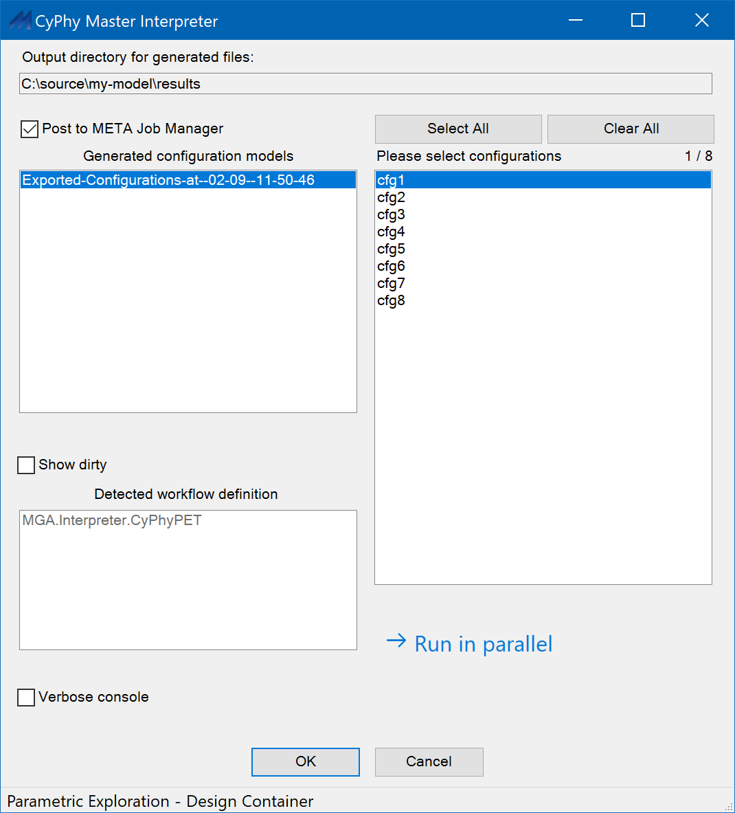

.. _master_interpreter:

Master Interpreter
==================

Generally the **Master Interpreter** is used to execute a Test Bench or PET.
Running the Master Interpreter results in the creation of a new output
folder in the ``results\`` folder of the project directory, the execution
of all tasks in the referenced workflow, and (optionally) the generation of
a *job* that is passed to the :ref:`results_browser` and executed.

For more information on the project directory folder structure see the
:ref:`openmeta_projects` chapter.

Running the Master Interpreter
------------------------------

To run the Master Interpreter, first open a Test Bench or Parametric
Exploration.  Then, click the Master Interpreter (|MASTER_INTERPRETER_ICON|)
on the GME toolbar.  Select configurations to run (click while holding the
Control key to select more than one), then click OK to run the Test Bench or
Parametric Exploration.

Options
~~~~~~~

**Post to META Job Manager:**  When checked, submits the job to the META Job
Manager for execution after all interpreters in the workflow have completed
successfully.  If unchecked, interpreters will run and an output directory
will be generated, but the job will not be submitted to the Job Manager for
execution and any post-interpreter scripts (as determined by the interpreters
in the workflow) will not be executed.

**Show dirty:**  When checked, shows generated configuration models whose
associated design space has been modified since generated by DESERT.

**Verbose console:**  Enables verbose console output, to support interpreter
debugging.

**Run in parallel:**  Runs the interpreters for the selected configurations in
parallel, using all available processor cores.  This is useful when working with
very large numbers of configurations, or when working with
computationally-intensive interpreters.

Jobs
----

An OpenMETA *job* is a single folder and associated metadata that is
passed to the Results Browser from the Master Interpreter.
Jobs can be executed locally by the Results Browser or sent to another machine
for execution using the :ref:`remote_execution` capability of the Results
Browser.

The results folder includes any artifacts required for execution of the
referenced workflow or PET, as well as any artifacts produced by the workflow
(for example, CAD models or PET results).  If the job is submitted to and
executed by the Job Manager, it will also contain job execution logs (in the
``logs`` subfolder), as well as a _REPORT.html containing step-by-step status
information and links to the logs for each step.

.. _job_labels:

Job Labels
~~~~~~~~~~

When the Master Interpreter creates a job, it tags the job with labels
that specify what environment is necessary for the execution of the job.
The list below details the labels that are assigned when a Test Bench
workflow includes each of the interpreters:

-  **Default:** "Windows14.13"
-  **CyPhy2CAD:** "Creo, CADCreoParametricCreateAssembly.exev1.4,
   Windows14.13"
-  **CyPhy2Modelica:** "py_modelica14.13, OpenModelica__latest_"
-  **CyPhyCADAnalysis:** "Creo, CADCreoParametricCreateAssembly.exev1.4,
   CyPhyCADAnalysis14.13"
-  **CyPhyPET:** Takes labels from the interpreters used in each of its
   constituent test benches.
-  **CyPhyPrepareIFab:** "Creo, CADCreoParametricCreateAssembly.exev1.4,
   Windows14.13"
-  **CyPhyReliabilityAnalysis:** "Windows14.13"
-  **CyPhySOT:** Takes labels from its interpreters.
-  **CyPhy2CADPCB:** "Visualizer"
-  **CyPhy2MfgBom:** "Windows14.13"
-  **CyPhy2PCBMfg:** "Windows14.13"
-  **CyPhy2RF:** "RF"
-  **CyPhy2Schematic:** "Schematic"
-  **CyPhy2Simulink:** "Simulink"
