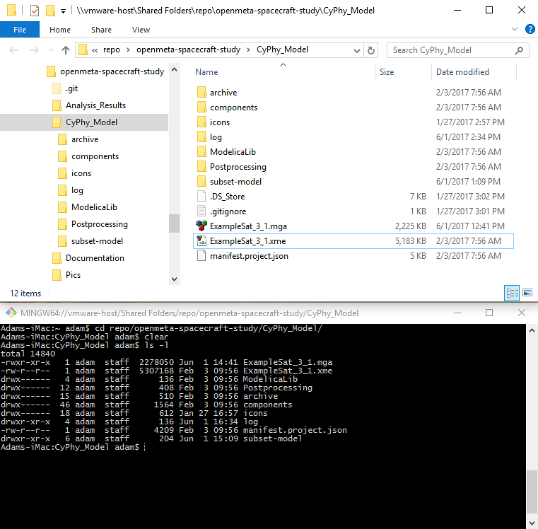

.. _runonhpc:

Running OpenMETA on Linux and/or High-Performance Computing (HPC)
=================================================================
This guide will demonstrate how OpenMETA analyses can be run using Linux and High-Performance Computing (HPC) environments. Although the OpenMETA user interface requires Windows, users can set up a "hybrid" working environment with only a few steps.

This configuration is useful for projects that require Linux-based applications or that wish to reap the performance benefits of HPC.

Configuring the Linux or HPC Environment
~~~~~~~~~~~~~~~~~~~~~~~~~~~~~~~~~~~~~~~~
Our first step will be to prepare the Linux or HPC environment to run OpenMETA analyses.

Prerequisites
-------------

1. Ensure that `Python 2.7.13 <https://www.python.org/downloads/release/python-2713/>`_ *(or a later 2.7.x version)* is installed on the system.
2. Ensure that `pip <https://packaging.python.org/tutorials/installing-packages/#install-pip-setuptools-and-wheel>`_ for Python is installed on the system. We'll use it to install the packages required to run OpenMETA analyses.
3. Ensure that `virtualenv <https://virtualenv.pypa.io/en/stable/installation/>`_ for Python is installed on the system. We'll use it to create an isolated, standalone Python environment for OpenMETA to use.
4. Ensure that *numpy* and *scipy* are installed on the system. `Official installation instructions can be found here <https://www.scipy.org/install.html>`_.

Configuration
-------------

Log in to your Linux or HPC environment. Use these commands to create a Python virtual environment and install the required Python packages:

    .. code-block:: bash
       :linenos:

       cd ~
       python -m virtualenv openmeta-venv
       openmeta-venv/pip install --extra-index-url https://pypi.metamorphsoftware.com run_mdao

    .. note::
       Because of differences between computing environments, you may need to follow additional steps to install specific Python packages that are required by these two.

Working in a Hybrid Environment
~~~~~~~~~~~~~~~~~~~~~~~~~~~~~~~
There are two ways of working with OpenMETA and Linux/HPC, depending on whether you have a shared filesystem. A shared filesystem could be any directory structure to which both your Windows and Linux/HPC environments have access, whether a physical disk or network shared filesystem.

In either case, we will run OpenMETA's user interface using the Windows machine, and switch to the Linux/HPC environment to run analysis. The inspection and management of analysis results will be done on the Windows machine.

Shared Filesystem
-----------------
.. note::
   For the purposes of this guide, a shared filesystem is any directory structure to which both your Windows and Linux/HPC environments have access, whether a physical disk or network shared filesystem.

Move your entire OpenMETA project folder to a location on the shared filesystem.
This should be a location that both your Windows and Linux/HPC environments have
access to.

   An example of a directory shared between Windows and Linux/HPC environments.

Use the OpenMETA user interface in your Windows environment as you normally would. When running Test Benches or PET analysis processes, *de-select* the **Post to META Job Manager** option, as indicated in the blue circle below.

.. image:: images/linux-hpc-master-int.png
   :alt: MasterInterpreter options
   :width: 400px

After running the **Master Interpreter** with this option switched off, you'll see a message in the OpenMETA console indicating the location of the generated (but unexecuted) analysis.

.. image:: images/linux-hpc-post-mi-console.png
   :alt: Console message after running Master Interpreter
   :width: 800px

Using the terminal to your Linux/HPC environment, navigate to this location. Run the analysis by using the Python virtual environment that we configured for OpenMETA.

.. code-block:: bash
   :linenos:

   cd <path_to_results_folder>
   ~/openmeta-venv/bin/python -m testbenchexecutor testbench_manifest.json

The Test Bench may take some time to run. Once it is complete, launch or refresh
OpenMETA's **Results Browser** to inspect the results of the analysis.
Because the analysis results are within the project directory, they will be
accessible in the same Results Browser as analyses performed locally in the
Windows environment.

.. figure:: images/linux-hpc-results-browser.png
   :alt: Test Bench results in the Results Browser
   :width: 800px

   Analysis results are accessible whether they were run in the Windows or Linux/HPC environments.

Isolated Filesystems
--------------------
If your Windows and Linux/HPC environments do not have access to a common filesystem, then we recommend using a secure file-transmission tool such as ``rsync`` or ``scp`` to transfer the project directory to and from the Linux/HPC environment. In the example below, we'll use ``rsync``.

We recommend studying the ``rsync`` command before using it for this purpose. Using it incorrectly may lead to data loss.

**In your Windows environment,** transfer the current version of the project directory to the Linux/HPC system. This will include the newly-generated analysis materials.

.. code-block:: bat

   rsync -a <project_directory> <username>@<remote_host>:<remote_project_directory>

**In your Linux/HPC environment,** navigate to the new analysis directory and run the analysis using the Python virtual environment you created for OpenMETA.

.. code-block:: bash

   cd <path_to_results_folder>
   ~/openmeta-venv/bin/python -m testbenchexecutor testbench_manifest.json

**In your Windows environment,** once the analysis is complete, transfer the newly-generated files to your Windows system.

.. code-block:: bat

   rsync -a <username>@<remote_host>:<remote_project_directory> <project_directory>

Launch or refresh OpenMETA's **Results Browser** to inspect the results of the analysis.
Because the analysis results are within the project directory,
they will be accessible in the same Results Browser as analyses performed locally in the
Windows environment.
