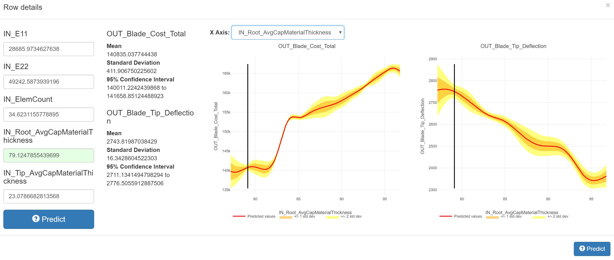

.. _surrogate_modeling:

Surrogate Modeling Tab
----------------------

The Surrogate Modeling tab uses the data computed by a PET to build a surrogate
model of the system being analyzed, using either gaussian process regression
or random forest regression.  These techniques allow prediction of system
responses, and, for gaussian process regression, provide an estimate of the
quality of the computed predicted values.

Walkthrough
~~~~~~~~~~~

|TAB_EMPTY|

The Surrogate Modeling tab opens to a page containing selectors for each
discrete design variable in your model, as well as a table containing a column
for each numeric design variable and objective in the model.

Begin by selecting a discrete configuration to analyze under "Discrete
Variables:". Since the techniques being used are numerical in nature and don't
attempt to model discrete variation, each combination of discrete design
variables must be analyzed separately.

|TAB_FULL|

Once you have chosen a discrete configuration to analyze, you're ready to begin
exploring the surrogate model of that configuration.  First, select "Add Row" to
add a row to the surrogate table.  From here, you can enter values for the
design variables you would like to explore, and click the blue |PREDICT_BUTTON| "Predict"
button or press Enter to evaluate the surrogate at that point.  You may also
add additional rows or click the |DUPLICATE_BUTTON| "Duplicate row" button to explore and
compare multiple points.

When a prediction has been computed, the results will appear in the objective
columns.  Depending on the technique being used, the results will consist of
one or two numbers--  the first number is the predicted value of the objective
at the chosen point, and, if visible, the second number (designated by σ) is
an estimate of the quality of the computed prediction, shown as a standard
deviation.

|ROW_DETAILS|

To see more details about a selected point and its prediction, click the
|DETAILS_BUTTON| "Row Details" button on the left side of a row.  This will open a dialog
showing the selected point, the prediction results (as well as the standard
deviation and 95% confidence interval, if applicable), and graphs showing the
predicted values for each objective relative to a selected design variable
(all other independent variables are held constant, at the values entered in
the text fields on the left).  The design variable used for the graphs can
be changed with the "X Axis:" dropdown.  Clicking any of the graphs will set the
value of the selected design variable to the clicked value, and re-evaluate
the surrogate at the new point.

After entering one or more points, the surrogate can be refined by clicking the
|TRAIN_BUTTON| "Train at these points" button.  This re-executes the source PET, using
the selected discrete design variables and the numeric design variables
specified in the table, and adds the new results to the data set used to train
the surrogate model.  Once the new values have been computed, the "Train at
these points" button will become enabled, and the objective cells in the table
will become yellow to indicate that their values are out of date-- click
|PREDICT_BUTTON| "Predict" in each row to re-compute the surrogate and get new
predictions at the selected points.

.. note::
   Depending on the results of the PET, the new points may not be within
   your Visualizer's current filter range. If the new surrogate predictions
   don't differ from the values prior to training, reset the filters by
   selecting the "Filters" pane in the footer and clicking "Reset Visible
   Filters".

Reference
~~~~~~~~~

Configuration
^^^^^^^^^^^^^

|CONFIGURATION|

**Surrogate Technique:**  Selects the surrogate technique to be used--  options
include Gaussian Process Regression (Kriging Surrogate) and Random Forest
Regression.

**Display Settings:**  Check "Round numbers" to enable rounding of computed
results; set "Precision" to the desired precision to display.

**Discrete Variables:**  Includes a drop-down menu for each discrete design
variable in the problem, which is used to select which points are used for
surrogate training.

Surrogate Table
^^^^^^^^^^^^^^^

|TABLE|

|DETAILS_BUTTON| **Row Details:**  Displays a details dialog with information about the
point, including surrogate results and graphs (see Walkthrough).

|PREDICT_BUTTON| **Predict:**  Evaluates the surrogate model at the specified point.

|DUPLICATE_BUTTON| **Duplicate row:**  Duplicates the selected row.

|DELETE_BUTTON| **Delete row:** Deletes the selected row.

|ADD_BUTTON| **Add row:**  Adds a new row.

|TRAIN_BUTTON| **Train at these points:**  Re-executes the source PET at the displayed
points, and adds the results to the set of data used for surrogate training.

.. |DELETE_BUTTON| image:: images/surrogate_button_delete.png
      :alt: Delete Row button
      :width: 34px

.. |DETAILS_BUTTON| image:: images/surrogate_button_details.png
      :alt: Row Details button
      :width: 34px

.. |DUPLICATE_BUTTON| image:: images/surrogate_button_duplicate.png
      :alt: Duplicate Row button
      :width: 33px

.. |PREDICT_BUTTON| image:: images/surrogate_button_predict.png
      :alt: Predict button
      :width: 46px

.. |CONFIGURATION| image:: images/surrogate_configuration.png
      :alt: Surrogate configuration
      :width: 1594px

.. |TAB_EMPTY| image:: images/surrogate_tab_empty.png
      :alt: Surrogate tab
      :width: 1611px

.. |TAB_FULL| image:: images/surrogate_tab_full.png
      :alt: Surrogate tab
      :width: 1600px

.. |TABLE| image:: images/surrogate_table.png
      :alt: Surrogate table
      :width: 1586px
