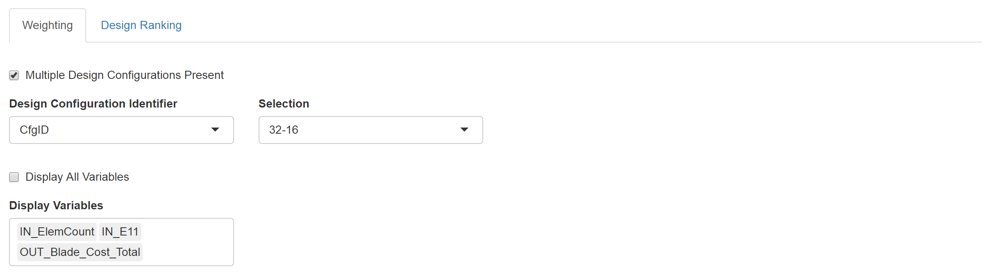

.. _uncertainty_quantification:

Uncertainty Quantification Tab
------------------------------

The Uncertainty Quantification Tab serves as a tool to analyze data
using probabilistic concepts.

Weighting Tab General Configuration
~~~~~~~~~~~~~~~~~~~~~~~~~~~~~~~~~~~

-  **Display All Variables:** Checking this box sets all the variables
   in the data set to appear in the bayesian tab.
-  **Display Variables:** When ‘Display All Variables’ is deselected,
   this select input allows the user to specify which variables they
   would like to display.

Weighting Tab Variable Configuration
~~~~~~~~~~~~~~~~~~~~~~~~~~~~~~~~~~~~

.. image:: images/uq_weighting_variables.png
   :alt: Uncertainty Quantification Weighting Tab Variable Options
   :width: 1220px

-  **Variable Type:** This drop down list sets the type of variable,
   i.e. 'Input' or 'Output'.
-  **Reshape to Gaussian:** This checkbox along with the σ and μ input
   boxes specifies that the user would like the data to be resampled
   using the normal probability distribution specified.

Weighting Tab Variable Plots
~~~~~~~~~~~~~~~~~~~~~~~~~~~~

The plots for each of the variables are displayed immediately to the right
of the variable options. Below is a legend for the plots; the default
color for each element is listed in parentheses.

-  **Plot Frame:** This will be 'Yellow' for 'Inputs' and 'Blue' for
   'Outputs.'
-  **Histogram (Wheat):** This histogram represents the raw data before
   any shaping/resampling.
-  **Reshaping Distribution (Black):** This is the weighting
   distribution used to resample the data.
-  **Resampled Distribution (Green):** This is the resampled
   distribution.
-  **Posterior Distribution (Orange):** This is posterior distribution
   after Forward Uncertainty Quantification has been performed.

At the bottom of the variable configuration is the **Run Forward UQ**
button. This will perform a forward uncertainty quantification on the
data and add a posterior distribution to the output plots. Note at least
one "Enable Constraint" checkbox must be checked for forward uncertainty
quantification to run successfully.

Probability Queries
~~~~~~~~~~~~~~~~~~~

.. image:: images/uq_probability_queries.png
   :alt: Uncertainty Quantification Probability Queries
   :width: 1225px

This section allows us to evaluate the integration of the area under the
resampled distributions below or above a certain threshold. These
probabilities are used additionally in the *Design Ranking Tab* to rank
the designs.

Design Ranking Tab
~~~~~~~~~~~~~~~~~~

.. image:: images/uq_design_ranking.png
   :alt: Uncertainty Quantification Design Ranking Tab
   :width: 1227px

The Design Ranking Tab uses the 'TOPSIS' package on CRAN to perform a
multi-criteria decision making optimization on the result of performing
all of the queries on all of the different design configurations
present. This allows the user to rank the designs based on the queries.

-  **Weights:** The Weights sections allows you to specify the relative
   importance of each of the queries.
-  **Rankings:** The rankings are displayed in a table.
