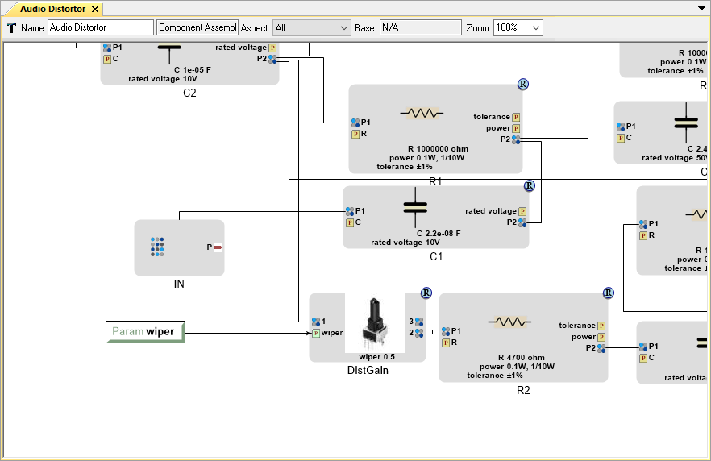
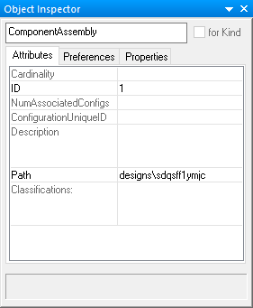

.. _component_assemblies:

Component Assemblies
====================

The first step in designing a system in OpenMETA is creating a model of the
system. A model is defined as an abstract representation of the design.
A model is *abstract* if it does not contain all details about the
system, but contains sufficient detail to express design choices with a
minimal amount of effort. This level of detail is controlled by the
designer, allowing a rapid definition of conceptual designs, with
addition of detail as the design is refined. The OpenMETA Language has been
designed to strike a compromise between the conceptual and detailed
models. These compromises will be clarified as we review the language
and tools.

OpenMETA emphasizes a component-based design methodology. Therefore,
following the previous section's discussion of the modeling of a
component, we will describe component connectivity, testing models, and
design spaces.

Component Assembly Semantics
----------------------------

*Component Assemblies* are used to model systems and subsystems.
*Component Assemblies* define which components are part of a given system
and how they are integrated together to serve a common purpose. For example,
the subsystem could produce torque to create acceleration of a vehicle,
or it could produce air flow to cool a heat exchanger.

What's Inside a Component Assembly Model?
-----------------------------------------

Syntactically, *Component Assemblies* are virtually identical to *Components*.
They can contain *Properties*, *Parameters*, various *Domain-Specific Ports*,
and even *Domain-Specific Models*. The latter is especially important when the
behavior of an assembly is difficult or impossible to decompose into its
constituent components.

   Component Assembly Representing the Distortion Circuit of a Guitar Preamp

In OpenMETA models, component assemblies are generally built by creating
references to one or more components and then creating relationships between
their interfaces by means of connections between their exposed ports. Assemblies
may be *nested* -- that is, assemblies may contain other assemblies; this allows
us to model systems of systems.

Resources
~~~~~~~~~

Unlike *Components* which store their resources in the ``results\`` folder,
*Component Assemblies* store their resources in a unique directory in the
``designs\`` folder as you can see below:

