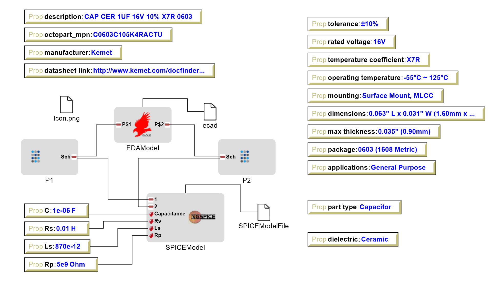
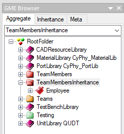
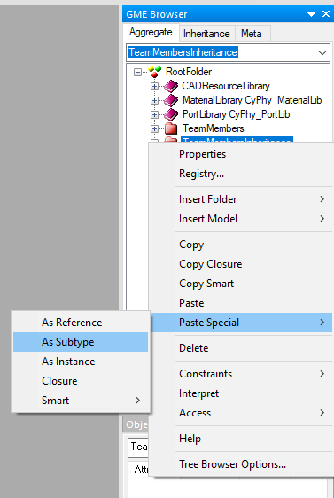
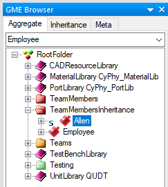
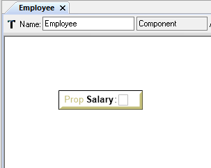
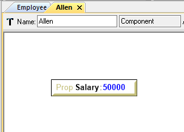
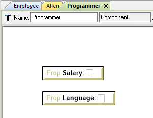
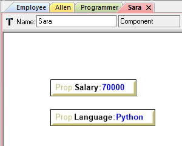
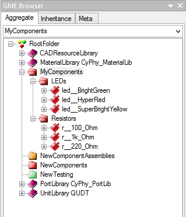
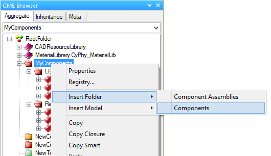

.. _components:

Components
==========

The **component** is the atomic model construct in OpenMETA, and it serves
as the basis for the multi-domain nature of the tools. Components touch
virtually every other concept in OpenMETA.

What's Inside a Component Model?
--------------------------------

Inside a component, you will typically see one or more domain models
and a number of interfaces exposing parts of the component to the containing
environment. For example, you could have a schematic model, CAD model,
and Modelica model, along with many properties, connectors, and other
essential parts. The component model captures several qualities of the
physical component, including its geometry (3-dimensional CAD model),
its dynamic behavior (an acausal power flow and transfer function), and
its numerical properties (characteristics such as weight). The component
also has connectors, which allow connection to other components.

.. figure:: images/LED_Diagram_lores.png
   :align: center

   *Concept drawing of an OpenMETA Component Model of an LED*

The OpenMETA Component Model aggregates these various models, providing a
single set of properties and connectors. When two components are
composed via these connectors, they are joined in many analysis domains
at once.

The figure below shows a simple capacitor component as represented in OpenMETA.

.. _capacitor:

   *OpenMETA Component Model of a Capacitor*

Domain-Specific Models
----------------------

For each of the domains represented in the component model, there is a
domain-specific model that exposes the necessary features of that domain.

For example, in the :ref:`capacitor` figure above we see that this capacitor has
both an EDA and a SPICE model. The EDA model exposes the two pins which
represent the phyiscal pads of the part footprint on a printed circuit board
(PCB) to which other components need to connect. The SPICE model also exposes
the two pins of the component but additionally exposes four values needed to
construct an accurate representation of the capacitor in the SPICE domain. The
**properties** that specify the appropriate values for the SPICE model as well
as a number of other **properties** that describe this component are described
in the next subsection.

Properties & Parameters
-----------------------

Components will typically contain a number of different **properties**
and **parameters**. Properties and parameters are ways of capturing
values that describe components. **Properties** are values that are
fixed for a given component and cannot be changed directly by a designer
using that component. **Parameters** are values that can be varied by a
system designer. For example, in the case of a drive shaft where the
designer can have one manufactured to a custom length, the component
model for that drive shaft will have length as a parameter.

A property may also be calculated automatically based on the values of
other properties or parameters. In the example of a drive shaft, the
mass of the drive shaft is calculated from the length.

This extends to the domain models as well. Again in the case of the
drive shaft example, the user-selected length can be assigned to a
parameter of the CAD model, adjusting the 3D geometry based on the
designer's selection. The calculated mass can be assigned to a parameter
of the dynamics model, ensuring that the correct inertia is used when
simulating its behavior.

.. note:: Insert an image of the drive train component.

Connectors
----------

OpenMETA components also contains **connectors**, which define interfaces
across multiple domain models. For the case of an electrical pin
connecting to a printed circuit board (PCB), the joining of two
connectors can capture the geometry (the center axis and mount plane
where the pin and board meet) and the schematic diagram relation (which
pins/nets are being joined) at the same time.

In the screenshot below, the connector **Cathode** represents both an
electrical terminal from the **SchematicModel** and an electrical
interface from the **ModelicaModel**.

.. note:: We need to update this image to include the new *Connector* look.

.. image:: images/01-01-connectors-in-LED-model.png
   :alt: Connectors in LED model

The simplified diagram below abstractly shows the structure of a similar
component, with its individual domain-specific interfaces grouped into
connectors. For more information on how *Connectors* are used to compose
OpenMETA *Components*, visit the :ref:`component_composition` section of the
next chapter.

Managing Complexity
-------------------

As the size and complexity of a project grow, the number of components and
difficulty of maintaining them also increase. To ease the task of component
management, OpenMETA supports *component references*, *component
instantiation*, and *component class inheritance*.

Component References
~~~~~~~~~~~~~~~~~~~~

The most common approach for sharing component libraries
is to create or import
OpenMETA Components from a library and to use *references* of those components in the Component
Assemblies and Design Containers used to express your design.
This allows us to use the exact same component in multiple places.

To instantiate a Component into an open Component Assembly or Design Container,
right-click and drag the Component from the GME Browser onto the canvas.
When prompted, select **Create Reference**.

For an example, see **** REFERENCE TO HELLO_WORLD_CREATING_A_TEAM – ASSIGNING MEMBERS TO A TEAM ****

Although components can also be copied or created directly within *Component Assemblies* and
*Design Containers*, we recommend keeping all the components in the project
confined to *Components Folders* and using component references everywhere
components are used.

Class Inheritance
~~~~~~~~~~~~~~~~~

Components can be created as subclasses of other Components.
This is useful for managing different classes of components that share many of the same characteristics.
When model objects are added to the base class components, they are
automatically added to the derived component classes.

It's also a useful technique for building and managing large libraries of Components.

To use Class Inheritance to streamline Component Authoring, let's revisit the :ref:`hello_world_adding_team_members`
section of the :ref:`hello_world` tutorial.
In the tutorial, we created four team members.
Even though each team member was different, they shared many Properties in common.
We will use Class Inheritance to make managing these Properties more efficient.

#. Right-click on the *RootFolder*, and choose :menuselection:`Insert Folder --> Components`.
#. Rename this new *Components* folder **TeamMembersInheritance**.
#. Right-click on the new **TeamMembersInheritance** folder and choose :menuselection:`Insert Model --> Component`.
#. Rename this component to **Employee**.

We will treat this **Employee** component as a *baseclass*, and use *subtyping* to derive specific team members from it.

#. Right-click on **Employee** and choose :menuselection:`Copy`.
#. Right-click on the **TeamMembersInheritance** folder and choose :menuselection:`Paste Special --> As Subtype`.

#. You will see a new **Employee** Component which includes a small "s" next to its icon.
#. Rename this Component to **Allen**.

The **Allen** Component inherits from the **Employee** component. If we add Properties or other fields to **Employee**, they will be created within **Allen** as well.

#. Double-click the **Employee** Component to open it.
#. From the Parts Browser pane on the left of the window drag a **Property** onto the open canvas.
#. Rename the property **Salary**. Do not set a value for **Salary** -- its value will differ for each employee.

#. Double-click the **Allen** Component to open it. Notice that a **Salary** Property was automatically created.
#. Set the value of **Allen**'s **Salary** to **50000**.

Inheritance can extend to several levels of depth. Let's say that, within our company, we also have programmers.
For programmers, we want to know their primary computer programming language.
This property wouldn't make sense for non-programmer employees, so we need a special class for them.

#. Right-click on **Employee** and choose :menuselection:`Copy`.
#. Right-click on the **TeamMembersInheritance** folder and choose :menuselection:`Paste Special --> As Subtype`.
#. You will see a new **Employee** Component which includes a small "s" next to its icon.
#. Rename this Component to **Programmer**.
#. Double-click the **Programmer** Component to open it.
#. From the Parts Browser pane on the left of the window drag a **Property** onto the open canvas.
#. Rename the property to **Language**. Do not set a value for **Language**.

Now we have a special **Programmer** class of Component. It contains all of the Properties of **Employee**,
as well as additional fields that apply only to programmers.

#. Right-click on **Programmer** and choose :menuselection:`Copy`.
#. Right-click on the **TeamMembersInheritance** folder and choose :menuselection:`Paste Special --> As Subtype`.
#. You will see a new **Programmer** Component which includes a small "s" next to its icon.
#. Rename this Component to **Sara**.
#. Double-click the **Sara** Component to open it.
#. Set the value of **Sara**'s **Langauge** to **Python**.
#. Set the value of **Sara**'s **Salary** to **70000**.

Components Library
------------------

Browsing Your Component Library
~~~~~~~~~~~~~~~~~~~~~~~~~~~~~~~

You can access the components in your project by using the **GME Browser** (on
the right hand side of the screen).
In the GME Browser, Components are contained in red *Components Folders*,
|COMPONENTS_FOLDER|. Component Folders can be nested and used for organization.

   Example of Components in an OpenMETA Project

To create a new folder, right-click on the parent folder, and choose
:menuselection:`Insert Folder --> Components`.

To move a component from one folder to another, just drag-and-drop it to the new
folder.

Getting Components
~~~~~~~~~~~~~~~~~~

To build designs in OpenMETA, you'll need to have the necessary OpenMETA
Components in your project. Components can be built from scratch, but they can
also be imported.

*Component packages* are ``.zip`` files that include everything needed to use a
component in design and simulation, such as 3D CAD models, EAGLE schematics, and
icons. In this format, components can be exchanged freely between users or
downloaded from websites.

If you are interested in electronics design, you can clone the `morph-components
<https://bitbucket.org/metamorphsoftwareinc/morph-components>`_ repository
for a large library of electronics components.

Importing Components
~~~~~~~~~~~~~~~~~~~~

Components can be shared in two forms, either as an ``.acm`` file with some
other files and folders around it, or as a ``.zip`` package that includes all
the file dependencies within it.

To import a Component:

#. Click the **Component Importer**, |COMPONENT_IMPORTER_ICON|.
#. If you are importing a...

    a. Component ``.acm`` file, navigate to and select the `.acm` file. The
    importer will find the other files that this component depends on and import
    them into your project's backend folders.

    b. Component ``.zip`` package, navigate to and select the `.zip` file. The
    ZIP file includes all of the files needed to use the component, and they'll
    be copied into your project's backend folders.

After the component is imported, the GME Console will display a link to the
component as well as its path within the Components Folder tree of your
OpenMETA project.

This process can be repeated for any components you feel will be necessary for
your design. You can import multiple components at the same time by selecting
all of them.

Exporting Components
~~~~~~~~~~~~~~~~~~~~

OpenMETA includes a utility which will create component packages from the
components in your OpenMETA project. These packages are `.zip` files which
contain everything that's needed to use a component.

To export a single component:

#. Open the component by double-clicking on it in the GME Browser.
#. Click the **Component Exporter** button, |COMPONENT_EXPORTER_ICON|.

   .. |COMPONENT_EXPORTER_ICON| image:: images/component_exporter_icon.png

#. You'll be prompted for a location in which to save the component package
   ``.zip`` file.
#. A component package ZIP file will be produced in the folder you selected.

To export *all* of the components in your OpenMETA project:

#. Close all of your editing windows.
#. Click the **Component Exporter** button, |COMPONENT_EXPORTER_ICON|.
#. You'll be prompted for a location in which to save your component package
   ``.zip`` files.
#. For each component in your OpenMETA project, a component package ZIP file will be
   produced in the folder you selected.
