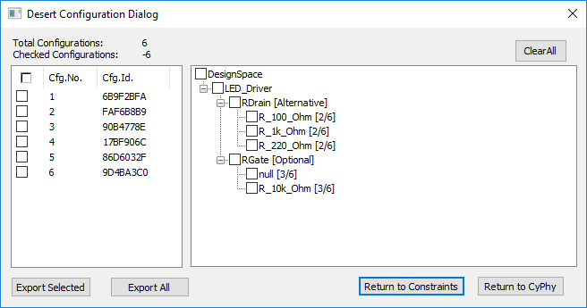

.. _design_spaces:

Design Spaces
=============

In a conventional design process, the designer can only capture a single
design architecture, with one choice of components. This method has
several drawbacks:

-  Requirements often change during the design process, sometimes
   necessitating a redesign.

-  Component and subsystem behavior is discovered during the design
   process, and the optimal choice of architecture and components may
   not be apparent until late in the design process.

-  The design is applicable to a single target use, and can require
   substantial rework for other applications.

Instead, OpenMETA introduces the concept of a *design space*. The design space
allows the models to express variability in the model, e.g. multiple
alternatives for components and assemblies where each component or assembly has
the same interface. Furthermore, we are able to constrain valid configurations,
e.g. one alternative may only be valid when another component is also selected.

Design Container Types
----------------------

The OpenMETA model editor offers a simple syntax for expressing design
options. This is done by using a **Design Container** instead of a Component
Assembly. Design Containers come in three flavors: **Compound**,
**Alternative**, and **Optional**; this is set in the *Type* attribute in the
Object Inspector.

.. figure:: images/DesignContainerTypeAttribute.png
   :alt: Type Attribute of a Design Container Object

   Type Attribute of a Design Container Object

An *Alternative* container is used to contain each valid
option. The container presents a consistent interface with the outside
system, while inside it contains mappings from its interface to the
interfaces of each option.

.. figure:: images/01-03-design-alternatives-in-gme.png
   :alt: Design alternatives in GME

   *Design Alternatives captured in the OpenMETA tool*

*Optional* containers are used to express that the contents of the container
may or may not be part of the design. Each Optional container in a design space
will result in a doubling of the total considered configurations.

*Compound* containers function identically to Component Assemblies but allow
for the use of other Design Containers within themselves; This is not allowed
with Component Assemblies.

Constraints
-----------

The design space is the set of all options, considering all the alternatives and
optionals. Consequently, the design space can get very large. While this is a
powerful mechanism to expand the range of designs under consideration, a
mechanism is also needed to limit the design space to a manageable size. For
this purpose, design space *constraints* can be specified and evaluated by the
**Design Space Exploration Tool** (DESERT).

Design space constraints are simple, static operations & equations that
can be specified for the properties and identities of components, as
well as assemblies in the design alternative space. Operations on the
properties can include total weight and cost, thresholds on a component
property, or identity. An example of an identity constraint is that a
designer would want all four tires on a truck to be of the same type.

.. figure:: images/01-03-property-constraint.png
   :alt: Design alternatives in GME

   *A property constraint in the OpenMETA tool*

DESERT
------

The DESERT Tool uses scalable techniques to apply constraints to
very large design spaces to rapidly prune the choices to a manageable
size. For example, a basic automotive drivetrain model may contain 288
configurations, capturing engine, transmission, and tire options. After
applying constraints related to matching mechanical interfaces, the
number of configurations drops to 48.

To run DESERT:

#. Open a Design Container and click the  Design Space Exploration Tool
   (DESERT) button (|DESERT_ICON|) on the toolbar.
#. If you have any contraints, you can selectively apply them or simply click
   the **ApplyAll** button.
#. Then, click the **Show Cfgs** button.

At this point, you will see a list of all the configurations generated within
your design space. To save these different configurations for later testing,
simply click the **Export All** button and then **Return To CyPhy**.

   Possible Configuration for an LED Driver Circuit

Typical design spaces can easily reach 10 billion configurations. After
constraint application, the number of configurations can be reduced to
thousands within seconds. Constraints can cover logical concerns, such
as power compatibility, or user specified preferences such as "*only
consider designs with X brand processors*". The remaining valid designs
can be subjected to deeper (and more computationally expensive)
analysis.

Design space creation and exploration is a process of expansion and
contraction of the design space. It can be a powerful tool to build
adaptable and flexible designs.
