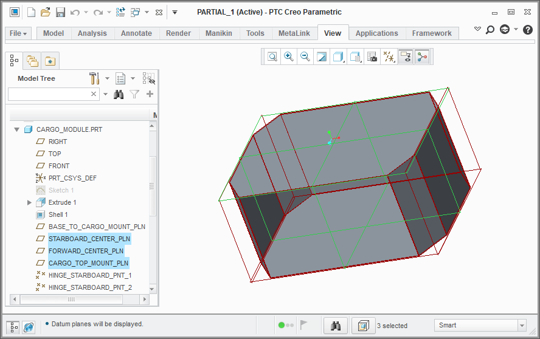
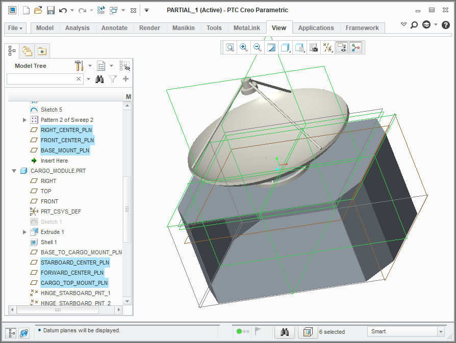

.. _cad_concepts:

Conceptual Overview
===================

OpenMETA helps analysts synchronize representations of their system across
many different modeling and simulation tools at once. For example, an OpenMETA
project may be used to synchronize a 3D CAD model and a physics simulation model
at the same time (as with the :ref:`spacecraft_model`).

OpenMETA does this by first establishing a structural model of the system,
where key elements of the system *(e.g.: battery, solar panel, antenna)* have
Component models, and those Component models are connected together.

Each Component model contains references to one or more domain-specific models,
such as 3D CAD models and physics simulation models.

The connections between the Components tell OpenMETA how to join these
individual models together to create a model of the overall system in each
targeted tool.

For more background on how OpenMETA's Component concept works, read the section
on :ref:`components`.

.. figure:: images/spacecraft.png
   :alt: Image of the Spacecraft Component Assembly and CAD Representation

   Image of the Spacecraft OpenMETA project and the resulting 3D CAD assembly

Concepts for Construction and Composition
-----------------------------------------

Geometric constraints are used as the composition mechanism for 3D CAD models
in OpenMETA.

Key connection features on CAD resources are marked with named *datums*.
These named datums may be:

* points
* axes
* surfaces
* coordinate systems

A connection between two Components in OpenMETA specifies how the named datums
in one model should be constrained to the named datums in another model.

When OpenMETA builds the system model, it asks the CAD tool to add each of the system's
parts to an assembly and to constrain those geometric features together in space.

Example
-------
With this example from the :ref:`spacecraft_model`, we'll see how this concept
applies in practice.

The antenna of the spacecraft is designed to mount to the top of the cargo bay.
In the antenna's CAD model, there are 3 named surfaces:

* **BASE_MOUNT_PLN**: This surface is in the plane of the antenna mount's base.
* **RIGHT_CENTER_PLN**: This surface is along the vertical centerline axis of the antenna, and oriented towards the right side.
* **FRONT_CENTER_PLN**: This surface is along the vertical centerline axis of the antenna, and oriented towards the front side.

.. figure:: images/antenna_planes.png

   Antenna part with three datum planes to define a mounting interface

The cargo module has 3 named surfaces, in a similar configuration,
at the location where the antenna should be mounted:

* **CARGO_TOP_MOUNT_PLN**: This surfaces is in the plane of the top of the cargo bay, where the antenna will mount.
* **STARBOARD_CENTER_PLN**: This surface is in the plane of the vertical centerline of the cargo bay, facing the starboard side.
* **FORWARD_CENTER_PLN**: This surface is in the plane of the vertical centerline of the cargo bay, facing the front side.

The cargo module has many other named surfaces as well, but these are the 3
that are relevant for composing with the antenna.

   Cargo module part with three datum planes to define a mounting interface

In our OpenMETA project, we have Component representations for both the
Antenna and Cargo Module. The **Cargo_to_Antenna** ports through with they are
connected provides rules for how the surfaces of one should be constraints
to the surfaces of the other:

================ =============== ====================
Antenna          Constraint Type Cargo Module
================ =============== ====================
BASE_MOUNT_PLN   align           CARGO_TOP_MOUNT_PLN
RIGHT_CENTER_PLN align           STARBOARD_CENTER_PLN
FRONT_CENTER_PLN align           FORWARD_CENTER_PLN
================ =============== ====================

.. figure:: images/simple_assembly.png
   :alt: Simple OpenMETA Assembly

   Simple OpenMETA Assembly of Antenna and Cargo module

When OpenMETA builds the system model, it asks the CAD tool to add both the
antenna and cargo bay parts into an assembly and to constrain these
geometric features together in space.

   Resulting 3D CAD Assembly Model

Through repetition of this process with the interfaces between the other
parts of the spacecraft, the whole assembly can be created from the
OpenMETA project.
