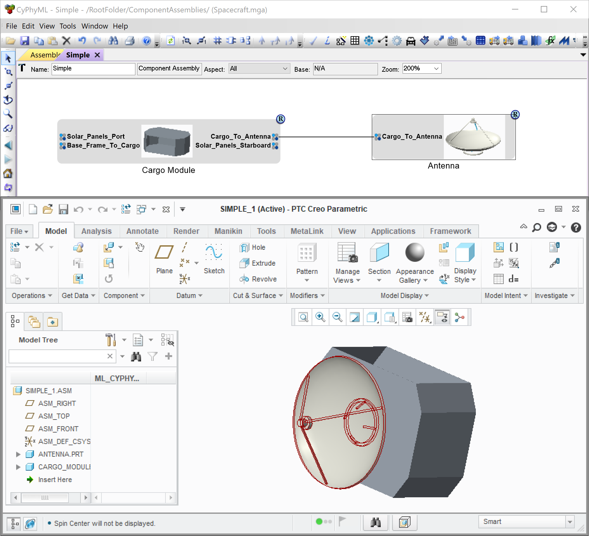

.. _metalink:

Metalink
========

Metalink allows a user to edit an OpenMETA component assembly and immediately
see those changes reflected in the CAD representation.
To open a connection between OpenMETA and the CAD tool, simply open the
desired Component Assembly in the editor and click the Metalink Button,
|METALINK_BUTTON|.

When you click different components in the OpenMETA project, you will
see the same components highlighted in the CAD representation.

.. |METALINK_BUTTON| image:: images/metalink_button.png
   :width: 24px

   Running Metalink with a Simple Assembly

Metalink is also capable of regenerating the CAD representation as parameters
in the OpenMETA project are changed or even entirely new components are added
to the assembly.

Requirements
------------

In addition to Creo, as noted in the :ref:`installation` chapter, Metalink
requires Java JDK 7 or higher.

Since Java SDK 7 is considered an archived version of Java by Oracle, we
recommend you download the Java 8 SDK from the Oracle `Java SE Development Kit 8
Downloads
<http://www.oracle.com/technetwork/java/javase/downloads/jdk8-downloads-2133151.html>`_
page if you do not already have Java installed on your target system.
