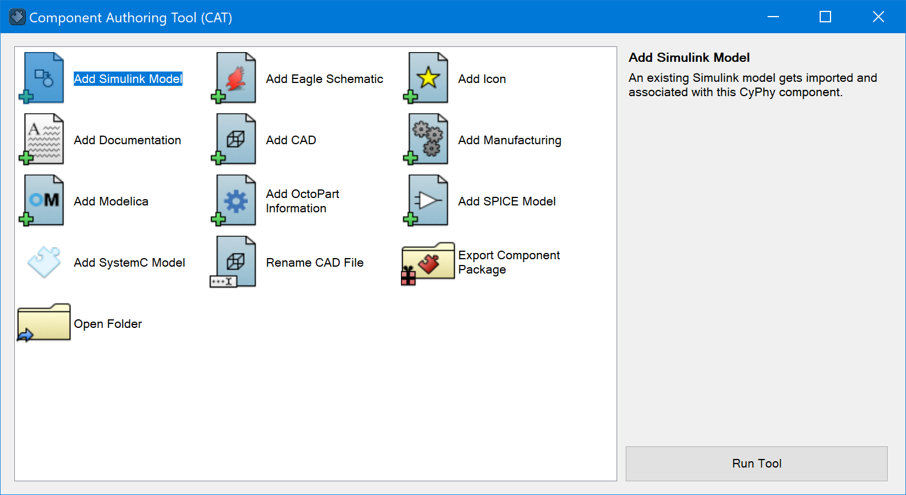

.. _working_with_cad:

Working with CAD Models
=======================

This section briefly describes the process for adding CAD resources to
OpenMETA Components and generating CAD assemblies by integrating a number of
OpenMETA Components into an OpenMETA Component Assembly and launching
:ref:`Metalink`.

OpenMETA currently has a single publicly-available CAD integration:
PTC Creo Parametric 3.0. For this reason, the below concepts will be
explained using Creo.

Constraint Methodology
----------------------

Key connection points on CAD resources are marked with named *datums*,
which can be constrained in OpenMETA to the datums of other connected
components to generate an assembly. By expressing these constraints in OpenMETA
on these connection points, instead of relative-position offsets, a
complex component can be automatically composed out of
other simpler components using fixed and/or partially constrained joints.

Preparing CAD Files
-------------------

Each part that is used in an OpenMETA project first needs to be prepared in the
native CAD environment. *Datums* that will be used for constraints as well as
any *Parameters* that will be used to adjust the dimensions of the part in OpenMETA
need to be added at this time.

.. figure:: images/antenna_planes.png

   Antenna part with three datum planes to define a mounting interface

In the *Antenna* CAD part above, you can see three planes at the base of
the antenna that will be used to constrain it to another component in a
larger assembly.

.. _component_authoring_tool:

Component Authoring Tool
------------------------

The Component Authoring Tool (CAT) makes it easy to add a CAD resource to
an OpenMETA component by simply selecting the native part or assembly file
that you want added to the component.
To use the CAT, open the OpenMETA component for which you wish to add a
CAD resource and click the |CAT_TOOL| button on the toolbar.

The CAT can be used to add many different types of domain models to an OpenMETA
component, but to add a CAD resource, simply double-click the "Add CAD" icon.
The next section describes the artifacts generated by the CAT.

CAD Models
----------

The most important artifact generated by the CAT is a *CAD Model* model.
This model contains references to any datums *(planes, axis,
coordinate systems, and points)* that are defined in the geometry.
A *CAD Model* model can also contain parameters, which are used to pass
values from OpenMETA into the CAD tool.
In the CAD tool these are often used as inputs to formulas
or to dimension geometry.

.. figure:: images/antenna_cat_artifacts.png
   :alt: CAD Model created from the Antenna.prt CAD file

   CAD Model created from the Antenna.prt CAD file

Each OpenMETA component has a corresponding folder in the ``components/``
folder in the project directory;
this is where any domain specific files are stored.
The *Resource* atom that is connected to the CAD Model specifies
the location of the referenced native CAD file relative to the component
directory.
For the Antenna component shown above, the referenced native CAD file
can be found at ``CAD/Antenna.prt`` relative to the component base folder.

.. note:: Creo versions its files by appending a numerical extention,
   but it only considers the latest; e.g. if you have both a
   ``CAD/Antenna.prt`` and a ``CAD/Antenna.prt.1`` file in your component
   folder, only the latter will be used by Creo.

Any unneeded atoms in the CAD Model can be removed for readability.
Additionally, CAD Models and Resources can be added to a component manually,
but we recommend using the CAT as this becomes rather tedious when there
are many CAD files that need to be added.

Connectors
----------

OpenMETA Connectors allow us to wrap multipe domain ports into
a single exposed connector on an OpenMETA Component.
For CAD purposes we often wrap a collection of datums that represent
an interface into a single connector.

Below you can see the three planes of the antenna part being wrapped
by a single "Cargo_To_Antenna" connector.

.. figure:: images/antenna_component_cleaned.png
   :alt: Antenna component with an OpenMETA Connector

   Antenna component with an OpenMETA Connector

See the :ref:`connectors` section of the :ref:`components` chapter for
more information on Connectors.

Composing Assemblies
--------------------

Composing CAD assemblies in OpenMETA is as simple as adding components
to an OpenMETA Component Assembly and creating a connection between the
desired connectors.

.. figure:: images/simple_assembly.png
   :alt: Simple OpenMETA Assembly

   Simple OpenMETA Assembly

After an assembly is created, you can view the composed CAD geometry
by executing a CAD Test Bench or running Metalink.
Visit the :ref:`cad_test_benches` section to see how to properly set up and
execute a CAD Test Bench.
The :ref:`metalink` tool is described in the next section.

Examples
--------

With Creo installed, check out the :ref:`spacecraft_model` walkthrough.

.. figure:: images/spacecraft.png
   :alt: Image of the Spacecraft Component Assembly and CAD Representation

   Image of the Spacecraft Component Assembly and CAD Representation
