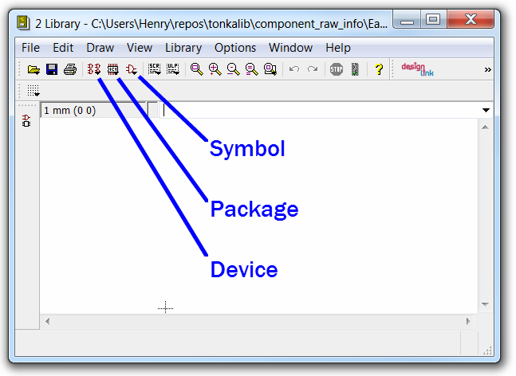
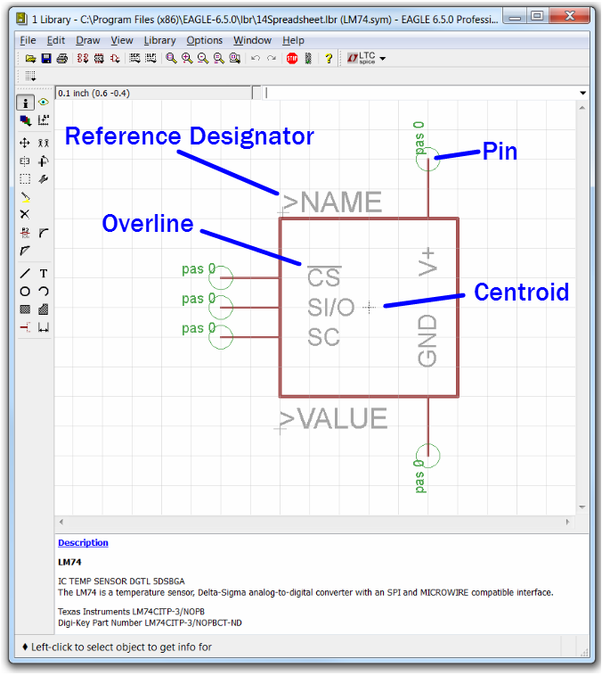

.. _eda:

Electronic Design Automation (EDA)
===================================

Electronic Design Automation (EDA) tools enable the design and manufacture of
electronic systems and integrated circuits. [1]_ In OpenMETA's integration of
EDA tools, we capture the `Schematic Models`_ for all of the components used
in a model and expose the pins of each component to be used for the composition
in a design.

Autodesk Eagle
~~~~~~~~~~~~~~

`Autodesk Eagle <https://www.autodesk.com/products/eagle/overview>`_ is a free
schematic and layout editor for electronic circuit design and the creation of
Printed Circuit Boards (PCBs). When used in conjunction with OpenMETA, the user
is able to compose designs using a rich library of components in the tools and
automatically generate ``.brd`` files from the model.

We recommend using the latest version of the EAGLE tools that can
be found on the `Autodesk Eagle Download Page
<https://www.autodesk.com/products/eagle/free-download>`_.

Schematic Models
~~~~~~~~~~~~~~~~

*Schematics* represent the elements of an electrical system using
abstracted symbols of components. Schematics excel at providing a clean,
efficient view of an electronic system. In electronic design the
location of the symbols in a schematic do not necessarily correlate with
the physical location of the components. OpenMETA currently uses **Eagle**
models to represent a component's schematic model.

.. figure:: images/01-eagle-model-of-diode.png
   :alt: Diode Model in EAGLE

   EAGLE Model of a Light-Emitting Diode (LED)

Modeling Guidelines
~~~~~~~~~~~~~~~~~~~

**EAGLE** (Easily Applicable Graphical Layout Editor, German: Einfach
anzuwendender grafischer Layout-Editor) is a PCB-design software
application by CadSoft that is used by the CyPhy modeling environment.

**EAGLE Devices** are electrical parts as found in an Eagle component
library. Each EAGLE device has an associated schematic called a
**"symbol"**, a PCB footprint called a **"package"**, and other information
such as the mapping between the pins of the symbol and the pads of the
package.

Purpose
^^^^^^^

One of the prerequisites for making a CyPhy component model is having an
Eagle device for the component. If you can't find the Eagle device you
want in a pre-existing library, you may need to make one. To help, this
subchapter attempts to provide some tips and summarize best practices
for modeling devices in Eagle.

Subsection Organization
^^^^^^^^^^^^^^^^^^^^^^^

The EAGLE library presents three different editing modes:

1. **Edit a Symbol** -- Used to design the schematic symbol, indicating schematic
   pins
2. **Edit a Package** -- Used to design the PCB footprint, including
   SMD lands, through-hole pads, and silk screens
3. **Edit a Device** -- Used to name and describe the device,
   select the symbol and package associated with the device,
   and map symbol pins to package pads

The icons used to switch between these views are shown in the figure
below.

   EAGLE 6.5.0 library action-toolbar icons that select either the symbol,
   package, or device editing modes.

The remaining three sections of this subchapter provide guidelines on
each of EAGLE's three editing views.

Editing a symbol
~~~~~~~~~~~~~~~~

-  The grid display should be on and set to 0.1 inch. All pins must be
   on the 0.1 inch grid, to enable them to be easily connected on
   schematics.

.. figure:: images/06-01-grid-popup.png
   :alt: EAGLE Grid Popup

   The EAGLE grid settings used to display 0.1 inch grid lines in the
   symbol editor.

-  The "direction" of all pins should be "pas" (passive), to keep things
   simple and avoid undesired side effects.
-  Each symbol should have a ``>NAME`` text, on layer 95 ("Names"). This
   text is a placeholder for the component reference designator, such as
   "R2", that will appear when the symbol is used in a schematic.
-  Each symbol should have a ``>VALUE`` text, on layer 96 ("Values").
-  The preferred height of the ``>NAME`` and ``>VALUE`` texts is 0.07
   inches, and the preferred font is "proportional".
-  The symbol's centroid, shown as a dotted-line "+" symbol, should be
   at the center of the symbol. (This is the handle that will select the
   part when editing a schematic.)
-  Pin naming should generally follow the pin names used on the
   manufacturer's data sheet.
-  An exclamation point ("!") in the text of a pin name will toggle the
   display of an overline above the following text. The overline may be
   used, for instance, to identify negative-logic signals.
-  In Eagle 6.5, it is not possible to manually adjust the position of a
   pin's name relative to the pin. If a pin-name's position is
   inappropriate, it can be hidden, and normal text added to look like
   the pin's name, using layer 94 (Symbols).
-  For polarized parts such as electrolytic capacitors, name the pins
   for their polarity, e.g. "POS" and "NEG". For diodes, it is better to
   name the pins as "A" (for anode) and "C" (for cathode), than "POS"
   and "NEG", since diode polarity is subject to interpretation based on
   a circuit's function.
-  For non-polarized components with two pins, the pins can be named "1"
   and "2", with pin "1" on the left.

   Symbol view in EAGLE library editor, showing a passive pin, the
   centroid, an overlined pin name, and a placeholder for the reference
   designator.

Editing a package
~~~~~~~~~~~~~~~~~

Eagle defines a **package** as a component footprint stored in a
library. The term **footprint** refers to the physical layout that is
required on the printed circuit board in order to mount a component.

Editing a package consists of designing or finding an appropriate package
footprint, and drawing the corresponding patterns on the appropriate EAGLE CAD
"layers". Each of these is described in more detail below.

Designing or finding an appropriate package footprint
^^^^^^^^^^^^^^^^^^^^^^^^^^^^^^^^^^^^^^^^^^^^^^^^^^^^^

Mathematically designing a PCB land pattern for a surface-mount
component is perhaps the most complicated step that may be needed in
designing an Eagle device, as it involves fabrication, assembly, and
component tolerances. How to do this properly is beyond the scope of
this guide. However, manufacturers often provide suggested
footprints for their components, either near the end of a datasheet or
available elsewhere online. Additionally, sometimes a package may be reused from
a similar component.

Drawing footprint patterns on EAGLE layers
^^^^^^^^^^^^^^^^^^^^^^^^^^^^^^^^^^^^^^^^^^

EAGLE allows 2-D graphics to be drawn on EAGLE layers, that will
eventually be processed to create files useful for automated PCB
fabrication and assembly. These EAGLE layers are related to but not
necessarily the same as PCB layers, since multiple EAGLE CAD layers may
be combined to form a tooling file for a single PCB layer. The most
common output file format is extended Gerber format, which contains a
vector-graphic represention of photolithographic artwork. The following
table gives an example of how EAGLE layers might be combined to form
Gerber files. (This example is for a two-layer PCB using both
through-hole and SMT components, with components and silk screen only on
the top side.)

+---------------------------+-----------------------+------------------------------------+
| Gerber file description   | Eagle layer numbers   | Eagle layer names                  |
+===========================+=======================+====================================+
| Top Solder Paste          | 31                    | tCream                             |
+---------------------------+-----------------------+------------------------------------+
| Top Silk Screen           | 20, 21, 25            | Dimension, tPlace, tNames          |
+---------------------------+-----------------------+------------------------------------+
| Top Solder Mask           | 29                    | tStop                              |
+---------------------------+-----------------------+------------------------------------+
| Component Side            | 1, 17, 18             | Top, Pads, Vias                    |
+---------------------------+-----------------------+------------------------------------+
| Solder Side               | 16, 17, 18            | Bottom, Pads, Vias                 |
+---------------------------+-----------------------+------------------------------------+
| Bottom Solder Mask        | 30                    | bStop                              |
+---------------------------+-----------------------+------------------------------------+
| Board Outline             | 20, 46                | Dimension, Milling                 |
+---------------------------+-----------------------+------------------------------------+
| Top Assembly Drawing      | 20, 21, 25, 51        | Dimension, tPlace, tNames, tDocu   |
+---------------------------+-----------------------+------------------------------------+

In addition, layers 44 and 45 (Drills and Holes) may be combined to form
a CNC drilling file, typically in "Excellon" format.

The following table lists the EAGLE package editor layers, with
suggestions for how they may be used when creating top-side devices.
(There is no need to design separate bottom-of-board components, since
EAGLE has a *mirror* tool to flip them.)

+------------+-----------+---------------------+--------------------------+
| Layer #    | Name      | Eagle Desc.         | Suggested Device Usage   |
+============+===========+=====================+==========================+
| 1          | Top       | Tracks, top side    | SMD lands. Might draw    |
|            |           |                     | arbitrarily-shaped lands |
|            |           |                     | as polygons.             |
+------------+-----------+---------------------+--------------------------+
| 2          | Route2    | Inner layer         | *Unused*                 |
+------------+-----------+---------------------+--------------------------+
| 3          | Route3    | Inner layer         | *Unused*                 |
+------------+-----------+---------------------+--------------------------+
| 4          | Route4    | Inner layer         | *Unused*                 |
+------------+-----------+---------------------+--------------------------+
| 5          | Route5    | Inner layer         | *Unused*                 |
+------------+-----------+---------------------+--------------------------+
| 6          | Route6    | Inner layer         | *Unused*                 |
+------------+-----------+---------------------+--------------------------+
| 7          | Route7    | Inner layer         | *Unused*                 |
+------------+-----------+---------------------+--------------------------+
| 8          | Route8    | Inner layer         | *Unused*                 |
+------------+-----------+---------------------+--------------------------+
| 9          | Route9    | Inner layer         | *Unused*                 |
+------------+-----------+---------------------+--------------------------+
| 10         | Route10   | Inner layer         | *Unused*                 |
+------------+-----------+---------------------+--------------------------+
| 11         | Route11   | Inner layer         | *Unused*                 |
+------------+-----------+---------------------+--------------------------+
| 12         | Route12   | Inner layer         | *Unused*                 |
+------------+-----------+---------------------+--------------------------+
| 13         | Route13   | Inner layer         | *Unused*                 |
+------------+-----------+---------------------+--------------------------+
| 14         | Route14   | Inner layer         | *Unused*                 |
+------------+-----------+---------------------+--------------------------+
| 15         | Route15   | Inner layer         | *Unused*                 |
+------------+-----------+---------------------+--------------------------+
| 16         | Bottom    | Tracks, bottom side | Might create bottom-side |
|            |           |                     | thermal lands for QFNs,  |
|            |           |                     | as drawn polygons.       |
+------------+-----------+---------------------+--------------------------+
| 17         | Pads      | Pads (through-hole) | The copper part of       |
|            |           |                     | though-hole pads. Not    |
|            |           |                     | used for SMD.            |
+------------+-----------+---------------------+--------------------------+
| 18         | Vias      | Vias (through all   | The copper part of vias. |
|            |           | layers)             | Might connect thermal    |
|            |           |                     | QFN lands drawn on both  |
|            |           |                     | sides of a board.        |
+------------+-----------+---------------------+--------------------------+
| 19         | Unrouted  | Airlines (rubber    | *Unused*                 |
|            |           | bands)              |                          |
+------------+-----------+---------------------+--------------------------+
| 20         | Dimension | Board outlines      | *Unused*                 |
|            |           | (circles for holes) |                          |
+------------+-----------+---------------------+--------------------------+
| 21         | tPlace    | Silk screen, top    | Top silk screen          |
|            |           | side                |                          |
+------------+-----------+---------------------+--------------------------+
| 22         | bPlace    | Silk screen, bottom | *Unused*                 |
|            |           | side                |                          |
+------------+-----------+---------------------+--------------------------+
| 23         | tOrigins  | Origins, top side   | Centroids for automated  |
|            |           | (generated autom.)  | SMT pick and place.      |
+------------+-----------+---------------------+--------------------------+
| 24         | bOrigins  | Origins, bottom     | *Unused*                 |
|            |           | side (generated     |                          |
|            |           | autom.)             |                          |
+------------+-----------+---------------------+--------------------------+
| 25         | tNames    | Service print, top  | ">NAME" text in the      |
|            |           | side (component     | device becomes a         |
|            |           | NAME)               | component reference      |
|            |           |                     | designator, such as      |
|            |           |                     | "R1".                    |
+------------+-----------+---------------------+--------------------------+
| 26         | bNames    | Service print,      | *Unused*                 |
|            |           | bottom s.           |                          |
|            |           | (component NAME)    |                          |
+------------+-----------+---------------------+--------------------------+
| 27         | tValues   | Component VALUE,    | *Unused*                 |
|            |           | top side            |                          |
+------------+-----------+---------------------+--------------------------+
| 28         | bValues   | Component VALUE,    | *Unused*                 |
|            |           | bottom side         |                          |
+------------+-----------+---------------------+--------------------------+
| 29         | tStop     | Solder stop mask,   | Typically automatically  |
|            |           | top side (gen.      | generated from design    |
|            |           | autom.)             | rules, can be manually   |
|            |           |                     | overridden.              |
+------------+-----------+---------------------+--------------------------+
| 30         | bStop     | Solder stop mask,   | *Unused*                 |
|            |           | bottom side (gen.   |                          |
|            |           | Autom.)             |                          |
+------------+-----------+---------------------+--------------------------+
| 31         | tCream    | Solder cream, top   | Typically automatically  |
|            |           | side                | generated from design    |
|            |           |                     | rules, can be manually   |
|            |           |                     | overridden.              |
+------------+-----------+---------------------+--------------------------+
| 32         | bCream    | Solder cream,       | *Unused*                 |
|            |           | bottom side         |                          |
+------------+-----------+---------------------+--------------------------+
| 33         | tFinish   | Finish, top side    | *Unused*                 |
+------------+-----------+---------------------+--------------------------+
| 34         | bFinish   | Finish, bottom side | *Unused*                 |
+------------+-----------+---------------------+--------------------------+
| 35         | tGlue     | Glue mask, top side | *Unused*                 |
+------------+-----------+---------------------+--------------------------+
| 36         | bGlue     | Glue mask, bottom   | *Unused*                 |
|            |           | side                |                          |
+------------+-----------+---------------------+--------------------------+
| 37         | tTest     | Test and adjustment | *Unused*                 |
|            |           | information, top    |                          |
|            |           | side                |                          |
+------------+-----------+---------------------+--------------------------+
| 38         | bTest     | Test and adjustment | *Unused*                 |
|            |           | inf., bottom side   |                          |
+------------+-----------+---------------------+--------------------------+
| 39         | tKeepout  | Restricted areas    | Used to provide more     |
|            |           | for components, top | component clearance.     |
|            |           | side                |                          |
+------------+-----------+---------------------+--------------------------+
| 40         | bKeepout  | Restricted areas    | *Unused*                 |
|            |           | for components,     |                          |
|            |           | bottom s.           |                          |
+------------+-----------+---------------------+--------------------------+
| 41         | tRestrict | Restricted areas    | Prevent shorts with      |
|            |           | for copper, top     | nearby metallic objects. |
|            |           | side                |                          |
+------------+-----------+---------------------+--------------------------+
| 42         | bRestrict | Restricted areas    | Prevent shorts with      |
|            |           | for copper, bottom  | nearby metallic objects. |
|            |           | side                |                          |
+------------+-----------+---------------------+--------------------------+
| 43         | vRestrict | Restricted areas    | *Unused*                 |
|            |           | for vias            |                          |
+------------+-----------+---------------------+--------------------------+
| 44         | Drills    | Conducting          | The holes of vias and    |
|            |           | through-holes       | through-hole pads.       |
+------------+-----------+---------------------+--------------------------+
| 45         | Holes     | Non-conducting      | Mounting and             |
|            |           | holes               | reference-holes.         |
+------------+-----------+---------------------+--------------------------+
| 46         | Milling   | Milling             | Component mounting tabs  |
+------------+-----------+---------------------+--------------------------+
| 47         | Measures  | Measures            | *Unused*                 |
+------------+-----------+---------------------+--------------------------+
| 48         | Document  | Documentation       | *Unused*                 |
+------------+-----------+---------------------+--------------------------+
| 49         | Reference | Reference marks     | *Unused*                 |
+------------+-----------+---------------------+--------------------------+
| 51         | tDocu     | Detailed top screen | Possibly additional info |
|            |           | print               | for assembly drawings.   |
+------------+-----------+---------------------+--------------------------+
| 52         | bDocu     | Detailed bottom     | *Unused*                 |
|            |           | screen print        |                          |
+------------+-----------+---------------------+--------------------------+

Device Orientation
''''''''''''''''''

Automated SMD pick-and-place machines need to be programmed with the
location of part centroids and part rotations. The orientation of
devices in the package editor should follow the following guidelines to
aid automated PCB assembly. In the descriptions, components are viewed
from the top side, and the plane of the editing monitor is assumed to be
vertical.

-  For symmetrical parts, the centroid (as seen as a "+" on layer 23,
   "tOrigins") shall be located at the center.
-  For asymmetrical parts, it is suggested that the centroid be located
   vertically halfway between the highest and lowest pins, and
   horizontally halfway between the leftmost and rightmost pins.
-  For two-pin components, such as chip resistors, inductors, and
   capacitors, the lands should be arranged horizontally, with pin 1
   (positive pin) on the left. For diodes, the cathode (pin "C") is on
   the left.
-  For parts with two rows of pins, the device shall be oriented so that
   the two rows of pins are vertical, with pin 1 in the upper left.
-  For devices with four rows of pins along the sides of a rectangle,
   and pin 1 at the end of a row, the device shall be oriented so that
   pin 1 is at the upper left.
-  For devices with four rows of pins along the sides of a rectangle,
   and pin 1 near the center of a row, the device shall be oriented so
   that pin 1 is near the top center.
-  Rectangular BGAs shall be oriented so that pin A1 is in the upper
   left.

See also:
http://ohm.bu.edu/~pbohn/__Engineering_Reference/pcb_layout/pcbmatrix/Component%20Zero%20Orientations%20for%20CAD%20Libraries.pdf

Silkscreens
'''''''''''

In general, silkscreen artwork:

-  should not be placed over copper pads and lands,
-  should avoid excessively tiny text, and
-  should allow for registration tolerances.

The minimum allowed width of silkscreen lines and the registration
tolerances of the silkscreen relative to the board vary depending on
the PCB manufacturer. Based on the capabilities of a few representative
PCB manufacturers, the following guidelines are suggested:

*  All of a component's printable silkscreen for the top side of the PCB should
   appear on EAGLE layer 21 ("tPlace"), except for the component reference
   designator, which will be indicated via the placeholder text ">NAME" on
   Eagle layer 25 ("tNames").
*  For components that may be too small to
   have printed silkscreen outlines, component outlines may be added to
   EAGLE layer 51 ("tDocu"), for component assembly drawings.
*  There should be a minimum of 0.2 mm clearance between silkscreen ink and
   copper lands.
*  The minimum silkscreen line width should be 6 mils (~0.15 mm).
*  The font for silkscreen text shall be "vector".
*  The minimum size of silkscreen text shall be 40 mils (~1.0 mm), with a
   "ratio" setting of 15%.
*  Silkscreen part outlines should be designed
   so they are visible when the part is placed.
*  Pin 1 of ICs should be
   indicated with a dot on layer 21. This dot should be a circle with a
   line width of 6 mils and a radius of 2.5 mils.
*  The positive pin of electrolytic capacitors should be indicated with a "+".
*  The cathode of diodes should be indicated in the silkscreen with at least a
   dot. Preferably, if space permits, there should also be a correctly-oriented
   diode symbol.

.. figure:: images/06-01-package.png
   :alt: EAGLE Symbol View

   Package view in EAGLE library editor, showing a pin-1 dot, the centroid,
   and one of the clearances between the silkscreen and SMD land.

Editing devices
~~~~~~~~~~~~~~~

-  When placing a symbol in the device, the grid should be set to 0.01
   inch with the grid display on, to help verify that all symbol pins
   are on a 0.1" grid.
-  The symbol should be placed in the device symbol window so that the
   symbol is properly positioned relative to the centroid of the symbol
   window.
-  Component reference designators, such as "R2" and "C10", typically
   consist of one or two letters (the prefix) followed by a number. The
   EAGLE device "Prefix" field should be set to the desired reference
   designator prefix. For a table of suggested reference designator
   prefixes for various types of components, see:
   http://en.wikipedia.org/wiki/Reference_designator

------

**Footnotes**

.. [1] `<https://en.wikipedia.org/wiki/Electronic_design_automation>`_
