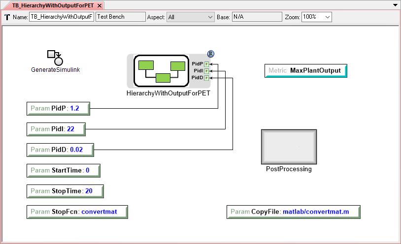

.. _simulink:

Simulink
========

The Simulink domain support allows Simulink models to be added to Components and
executed as part of a test bench.  Simulink support requires an installed copy
of MATLAB and Simulink.

Adding Simulink models to Components
------------------------------------

Via the Component Authoring Tool
~~~~~~~~~~~~~~~~~~~~~~~~~~~~~~~~

Simulink blocks in the Simulink standard library may be added to Component
models using the Component Authoring Tool:

 #. To begin, click the **Component Authoring Tool** icon, |CAT_TOOL|, in the
    toolbar and select **Add Simulink Model**.
    A dialog will appear listing available blocks in the Simulink standard
    library (this may take a minute or two if MATLAB has not been launched
    recently).
 #. Select the desired block and click **OK**.  A second dialog will appear
    listing parameters available for the selected block.
 #. Click the checkbox next to each parameter that should appear in the
    component model, then click **OK**.  After closing the Component Authoring
    Tool, the imported Simulink block will appear in the model.

Running Simulink models in a Test Bench
---------------------------------------

A number of specifically-named Parameters have special meaning when included in
a Test Bench that includes the **CyPhy2Simulink** interpreter in its workflow:

  * **CopyFile**:  Will copy the specified file (specified by a project-relative
    path) to the execution directory before executing the Simulink model.  This
    allows MATLAB and Simulink to find any needed support files for execution
    (for example, MATLAB functions).
  * **UserLibrary**:  Directs the Simulink interpreter to load the specified
    user library before execution, allowing its components to be used in the
    Simulink model.  This also copies the specified library to the execution
    directory.

   Example Simulink Test Bench

Any other unconnected Parameters in the Test Bench will be passed through to
Simulink as simulation parameters.  A full list of available parameters is
available within Simulink; some common useful parameters are listed below:

  * **StartTime**:  Specifies the start time for the simulation.
  * **StopTime**:  Specifies the stop time for the simulation.
  * **StopFcn**:  Specifies a MATLAB function to execute when the simulation
    completes; this is useful to extract data from the simulation to pass on
    as test bench metrics.

.. note:: The names used for each simulation parameter should be the parameter's
    Command Line Name.  These may be viewed within Simulink on the "All Parameters"
    tab of the "Model Configuration Parameters" dialog (accessible from the
    "Simulation" menu within Simulink).

OpenMETA :ref:`post_processing_blocks` are also supported within Simulink Test
Benches; these may run user-specified Python code and will execute after the
Simulink simulation completes.
