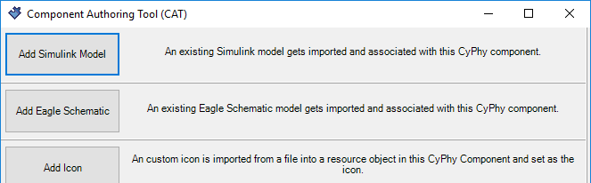
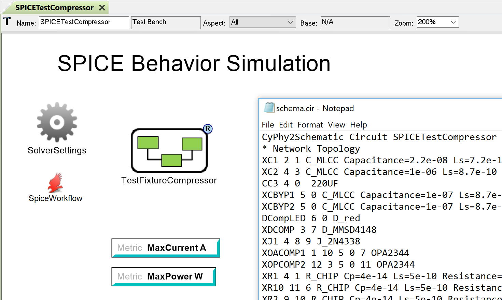

.. _interpreters:

Interpreters
============

*Interpreter* is the general term for any program or code invoked from within
GME that interacts with an OpenMETA project and produces a desired effect.
Interpreters are primarily used to perform modifications to OpenMETA projects
or to consume and transform OpenMETA projects in order to generate executable
analyses.

.. _utility_interpreters:

Utility Interpreters
--------------------

Utility Interpreters are those interpreters that are generally intended to be
used in the context of *Components*, *Component Assemblies*, or *Design
Containers*.
For example, the AddConnector Interpreter assists a user in creating
connectors around the bare pins in an electronics component model.

   The Component Authoring Tool Interpreter Dialog

The Component Authoring Tool (CAT) above is another great example: this utility
makes it simple to generate a component model by providing a wizard for
generating OpenMETA model objects based on existing domain-specific resources.

Test Bench Interpreters
-----------------------

Test Bench Interpreters are those interpreters that are designed to consume
the OpenMETA project and generate artifacts or executable analyses.
Test Bench Interpreters are intended to be invoked in the context of
:ref:`test_benches`.

For example, the CyPhy2Schematic Interpreter when invoked from the context
of a Test Bench, is capable of generating a SPICE circuit file from a composed
system of electronics components referenced as the *TopLevelSystemUnderTest*.

   SPICE Analysis Generated by CyPhy2Schematic Interpreter

Test Bench Interpreters are usually targeted at a single
domain in the model, but they can target multiple domains, e.g. generating a
co-simulation analysis.

Custom Interpreters
-------------------

In addition to the interpreters that come with OpenMETA, you can create custom
interpreters to satisfy a specific need you may encounter.

Most of the interpreters shipped with OpenMETA are written in C++ or C#, but
since building custom interpreters in these languages is currently unsupported,
the process for invoking a *CyPhyPython Interpreter* is described below.
Both Utility and Test Bench Interpreters can be created and invoked with
*CyPhyPython Interpreter*.

Invoking an Interpreter
~~~~~~~~~~~~~~~~~~~~~~~

Interpreters can be invoked as utilities as follows:

#. Navigate to the desired context, e.g. a *Component*, *Design Container*, etc.
#. Click the CyPhyPython Interpreter Button, |CYPHYPYTHON_BUTTON|, located in
   the toolbar.
#. Locate the script and click **Open**.

To invoke an CyPhyPython Interpreter as a Test Bench Interpreter, you will need
to add a *CyPhyPython Interpreter* Task to the workflow. An example of this can
be found in the :ref:`hello_world_analyzing_our_company` section of the
:ref:`hello_world` tutorial.

.. note:: If you don't see the CyPhyPython Button, |CYPHYPYTHON_BUTTON|, on the
   toolbar, follow the instructions below to add it:

   #. Open the **Components** manager from the menu bar,
      :menuselection:`Tools --> Register Components...`.

      .. image:: images/ComponentsManager.png

   #. Select **CyPhyPython**.
   #. Click **Enable**.

Building an Interpreter
~~~~~~~~~~~~~~~~~~~~~~~

There is currently no documentation on writing CyPhyPython Interpreters.
If you are attempting to do so, a good example to imitate would be the
:ref:`value_aggregator` that is used in the
:ref:`hello_world_analyzing_our_company` section of the :ref:`hello_world`
tutorial.
With OpenMETA installed, you can copy the interpreter script directly and make
changes as you see fit:
``C:\Program Files (x86)\META\bin\ValueAggregator.py``.
