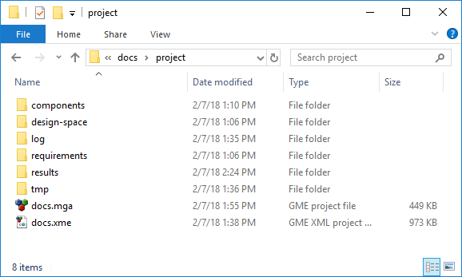
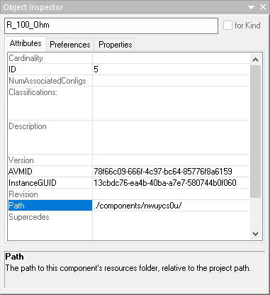

.. _openmeta_projects:

OpenMETA Projects
=================

An OpenMETA Project comprises a OpenMETA model file and a number of associated
folders. Since the relative location of all the items must stay constant
throughout the life of the project, it is customary to create a separate folder
for each project.

Project Folder Structure
------------------------

In the figure below, you can see what a typical OpenMETA project directory
looks like.

   A Typical OpenMETA Project Directory

OpenMETA Model Files
^^^^^^^^^^^^^^^^^^^^

Both the ``docs.mga`` and ``docs.xme`` files store the project data in its
entirety. The difference between these two formats is described in the
`Project File Extensions`_ section below. Essentially, every object that is
included in the GME Browser has a representation in this file.

Components Folder
^^^^^^^^^^^^^^^^^

The ``components`` folder is the second key component of an OpenMETA project
directory. This folder includes the resources associated with all the components
that are included in the OpenMETA Project. In the model file, each component has
a reference that points to a subfolder in the ``components`` folder. These
folders can be renamed, but this action is best done from within GME by
adjusting the *Path* attribute of the component in the Object Inspector.

   Properly Renaming an OpenMETA Component Resource Folder

.. note::

   It is often necessary to navigate to the resource folder for a given
   component. The simplest way to do so is to:

   #. Open the component.
   #. Click the Component Authoring Tool (CAT) Button, |CAT_BUTTON|.
   #. Click the **Open Component Folder** button at the bottom of the CAT
      Dialog Window.

Results and Merged Folders
^^^^^^^^^^^^^^^^^^^^^^^^^^

After you begin executing analysis in an OpenMETA project, a ``results`` folder
will be created in your project directory. This folder is where all executable
analyses are placed when they are generated from the OpenMETA tools.

Similarly, when you start to explore results using the :ref:`results_browser`
and :ref:`visualizer`, a ``merged`` folder will be created that will include
collections of data that are being explored.

Project File Extensions
-----------------------

.mga
^^^^

The native storage format for OpenMETA projects is the ``.mga`` file. This
format is a binary format and therefore usually the smaller of the two formats.
When you are editing an OpenMETA model in GME and click :menuselection:`File -->
Save` or hit :kbd:`Ctrl-S` on the keyboard, this is the format that is saved.

.xme
^^^^

The ``.xme`` format is an XML-based format that human-readable. This type,
although larger, lends itself much better to version control as discussed in the
next section. To save your project in the ``.xme`` format, you need to click
:menuselection:`File --> Export XML`.

Collaboration
-------------

Given the complexity and cross-disciplinary nature of the systems modeled in
OpenMETA, it is common for more than one user to be developing a model
simultaneously. To address this use case we describe two separate, though
not mutually exclusive, solutions below for dealing with the management of an
OpenMETA Project.

Version Control System
^^^^^^^^^^^^^^^^^^^^^^

Using a Version Control System with OpenMETA is an easy way to save versions
of an OpenMETA project as it develops. This can be especially useful as the
modeled system evolves through the life cycle stages. Throughout this section
we describe the best practices for sharing an OpenMETA project using the Git
version control system, but these principles should apply
to any version control system that is used.

What to Check In
~~~~~~~~~~~~~~~~

Given the complexity of the project, it may only be necessary to track changes
to the project file itself. For this purpose we suggest you check in the
``.xme`` format of the OpenMETA Model. Using this format allows Git to easily
recognize the difference between subsequent revisions and efficiently store the
history.

We recommend saving your project often in the native format, and exporting to
the XML format only when you are ready to commit some changes. Likewise, it is
good practice to re-import a project before you begin to make changes to the
model to minimize the chance of including unwanted changes. This can be done
by:

#. Closing the project.
#. Clicking :menuselection:`File --> Open`.
#. Selecting the ``.xme`` version of the project.
#. Replacing the current ``.mga`` with the opened ``.xme`` by clicking
   **Yes** when asked to replace the current project.

.gitignore File
~~~~~~~~~~~~~~~

As you continue to work with an OpenMETA project, many files will be generated
in the project directory. It is not useful to check in these files as they can
always be regenerated using the model itself as desired. Generating a
``.gitignore`` file in the root of your project directory can be a useful way to
ensure that you are only checking in necessary files to your repository. For
example, the following file prevents the ``log``, ``merged``, ``results``,
``requirements``, and ``design-spaces`` directories from being checked in. 

.. code-block:: text
   :name: .gitignore
   :caption: .gitignore

   log/
   merged/
   results/
   requirements/
   design-spaces/

This could be used as a starting point for building a ``.gitignore`` file that
suits the needs of a specific project.

Branching and Merging
~~~~~~~~~~~~~~~~~~~~~

Git offers the ability to create *branches* where there are two diverging
versions of an entity that are eventually going to be *merged* back into a
single version; however, merging ``.xme`` files is often very difficult and
sometimes virtually impossible to accomplish.

For this reason we only suggest branching when you want to experiment with
some change or feature and simply replace the original version if successful.

SubTree Merge
^^^^^^^^^^^^^

This tool can be used to merge the work of multiple users in the same OpenMETA
project provided they are working in mutually exclusive sections of the model.
