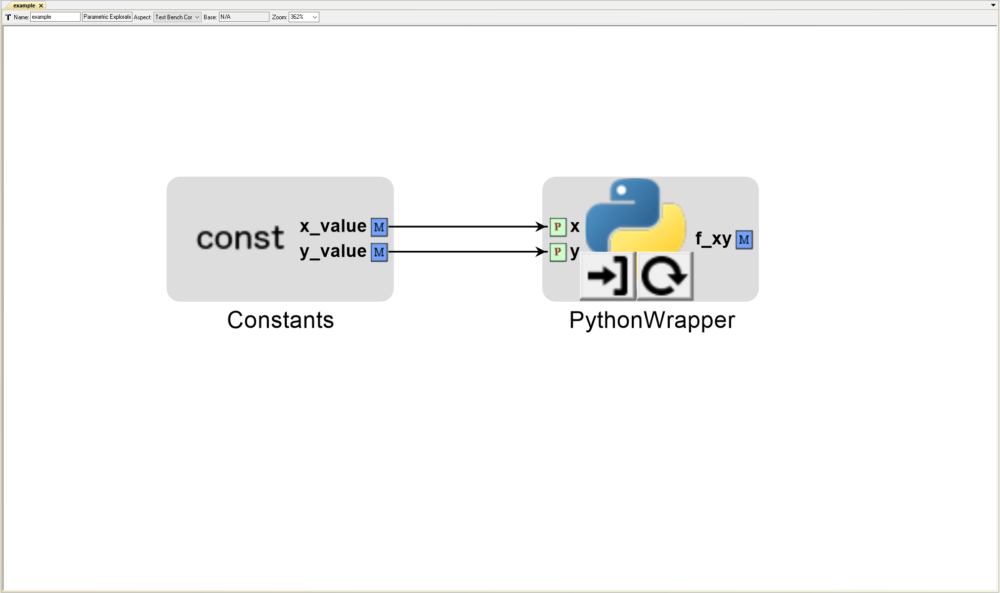

.. _constants_blocks:

Constants Blocks
================

These allow the user to set constant scalar values that can then be used to drive
other Analysis blocks within a PET.

Adding Constants Blocks to a PET
--------------------------------

To add a Constants Block to a PET, simply drag the Constants block icon from the
Part Browser and onto the PET canvas.

.. figure:: images/Constants.png
   :alt: text

   A Constants block in a PET

Populating Constants Blocks with Metrics
----------------------------------------

Constants Blocks within a PET can contain Metrics that hold scalar values.

To add a Metric to a Constants Block, double-click on the Constants Block
to open it, then drag the Metric icon from the Parts Browser into the Constants
Block canvas. The Metric can be renamed and its value can be set via
:menuselection:`Object Inspector --> Attributes --> Value`.

.. figure:: images/Metric.png
   :alt: text

   A Metric in a Constants block

.. figure:: images/MetricValue.png
   :alt: text

   A Metric's value being set

.. figure:: images/MetricConnected.png
   :alt: text

   A Constant's Metric connected to a PET Analysis Block

Multiple Metrics can be added to the same Constants Block. Each one will display as
a separate port on the Constants Block model.

.. figure:: images/MetricMultiple.png
   :alt: text

   Two Metrics with set values in a Constants block

   Two Constants' Metrics connected to a PET Analysis Block
