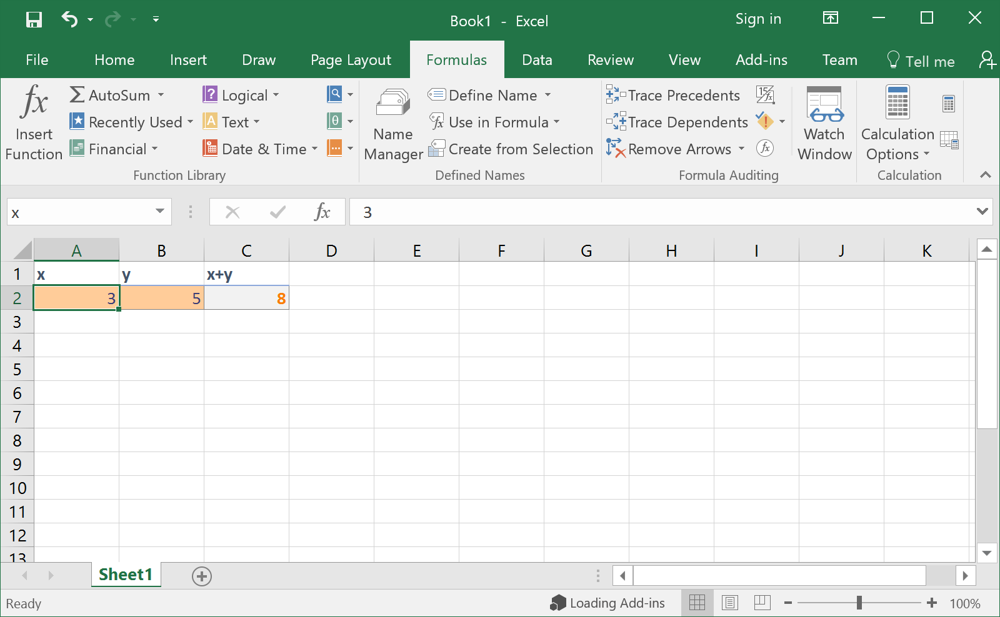

.. _excel_wrappers:

Excel Wrappers
==============

Preparing an Excel Spreadsheet
------------------------------

Before adding an Excel Spreadsheet, you must name all the cells that you desire
to be exposed in the Excel Wrapper analysis block. You can do this in Excel in
one of two ways:

#. selecting a cell and then typing a name in the **Name Box** in the upper left
   portion of the Excel window, or

#. using the **Name Manager** tool in the **Formula** tab on the ribbon.

Any cells that are formulas will be interpreted as outputs; all others will be
interpreted as inputs.

   An Excel Spreadsheet Being Prepared For Use As an Analysis Block

Adding Excel Wrappers to a PET
------------------------------

To add an Excel Wrapper to a PET, simply drag the Excel Wrapper icon from the
Part Browser and onto the PET canvas. Double-click on the Excel Wrapper and use
the **Open** dialogue to select the Excel file to be added to the PET.

.. figure:: images/ExcelWrapperAddition.png
   :alt: text

You should then see your component with the exposed inputs and outputs in the
PET Canvas.

.. _pet_analysis_blocks_python_wrappers:
