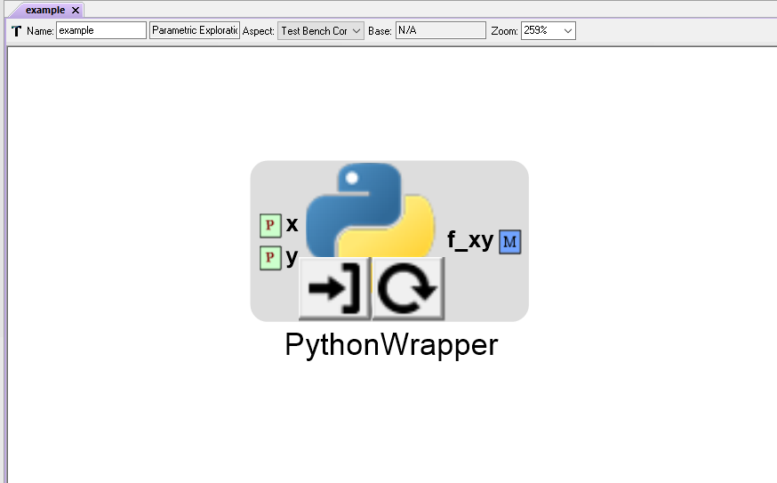

.. _python_wrappers:

Python Wrappers
===============

These serve as the most generic integration point. Practically any Python model or
tool can be added to a PET using Python Wrappers.

Adding Python Wrappers to a PET
-------------------------------

To add a Python Wrapper to a PET, simply drag the Python Wrapper icon from the
Part Browser and onto the PET canvas.

.. figure:: images/PythonWrapper.png
   :alt: text

   A Python Wrapper in a PET

A Python Wrapper can be loaded with specially-formatted Python scripts.

Below is a template Python Wrapper OpenMDAO Component script:

.. code-block:: python
   :name: Paraboloid.py
   :caption: Paraboloid.py

   from __future__ import print_function
   from openmdao.api import Component
   from pprint import pprint

   ''' First, let's create the component defining our system. We'll call it 'Paraboloid'. '''
   class Paraboloid(Component):
       ''' Evaluates the equation f(x,y) = (x-3)^2 +xy +(y+4)^2 - 3 '''

       def __init__(self):
           super(Paraboloid, self).__init__()

           ''' Inputs to the Python Wrapper Component are added here as params '''
           self.add_param('x', val=0.0)
           self.add_param('y', val=0.0)

           ''' Outputs from the Python Wrapper Component are added here as unknowns '''
           self.add_output('f_xy', shape=1)

       def solve_nonlinear(self, params, unknowns, resids):
           ''' This is where we describe the system that we want to add to OpenMETA '''
           ''' f(x,y) = (x-3)^2 + xy + (y+4)^2 - 3 '''

           x = params['x']
           y = params['y']

           f_xy = (x-3.0)**2 + x*y + (y+4.0)**2 - 3.0

           unknowns['f_xy'] = f_xy

           ''' This is an equivalent expression to the one above
           unknowns['f_xy'] = (params['x']-3.0)**2 + params['x']*y + (params['y']+4.0)**2 - 3.0
           '''

.. note:: For more information on OpenMDAO Component scripts and how to write them, reference
   the OpenMDAO documentation: http://openmdao.readthedocs.io/en/1.7.3/usr-guide/basics.html#component

Loading Python Wrappers
-----------------------

To load a Python Wrapper, double-click on the Python Wrapper and use the
file explorer to select the Python script to be added to the PET.

.. figure:: images/LoadingPythonWrapper.png
   :alt: text

   Loading a Python Wrapper with a Python script

   A Python Wrapper loaded with a Python script

Reloading Python Wrappers
-------------------------

.. note:: You have to manually reload Python Wrappers whenever you
   change the exposed Params and Unknowns within the Python script.

   Reloading also allows you to quickly switch between different
   versions of a Python script in your PET.

To load a Python Wrapper with a different Python script (or reload the same script),
left-click on the |RELOAD| button and select the desired Python file.

.. |RELOAD| image:: images/icons/reload.png
      :alt: Load icon
      :width: 25px

.. figure:: images/LoadingPythonWrapper.png
   :alt: text

   Reloading a Python Wrapper with a Python script

   A Python Wrapper loaded with a Python script

Editing Python Wrappers
-----------------------

To edit a Python Wrapper script from within OpenMETA, left-click on the |EDIT| icon

.. figure:: images/EditingPythonWrapper.png
   :alt: text

   Editing a Python Wrapper script
