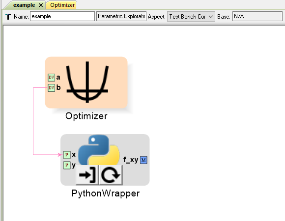
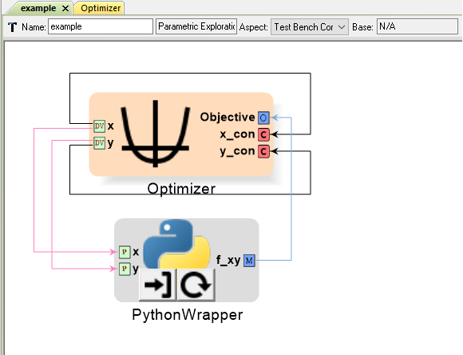
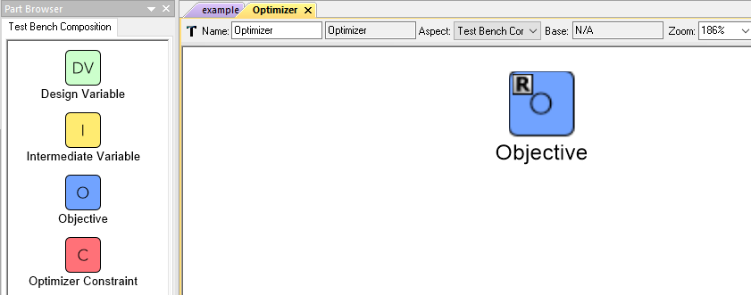
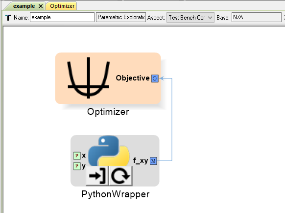
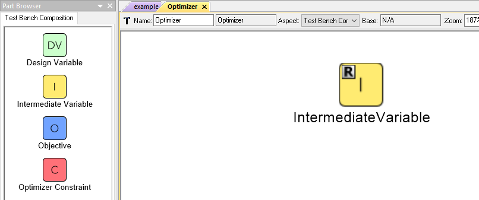
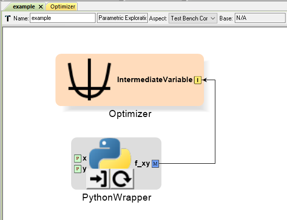
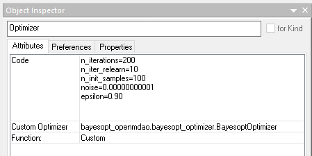

.. _optimizer_driver:

Optimizer PET Driver
--------------------

The Optimizer varies system inputs in order to minimize a single system output.
Like the Parameter Study, the Optimizer records the systems inputs and designated
outputs at every iteration.

However, unlike the Parameter Study, the Optimizer uses the designated system outputs
to change the system's inputs as well as decide when the optimization process
has reached a satisfactory stopping point.

Adding an Optimizer to a PET
~~~~~~~~~~~~~~~~~~~~~~~~~~~~

To add an Optimizer to a PET, simply drag the **Optimizer** icon from the
Part Browser and onto the PET canvas.

.. figure:: images/Optimizer.png
   :alt: text

   An Optimizer in a PET

****

Design Variable
~~~~~~~~~~~~~~~

A Design Variable placed inside a Optimizer will appear as a port
on the Parameter Study's PET model and can be connected to PET Analysis
Blocks.

Over the course of a PET run, a Optimizer Driver
changes each Design Variable's value many times in order to
minimize the Objective. The inputs of PET Analysis Blocks can be connected to it.

.. figure:: images/DesignVariableOptimizer.png
   :alt: text

   A Design Variable in an Optimizer PET Driver

   An Optimizer PET Driver's Design Variable connected to a PET Analysis Block

Adding a Design Variable to an Optimizer Driver
^^^^^^^^^^^^^^^^^^^^^^^^^^^^^^^^^^^^^^^^^^^^^^^^

To add a Design Variable to an Optimizer Driver, simply drag
the **Design Variable** icon from the Part Browser and onto the PET canvas.

Design Variable Range
^^^^^^^^^^^^^^^^^^^^^

Each Design Variable has **Range** attribute
that can be set by the user.

To set a Design Variable's range:

#. Left-click on the Design Variable
   and edit the **Range** attribute in the **Object Inspector**.

#. Enter the Design Variable's minimum value followed by
   a comma followed by the Design Variable's maximum value.
   (e.g. Entering **-50,34** in a Design Variable's **Range** attribute
   will limit that Design Variable to values between **-50** and **+34 inclusive**).

.. figure:: ../basics/images/DesignVariableRange.png
   :alt: text

   Setting a Design Variable's range

.. note:: The Optimizer Driver treats Design Variables differently then the
   Parameter Study driver, so setting a Design Variable's range in an
   Optimizer only sets the default optimization starting point for that
   variable to be the (minimum+maximum)/2.

.. warning:: Setting a Design Variable's range DOES NOT keep the Optimizer from setting
   the Design Variable's value outside of that range during the optimization process.
   In order to properly constrain Design Variables, the user must add an additional
   Constraint to the Optimizer Driver for each constrained Design Variable,
   set that Constraint's **MinValue** and **MaxValue** attributes to the desired
   Design Variable bounds, and connect the Design Variable to the Constraint using
   Connect Mode at the PET level *(i.e. outside of the Optimizer)*.

   Constraining an Optimizer's Design Variables

   Check out the :ref:`pet_advanced_topics` chapter to learn more about how to
   finesse an optimization.

Objective
~~~~~~~~~

An Objective placed inside an Optimizer will appear as a port
on the Optimizer's PET model and PET Analysis Blocks can be
connected to it.

At every iteration of the Optimizer, the Objective will record
the value of the Metric connected to it. Additionally, the Optimizer
Driver will use the Objective's recorded value to change the values
of the Design Variable(s) for the next iteration as well as to decide
when a satisfactory minimum has been achieved.

Adding an Objective to an Optimizer Driver
^^^^^^^^^^^^^^^^^^^^^^^^^^^^^^^^^^^^^^^^^^

To add an Objective to an Optimizer Driver, simply drag
the **Objective** icon from the Part Browser and onto the Optimizer canvas.

   An Objective in a Optimizer PET Driver

   A PET Analysis Block connected to an Optimizer PET Driver's Objective

Intermediate Variable
~~~~~~~~~~~~~~~~~~~~~

An Intermediate Variable placed inside an Optimizer
will appear as a port on the Optimizer's PET model and PET
Analysis Blocks can be connected to it.

An Intermediate Variable records the value of the Metric connected
to it at every iteration of the Optimizer but does not affect the
optimization process like the Objective does.

Adding an Intermediate Variable to an Optimizer Driver
^^^^^^^^^^^^^^^^^^^^^^^^^^^^^^^^^^^^^^^^^^^^^^^^^^^^^^

To add an Intermediate Variable to an Optimizer Driver, simply drag
the **Intermediate Variable** icon from the Part Browser and onto the Optimizer canvas.

   An Intermediate Variable in a Optimizer PET Driver

   A PET Analysis Block connected to an Optimizer PET Driver's Intermediate Variable

****

Optimizer Constraint
~~~~~~~~~~~~~~~~~~~~

An Optimizer Constraint placed inside an Optimizer
will appear as a port on the Optimizer's PET model and PET Analysis
Blocks can be connected to it.

An Optimizer Constraint allows designated system outputs to influence
the optimization process - **if** the
optimization method being used supports constraints!

Adding an Optimizer Constraint to an Optimizer Driver
^^^^^^^^^^^^^^^^^^^^^^^^^^^^^^^^^^^^^^^^^^^^^^^^^^^^^

To add an Intermediate Constraint to an Optimizer Driver, simply drag
the **Intermediate Constraint** icon from the Part Browser and onto the Optimizer canvas.

.. figure:: images/OptimizerConstraint.png
   :alt: text

   An Objective Constraint in a Optimizer PET Driver

.. figure:: images/OptimizerConstraintConnected.png
   :alt: text

   A PET Analysis Block connected to an Optimizer PET Driver's Objective Constraint

Optimizer Constraint MinValue & MaxValue
^^^^^^^^^^^^^^^^^^^^^^^^^^^^^^^^^^^^^^^^

Each Optimizer Constraint has **MinValue** and **MaxValue** attributes
that can be set by the user. The Optimizer Driver will do its best
to keep system outputs connected to a Optimizer Constraint within
the bound(s) defined by the **MinValue** and **MaxValue** attributes.

To set an Optimizer Constraint's MinValue and/or MaxValue attributes:

#. Left-click on the Optimizer Constraint
   and edit the **MinValue** attribute in the **Object Inspector**.

#. Enter the Optimizer Constraint's minimum value.

#. Repeat this process for the Optimizer Constraint's maximum value.

Optimizer Types
~~~~~~~~~~~~~~~~~~~~

The OpenMETA Optimizer comes with two different optimization methods, and can be extended
by users to include more. Users can change the optimization method and related settings by
selecting (or opening) the Optimizer Driver and editing its attributes
in the Object Inspector.

COBYLA
^^^^^^

This Optimizer Uses the COBYLA function in SciPy's
`optimize` library. COBYLA supports constrained optimization without
defined gradients (or Jacobian matrixes).

.. figure:: images/COBYLAOptimizerAttributes.png
   :alt: text

   A COBYLA Optimizer's Attributes

*Code*

==================  =====================================================================================================  =======
Name                Description                                                                                            Default
==================  =====================================================================================================  =======
maxiter             maximum number of iterations when attempting to converge                                               200
tol                 optimization tolerance                                                                                 1e-4
opt_settings        additional settings passed directly to the COBYLA optimizer.  For                                      {}
                    details on available options, see the `SciPy docs
                    <https://docs.scipy.org/doc/scipy/reference/optimize.minimize-cobyla.html#optimize-minimize-cobyla>`_
==================  =====================================================================================================  =======

*Custom Optimizer*

Leave this field blank.

*Function*

Select **COBYLA**.

BayesOpt
^^^^^^^^

This Optimizer uses the `BayesOpt <https://rmcantin.bitbucket.io/html/index.html>`_
Bayesian optimization library. BayesOpt supports unconstrained optimization.

   A BayesOpt Optimizer's Attributes

*Code*

==================  =====================================================================  =======
Name                Description                                                            Default
==================  =====================================================================  =======
n_iterations        number of target function evaluations                                  190
n_iter_relearn      number of iterations between re-learning kernel parameters             50
n_inner_iterations  max iterations (per dimension) to optimize the acquisition function    500
n_init_samples      initial set of samples / target function evaluations                   10
epsilon             probability of performing a random (blind) target function evaluation  0.0
==================  =====================================================================  =======

.. note:: If **n_iter_relearn=0** then there will be no relearning.

   **epsilon** can be given a double value between 0.0 and 1.0 inclusive.
   Higher values result in more forced exploration whereas lower values result
   in a greater exploration of the learned model.

   For more information on each parameter, additional
   parameters not covered here, the BayesOpt method library,
   and Bayesian optimization in general, please visit
   https://rmcantin.bitbucket.io/html/usemanual.html#params
   and its related pages.

*Custom Optimizer*

Enter
**bayesopt_openmdao.bayesopt_optimizer.BayesoptOptimizer**
in this attribute field

You will also need to
install the BayesOpt package by running the following command in a Command Prompt:

.. code::

   "C:\Program Files (x86)\META\bin\Python27\Scripts\python.exe" -m pip install --user bayesopt_openmdao

*Function*

Select **Custom**.
