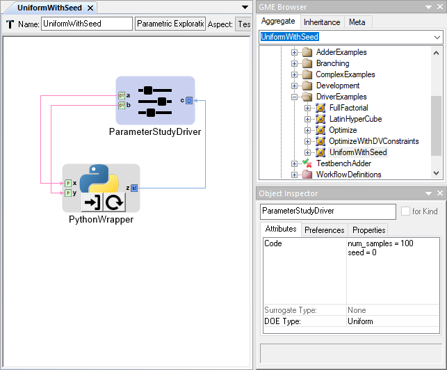
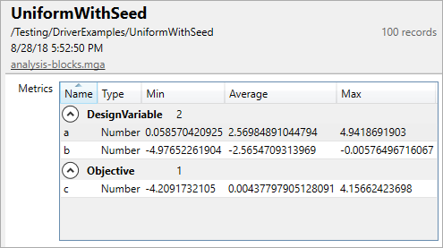

.. _parameter_study_driver:

Parameter Study PET Driver
==========================

The Parameter Study Driver generates a set of inputs based on the type
of Design of Experiments (DOE) that is being conducted. Then
the driver evaluates the analysis workflow at each of the generated
input sets and records the values of the objectives.

The Parameter Study is configured by setting and adjusting a number
of its attributes. These attributes can be accessed by left-clicking
a Parameter Study and then looking under the **Attributes** tab of the
**Object Inspector** window.

.. figure:: images/ParameterStudyAttributes.png
   :alt: text

   A Parameter Study Driver's Attributes

Code
~~~~

The **Code** attribute is used to pass configuration variables
to underlying MDAO engine. For example, in the image above you can
see we assigned the variable ``num_samples`` the value of ``10``.
You will use this field to set other values such as ``seed`` and ``num_levels``.
See the `DOE Types`_ section below for more
information on what code variables need to be set for each type.

Surrogate Type
~~~~~~~~~~~~~~

The **Surrogate Type** attribute is not currently documented.

DOE Types
~~~~~~~~~

The **DOE Type** attribute determines the sampling method by which
the Parameter Study explores the Design Variable space.
Different DOE Types can be selected by left-clicking
the **DOE Type** attribute field and selecting the desired method.
The different types and their accompanying configurations are described below.

Full Factorial
^^^^^^^^^^^^^^

The Full Factorial DOE Type makes it easy to exhaustively explore a design
space. This type generates **dv^num_levels** input cases where **dv** is the
number of Design Variables (or factors) in our driver and **num_levels**, set in
the *Code* attribute, is the number of discrete values to consider from the
range specified for each design variable.

If **num_levels = 1**, then each Design Variable will have one level equal to
the lower bound specified in the :ref:`design_variable_range_attribute` of the
Design Variable.
In the case of a single value defined in the *Range* attribute, the level is
simply the value.
If **num_levels = 2**, then each Design Variable will have two levels equal to
the lower and upper bounds specified in the range attribute of the *Design
Variable*.
If **num_levels = 3** or greater, then each Design Variable will have levels
evenly distributed across its range, including the lower and upper bounds.

For example, if the PET has two Design Variables **x** and **y**, both with a
*Range* of **-10,10** and the *Code* attribute defined with **num_levels = 3**,
then the following combination of inputs would be simulated:

+-----+-----+-----+
| row | x   | y   |
+=====+=====+=====+
| 1   | -10 | -10 |
+-----+-----+-----+
| 2   | -10 | 0   |
+-----+-----+-----+
| 3   | -10 | 10  |
+-----+-----+-----+
| 4   | 0   | -10 |
+-----+-----+-----+
| 5   | 0   | 0   |
+-----+-----+-----+
| 6   | 0   | 10  |
+-----+-----+-----+
| 7   | 10  | -10 |
+-----+-----+-----+
| 8   | 10  | 0   |
+-----+-----+-----+
| 9   | 10  | 10  |
+-----+-----+-----+

Central Composite
^^^^^^^^^^^^^^^^^

This DOE type is currently unsupported.

Opt Latin Hypercube
^^^^^^^^^^^^^^^^^^^

The Opt[imized] Latin Hypercube type is a pre-determined samples driver that seeks to
produce good coverage across all the dimensions (or Design Variables). This is
preferred to a Uniform type of sampling in most cases as you have a higher
probability of an evenly-sampled independent variables space.

This pre-ddetermine samples driver is implemented using an evolutionary
algorithm to optimize the Morris-Mitchell sampling criterion. [#]_
This type of DOE supports a number of configuration options to assign in the
code block:

-  **num_samples** - This specifies the total number of samples to generate.
   It must be greater than or equal to 2.
-  **seed** - This is used to seed the pseudorandom number generator (PRNG). If
   it is assigned, the generated Latin Hypercube Design (or input cases) will
   always be the same when this PET is run, i.e. the behavior will be
   deterministic. (Default: random)
-  **generations** - This determines how many generations the genetic algorithm
   will evolve over. (Default: 2)
-  **population** - This sets the size of the population used in the
   evolutionary optimization. (Default: 20)
-  **norm-method** - This determines the method for determining the vector norm.
   *1-norm* is faster, but less accurate. (Choices: ["1-norm", "2-norm"],
   Default: "1-norm")

Uniform
^^^^^^^

The Uniform type generates a input cases by simply sampling each Design Variable
using a uniform or discrete uniform distribution across the interval defined in
its *Range* attribute. It will generate as many input cases as are specified by
the **num_samples** assignment in the **Code** attribute.

As with the *Opt Latin Hypercube* DOE type, you can realize deterministic
behavior by setting the **seed** parameter in the code block. Take as an example
one of the PETs in the `analysis-blocks
<https://github.com/metamorph-inc/openmeta-examples-and-templates/tree/master/analysis-blocks>`_
project of the `openmeta-examples-and-templates
<https://github.com/metamorph-inc/openmeta-examples-and-templates>`_ repository:

   **Testing/DriverExamples/UniformWithSeed** PET

Since the seed is set to **0**, the results will always be the same when this
PET is executed. Try it yourself and see if your results match!

CSV File
^^^^^^^^

The CSV File type allows for an arbitrary set of test cases to be specified
in a CSV file and then executed with the given analysis workflow. This is
useful when you have a number of edge cases you need to test.

The input file is selected by placing the path, relative to the project
directory (i.e. the location of the current ``.mga`` file), in a
``filename='<path>'`` assignment in the **Code** attribute of the
Parameter Study Driver. This file will be copied to the execution
directory when the PET is executed.

.. figure:: images/driver_config_csv_file.png
   :alt: Example CSV File DOE Type Configuration for a Parameter Study Driver

   Example CSV File DOE Type Configuration for a Parameter Study Driver

All design variables that are unrepresented in the input CSV file will be
assigned a value that is the average of the interval specified in that design
variable's *Range* attribute in the Parameter Study Driver. Extra columns that
don't match any of the design variables are allowed in the input CSV, but
they are ignored.

------

Footnotes

.. [#] http://openmdao.org/releases/0.1.4/docs/srcdocs/packages/openmdao.lib.html#openmdao-lib-doegenerators-optlh-py
