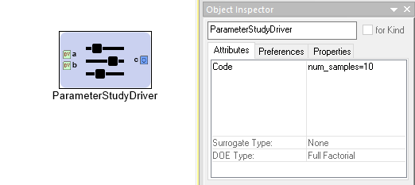

.. _parameter_study_driver:

Parameter Study PET Driver
==========================

The Parameter Study Driver generates a set of inputs based on the type
of Design of Experiments (DOE) that is being conducted. Then
the driver evaluates the analysis workflow at each of the generated
input sets and records the values of the objectives.

The Parameter Study is configured by setting and adjusting a number
of its attributes. These attributes can be accessed by left-clicking
a Parameter Study and then looking under the **Attributes** tab of the
**Object Inspector** window.

   A Parameter Study's Attributes

Code
~~~~

The **Code** attribute is used to pass configuration variables
to underlying MDAO engine. For example, in the image above you can
see we assigned the variable ``num_samples`` the value of ``10``.

See the `DOE Types`_ section below for more
information on what code variables need to be set for each type.

Surrogate Type
~~~~~~~~~~~~~~

The **Surrogate Type** attribute is not currently documented.

DOE Types
~~~~~~~~~

The **DOE Type** attribute determines the sampling method by which
the Parameter Study explores the Design Variable space.
Different DOE Types can be selected by left-clicking
the **DOE Type** attribute field and selecting the desired method.
The different types and their accompanying configurations are described below.

Full Factorial
^^^^^^^^^^^^^^

The Full Factorial type generates **DV^num_samples** input cases where
**DV** is the number of Design Variables and **num_samples** is set
in the **Code** attribute. The levels for each Design Variable are evenly
distributed across the Design Variable's range with one level
at the minimum value and and one level at the maximum value.

If **num_samples=1**, then each Design Variable will have one level,
and that level will be the Design Variable's respective minimum value.
If **num_samples=2**, then each Design Variable will have two levels,
and those levels will be the Design Variable's respective minimum and
maximum levels.
If **num_samples=3** or greater, then Design Variable will have
additional levels evenly distributed across its range.

When the PET is run, a full factorial exploration of the design
space will occur - e.g. if the PET has two Design Variables x and y,
both with a **Range** of **-10,+10** and **num_samples=3**, then
the PET will test the following *(x,y)* inputs: *(-10,-10), (-10,0),
(-10,+10), (0,-10), (0,0), (0,+10), (+10,-10), (+10,0), (+10,+10)*.

Central Composite
^^^^^^^^^^^^^^^^^

This DOE type is currently unsupported.

Opt Latin Hypercube
^^^^^^^^^^^^^^^^^^^

The Opt Latin Hypercube type is a predetermined-samples driver that seeks to
produce good coverage across all the dimensions. This is preferred to a Uniform
type of sampling in most cases as you have a higher probability of an
evenly-sampled independent variables set.

Uniform
^^^^^^^

The Uniform type generates **num_samples** input cases where **num_samples**
is set in the **Code** attribute. The input cases are evenly distributed across
the ranges of all Design Variables.

If **num_samples=1**, then each Design Variable will be set to its minimum value
in the resulting single input case.

CSV File
^^^^^^^^

The CSV File type allows for an arbitrary set of test cases to be specified
in a CSV file and then executed with the given analysis workflow. This is
useful when you have a number of edge cases you need to test.

The input file is selected by placing the path, relative to the project
directory (i.e. the location of the current ``.mga`` file), in a
``filename='<path>'`` assignment in the **Code** attribute of the
Parameter Study Driver. This file will be copied to the execution
directory when the PET is executed.

.. figure:: images/driver_config_csv_file.png
   :alt: Example CSV File DOE Type Configuration for a Parameter Study Driver

   Example CSV File DOE Type Configuration for a Parameter Study Driver

All design variables that are unrepresented in the input CSV file will be
assigned a value that is the average of the interval specified in that design
variable's *Range* attribute in the Parameter Study Driver. Extra columns that
don't match any of the design variables are allowed in the input CSV, but
they are ignored.
