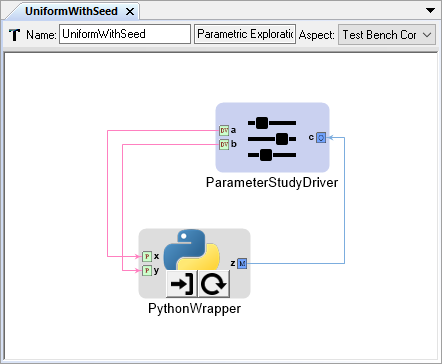

.. _pet_drivers:

PET Drivers
===========

A PET Driver allows the modeler to define the inputs (or design variables) to
the analysis workflow defined by the PET. The PET driver is also used to specify
the desired outputs to capture from the analysis iterations.

   Simple PET with a Parameter Study Driver

In addition to the documentation that follows, a number of example PETs using
different drivers can be found in the `analysis-blocks
<https://github.com/metamorph-inc/openmeta-examples-and-templates/tree/master/analysis-blocks>`_
project of the `openmeta-examples-and-templates
<https://github.com/metamorph-inc/openmeta-examples-and-templates>`_ repository.
As you read through the documentation, we recommend you run these example PETs
and explore the results using the Visualizer or simply opening the
``output.csv`` file that is produced in the output directory. See the
:ref:`active_jobs_tab` section for more information on navigating to the output
directory of a complete analysis.

.. toctree::
   :maxdepth: 1
   :caption: Sections

   basics/pet_driver_basics
   parameter_study/parameter_study_driver
   optimizer/optimizer_driver
   pcc/pcc_driver
