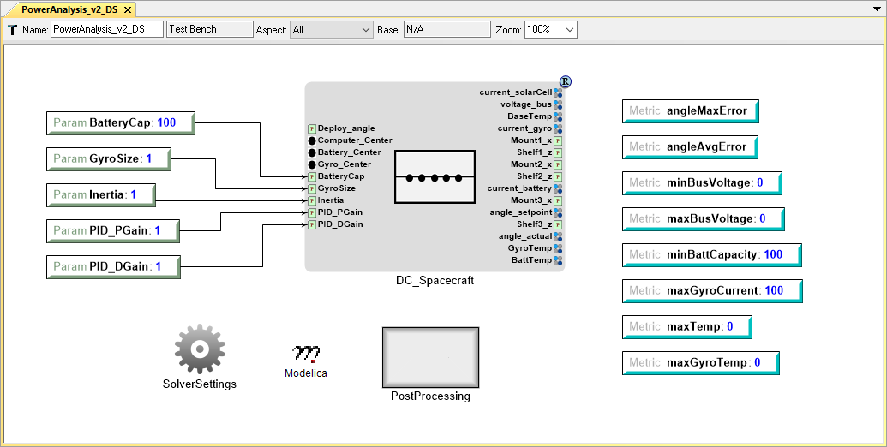
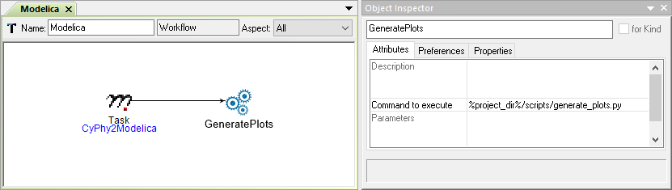
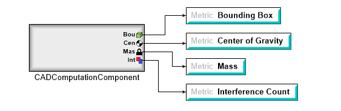
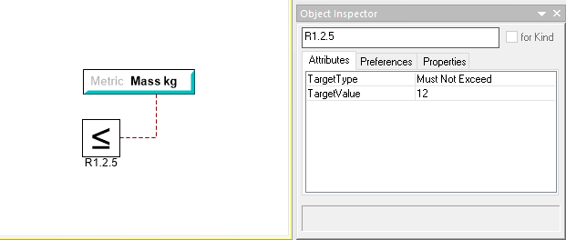
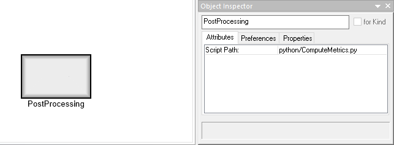

.. _test_bench_basics:

Test Bench Basics
=================

Introduction
------------

The *Test Bench* is the OpenMETA model object used to define how an
OpenMETA system model should be translated into an executable
domain-specific model, analysis, or simulation.
When a Test Bench is executed with the :ref:`master_interpreter`, a job is
created, ready to be processed by the :ref:`results_browser`.

   Modelica Test Bench from the OpenMETA Spacecraft Project

For example, the Modelica Test Bench above defines how a spacecraft system model
composed of OpenMETA components, each containing a Modelica model, should be
translated into a Modelica system model that includes the complete set of
equations. When the job is passed to the Results Browser and executed, the
Modelica solver consumes the system model and returns the results.

Test Bench Functions
--------------------

Simulation Test Benches
~~~~~~~~~~~~~~~~~~~~~~~

In the OpenMETA Tools, test benches most often serve as a virtual environment
used to run experiments on a system. Test benches define a testing context for a
system, providing sources of stimulus and loading elements that gather
experimental data. In OpenMETA, a user can dictate the test conditions for their
experiment themselves or choose from a library of pre-configured test benches
that represent design requirements or other criteria. In addition to the
configuration of test conditions, the user can customize the data gathered
through the execution of a test bench. A good example is the Modelica test bench
described above.

Artifacts-Generating Test Benches
~~~~~~~~~~~~~~~~~~~~~~~~~~~~~~~~~

While most test benches are used to perform analyses, other test benches
can perform design services for the user. For example, a user that has
completed an OpenMETA design can run a test bench to auto-generate a
schematic of their design. Additionally, the user can run a CAD assembly
test bench to build a 3D model of their design.

.. figure:: images/01-04-example-test-bench.png
   :alt: example test bench

   An Example Test Bench

"NewDC\_\_SimpleLEDCircuit" is the *System Under Test*, while the other test
components provide the *Wraparound Environment*.

Test Bench Parts
----------------

Systems Under Test
~~~~~~~~~~~~~~~~~~

Test Benches always include a *TopLevelSystemUnderTest*, which references
the model in our project that is the object of testing. If there are
parameters exposed from this assembly, they will be visible in the Test
Bench. You can in turn create Parameters in the Test Bench itself and use
these to drive the parameters of the *TopLevelSystemUnderTest*.

If the *TopLevelSystemUnderTest* is a *design space*, a test bench can be executed
with any or all of the discrete configurations when using the
:ref:`master_interpreter`.

.. _workflows:

Workflows
~~~~~~~~~

A *Workflow* is an OpenMETA model object used to define steps necessary to
properly run an analysis. Workflows must exist in a *Workflow Definitions*
folder, which itself must exist in a *Testing* folder, and be added to the test
bench by reference.

   An Example Modelica Workflow

Workflow steps may include *Tasks* to call model *Interpreters* at the time of
job creation, *Executions Tasks* to define scripts to be run at the time of job
execution, or both.

Metrics and Metric Constraints
~~~~~~~~~~~~~~~~~~~~~~~~~~~~~~

*Metrics* are used to define the named values that will serve as the results of
a given analysis or simulation. During the course of the execution, these
values will be calculated and set by analysis.

   A CAD Computation Block Driving Test Bench Metrics

*Metric Constraints* are used in conjunction with metrics to express the desired
value of a given metric. After a metric constraint has been added to a test
bench and connected to a metric, you can express the target type and value.

Metrics and metric constraints are not necessary for the execution of a test
bench, and with `Artifacts-Generating Test Benches`_, they are often not
present.

Test Components
~~~~~~~~~~~~~~~

You can include *test components* to create a fixture around the system
under test. They can be used as a stimulus so its performance can be analyzed.

   5V Source Test Component Used to Power a Design for Evaluation

.. _post_processing_blocks:

PostProcessing Blocks
~~~~~~~~~~~~~~~~~~~~~

PostProcessing Blocks allow us specify a script to run at the conclusion of
the main Test Bench execution step and are useful for calculating metrics from
the generated results of a simulation.

Other Objects
~~~~~~~~~~~~~

In addition to the major elements described above, there are many more models,
references, and atoms that can exist in a test bench. Most of these provide
more flexibility for defining the testing environment and system stimulus.
Visit the :ref:`integrated_domains` chapter for more information.
