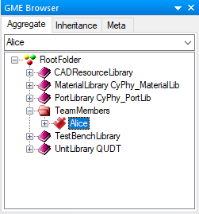
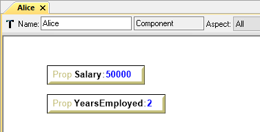

.. _hello_world_adding_team_members:

Adding Team Members
===================

Now that we have a new project, let's begin to add some team members. For the
purpose of this example, we will model team members as OpenMETA components.
In general, OpenMETA components can be used to model anything from a complete
vehicle to a single resistor; the level of granularity to which a system is
divided into individual components depends upon the needs of the model.

Adding a Components Folder
--------------------------

Before we can add our first component, we need to create a **Components**
folder.

#. Locate the GME Browser. If it is not visible in the main window, make sure
   the :menuselection:`View --> GME Browser` option is ticked.

   .. image:: images/gme_browser.png

#. Right-click on the **RootFolder**, and choose :menuselection:`Insert Folder
   --> Components`.
#. Rename this new *Components* folder **TeamMembers**.

Adding a Team Member
--------------------

Now let's create a team members and give them some properties.

#. Right-click on the new **TeamMembers** folder, and choose
   :menuselection:`Insert Model --> Component`.
#. Rename this new component with your name.

Your GME Browser pane should something like this now:

Adding Properties
-----------------

Our component is rather bland in its current state, so let's add some properties
to it to better reflect our person.

#. Open the new component by double-clicking on it in the GME Browser. This will
   open a canvas to start editing our component.
#. From the Parts Browser pane on the left of the window drag a **Property**
   on to the open canvas. If the Parts Browser is not visible, make sure the
   :menuselection:`View --> Parts Browser` menu item is ticked.
#. Rename the Property **Salary**.
#. Set the value to **50000**.

   .. note::

      Properties and their values can be set directly in the canvas or by using
      the Object Insepctor pane that is found in the bottom right of the GME
      window. If the Object Inspector is not visible make sure the
      :menuselection:`View --> Object Inspector` menu option is ticked.

      .. image:: images/object_inspector.png

#. Repeat this process to also add a **YearsEmployed** property and set the
   value accordingly.

When you are done your OpenMETA component should look something like this:

Go ahead and create a few more team members in the same fashion as before, and
then head to the next chapter to create a team with these members.
