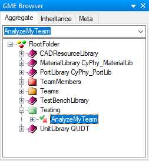
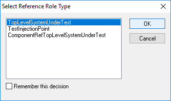
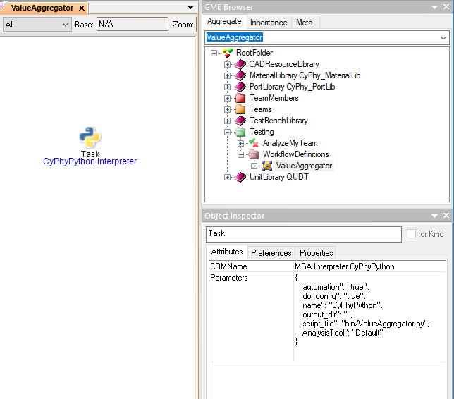
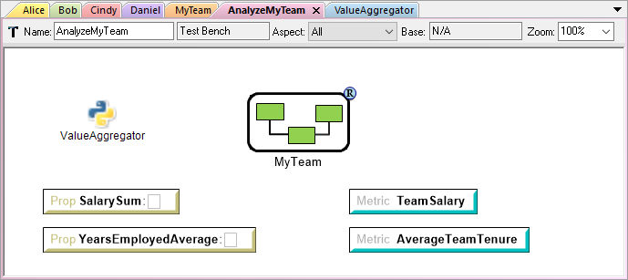
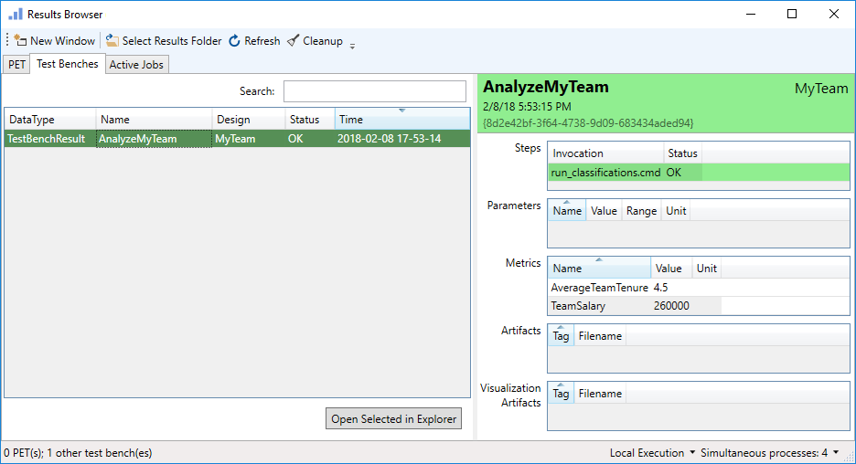

.. _hello_world_analyzing_our_company:

Analyzing Our Company
=====================

A model of our team is not very useful unless we have a way to execute
operations on the model to generate meaningful and significant results.
In OpenMETA, :ref:`test_benches` are used to transform a model to new
representations, generate simulation code, and calculate metrics.

For the given exercise, we would like to calculate some meaningful metrics about
our team.

Creating a Test Bench
---------------------

Let's add a Test Bench to our project.

#. Right-click on the **RootFolder** in the GME Browser and choose
   :menuselection:`Insert Folder --> Testing`.
#. Right-click on the resulting **Testing** folder and choose
   :menuselection:`Insert Model --> Test Bench`.
#. Rename this new Test Bench **AnalyzeMyTeam**.

The GME Browser should now look like this:

Adding Our Team
---------------

Let's specify the **MyTeam** Component Assembly as the System Under Test.

#. Double-click the **AnalyzeMyTeam** Test Bench from the GME Browser to open it
   in the canvas window.
#. Right-click and drag the **MyTeam** Component Assembly from the GME Browser
   onto the canvas.
#. Select **Create reference**.
#. Select **TopLevelSystemUnderTest** and click **OK**.

Adding the Workflow
-------------------

:ref:`workflows` are used to define the steps that should be carried out when a
Test Bench is executed. We will have to create a workflow defining what the test
bench should do when executed and then add it to our Test Bench.

#. In the GME Browser, right-click on the **Testing** folder and choose
   :menuselection:`Insert Folder --> Workflow Definitions`.
#. Right-click on the resulting **WorkflowDefinitions** Folder and choose
   :menuselection:`Insert Model --> Workflow`.
#. Rename the workflow **ValueAggregator**.
#. Double-click the workflow to open it in the canvas window.
#. Drag a **Task** from the Parts Browser onto the canvas.
#. Select the **CyPhyPython Interpreter**.

   .. image:: images/cyphypython_interpreter.png

#. Double-click the resulting Task.
#. In the dialog that appears enter ``bin/ValueAggregator.py`` in the
   **script_file** field.

   .. image:: images/workflow_parameters.png

Your workflow should now look something like this:

Let's finish by adding this workflow to our Test Bench.

#. Open the Test Bench in the canvas by locating and double-clicking it in the
   GME Browser.
#. Right-click and drag the new **ValueAggregator** *Workflow* onto the canvas
   and choose **Create reference**.

Adding Our Queries
------------------

The :ref:`value_aggregator` that we added in the previous steps is a script
included with the OpenMETA tools that allows us to easily query and extract
values from the model we've constructed. We will use this tool to calculate the
team's salary and average tenure with our company.

The Value Aggregator script visits each of the properties in the Test Bench and
performs the query defined in the **Description** attribute. Then it assigns
values to each Metric based on the equation defined in its **Description**
attribute. We will create two queries and metrics.

#. From the Parts Browser drag a **Property** into the **AnalyzeMyTeam** canvas.
#. Rename the *Property* **SalarySum**.
#. In the Object Inspector enter ``Salary,*,SUM`` into the **Description**
   attribute.

   .. image:: images/salary_sum_description.png

#. Create a second **Property** named **YearsEmployedAverage** and enter
   ``YearsEmployed,*,AVERAGE`` into the **Description** attribute.

#. From the Parts Browser drag a **Metric** into the **AnalyzeMyTeam** canvas.
#. Rename the *Metric* **TeamSalary**.
#. In the Object Inspector enter ``TeamSalary = SalarySum`` into the
   **Description** attribute.

   .. image:: images/team_salary_description.png

#. Create a second **Metric** named **AverageTeamTenure** and enter
   ``AverageTeamTenure = YearsEmployedAverage`` into the **Description**
   attribute.

Your finished Test Bench should look something like this:

Running Our Analysis
--------------------

The only thing left to do it run our newly-created Test Bench using the
:ref:`master_interpreter`.

#. While the **AnalyzeMyTeam** *Test Bench* is open in the canvas, click the
   Master Interpreter button, |MASTER_INTERPRETER_BUTTON|, on the toolbar.
#. Click **OK** when the dialog appears.

This will send the job to the :ref:`results_browser` for execution. When the job
completes and turns green, navigate to the Test Benches tab to see the results
of the job. Your results should look something like this:

