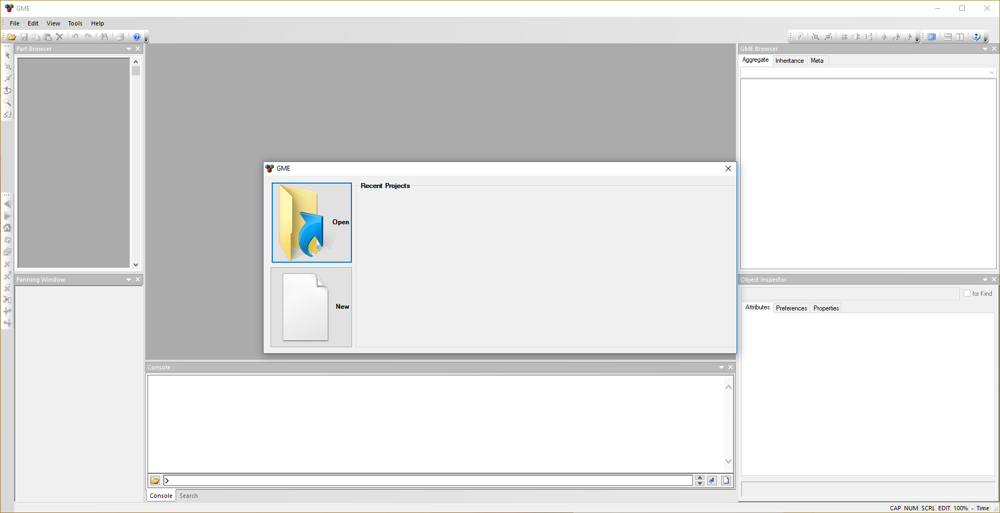

.. _hello_world_creating_a_project:

Creating a New Project
======================

Before we can get started building a model, we need to create a new OpenMETA
project.

Opening GME
-----------

OpenMETA projects are created and edited using the Generic Modeling Environment,
or GME.
GME is an open-source, configurable editor for domain-specific modeling.
In the case of OpenMETA, we will use GME with the CyPhyML paradigm, which
is short for Cyber-Physical Modeling Language.

Since GME was installed by with OpenMETA, begin by launching the "GME"
Desktop app.
Make sure to only select the version that is not suffixed by "(64 bit)".

   A New Instance of GME

Creating a New Project
----------------------

Now let's create a new OpenMETA project:

#. Click **New** on the opening GME dialog or select :menuselection:`File -->
   New Project...` from the menu.
#. Select the **CyPhyML** paradigm.

   .. image:: images/cyphyml.png

#. Click **Create new**.
#. On the **New Project** dialog that appears, leave "Create project file"
   selected and click **Next >**.

   .. image:: images/new_project_dialog.png

#. When prompted to save the new project, you may save your project wherever you
   like, but we recommended that you save the project file in a new or empty
   directory. For more information on the structure of an OpenMETA project, see
   the :ref:`openmeta_projects` chapter.

   .. image:: images/save_as.png
