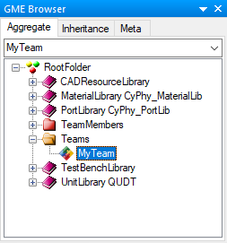
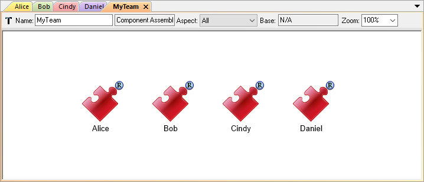

.. _hello_world_creating_a_team:

Creating a Team
===============

Now that we have modeled ourselves and some fellow team members, let's create a most
basic organizational structure by organizing the modeled persons into a team.

.. _hello_world_assigning_members_to_a_team:

Adding a Component Assemblies Folder
------------------------------------

Just as we created a *Components* folder before creating a *Component*, we need to create a *Component
Assemblies* Folder before creating a *Component Assembly*.

#. Right-click on the **RootFolder** in the GME Browser, and choose
   :menuselection:`Insert Folder --> Component Assemblies`.
#. Rename this new *Component Assemblies* folder **Teams**.

Adding a Team
-------------

Now we can create our team:

#. Right-click on the new **Teams** folder, and choose
   :menuselection:`Insert Model --> Component Assembly`.
#. Rename this new component assembly **MyTeam**.

You should now see the following in your GME Browser:

Assigning Members to a Team
---------------------------

Now that we've created a team, let's add some members. In this exercise we will
add the team members *by reference*; this is usually how you will use components
in OpenMETA. Although people cannot be easily duplicated, it is often the case
that a component is reused multiple times in a system, and using references to
components allows us to make a single change take effect everywhere the
component is referenced.

#. Open the new team by double-clicking on the **MyTeam** Component Assembly.
#. Expand the **TeamMembers** folder if it is not already expanded.
#. Right-click and drag one of the team members from the **TeamMembers** folder
   onto the canvas.
#. Select **Create Reference**.
#. Repeat this process as many times as necessary to add all the team members.

When you are done adding team members your **MyTeam** *Component Assembly*
should look something like this:

